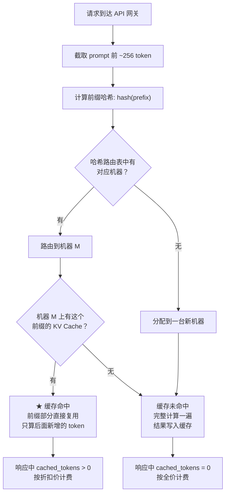

# KV Cache 和 Prompt Cache 的区别

如果你用过 OpenAI 的 API，可能注意过响应里偶尔会出现这么一个字段：

```json
"usage": {
  "prompt_tokens": 2006,
  "completion_tokens": 300,
  "total_tokens": 2306,
  "prompt_tokens_details": {
    "cached_tokens": 1920
  }
}
```

明明 prompt 一样长，但 `cached_tokens` 显示这 2006 个 token 里有 1920 个命中了缓存——意味着你只需要为 86 个 token 付全价，剩下的按折扣价算。

再翻翻 vLLM 或者 HuggingFace 的推理教程，又会频繁撞见另一个词：KV Cache。文档里说它是推理加速的核心，vLLM 的 PagedAttention 本质上就是在管理 KV Cache 的分配和复用。

都是缓存，都跟 token 的计算过程有关，这两个东西到底什么关系？

## 一、KV Cache

要理解 KV Cache，得先看自回归生成到底在算什么。

Transformer 生成文本是一步一步来的。给它"今天天气"，它预测下一个 token 是"真"。然后给它"今天天气真"，预测"好"。如此反复，直到吐出结束符。

这个过程里，每一步都要跑完整的 Attention。而 Attention 的本质是每个 token 和序列中所有 token 做交互——第一个 token 和所有 token 算，第二个 token 也和所有 token 算，以此类推。所以第 n 步的 Attention 计算量是 O(n²)。

问题是：前面 token 的交互结果，是不是每一步都要重新算？

#### 不变的 K 和 V

Attention 的计算，核心是三个矩阵：

```
Q（Query）：当前 token 在"找什么"
K（Key）：  每个 token 的"索引标签"
V（Value）：每个 token 的"实际内容"
```

对于已经生成过的历史 token，它们的 K 和 V 不会再变了——因为 K 和 V 只取决于 token 自身的 embedding，跟后面来了什么新 token 没关系。唯一在变的是 Q——每个新 token 都有自己要"找"的东西。

那为什么还要每步都重算全部 K 和 V？直接存起来不就行了。

这就是 KV Cache。第一步（prefill 阶段）把 prompt 的 K 和 V 全部算好存起来。之后每生成一个新 token（decode 阶段），只算这个新 token 的 Q、K、V，然后把新 K、V 追加到缓存里，Q 和缓存的全部 K、V 做 Attention。

计算量从 O(n²) 压到 O(n)。代价是显存里要多存一份越来越长的 K/V 张量——序列每长一个 token，每一层 Attention 的缓存就多一行。

#### 代码实现

先看没有缓存的版本，每一步都要重算所有 token：

```python
import torch
import torch.nn as nn
import math

class SimpleAttention(nn.Module):
    def __init__(self, d_model=512, n_heads=8):
        super().__init__()
        self.d_model = d_model       # 模型总维度，比如 512
        self.n_heads = n_heads       # 注意力头数，比如 8
        self.d_head = d_model // n_heads  # 每个头的维度，512/8=64

        # 三个线性层，把输入 embedding 投影为 Q、K、V
        # 输入形状: (batch, seq_len, d_model) → 输出: (batch, seq_len, d_model)
        self.W_q = nn.Linear(d_model, d_model, bias=False)
        self.W_k = nn.Linear(d_model, d_model, bias=False)
        self.W_v = nn.Linear(d_model, d_model, bias=False)
        self.W_o = nn.Linear(d_model, d_model, bias=False)  # 输出投影

    def forward(self, x):
        """
        x: (batch=1, seq_len, d_model=512), 比如 (1, 5, 512) 表示 5 个 token
        返回: attention 输出, 形状也是 (1, seq_len, 512)
        """
        B, T, C = x.shape  # B=1(批次), T=seq_len(序列长度), C=512

        # —— 第一步：把所有 token 投影为 Q、K、V ——
        # 如果序列有 5 个 token，这三个结果都是 (1, 5, 512)
        q = self.W_q(x)  # 每个 token 的"我要找什么"
        k = self.W_k(x)  # 每个 token 的"我是谁"
        v = self.W_v(x)  # 每个 token 的"我的内容"

        # —— 第二步：拆成多头 ——
        # 把 512 维拆成 8 个头 × 64 维
        # (1, 5, 512) → (1, 5, 8, 64) → (1, 8, 5, 64)
        q = q.view(B, T, self.n_heads, self.d_head).transpose(1, 2)
        k = k.view(B, T, self.n_heads, self.d_head).transpose(1, 2)
        v = v.view(B, T, self.n_heads, self.d_head).transpose(1, 2)
        # 现在每个形状都是 (1, 8, 5, 64): 1个批次, 8个头, 5个token, 每头64维

        # —— 第三步：计算注意力分数 ——
        # Q 和 K 做点积，得到每个 token 对每个 token 的"关注度"
        # (1, 8, 5, 64) × (1, 8, 64, 5) → (1, 8, 5, 5)
        attn_scores = (q @ k.transpose(-2, -1)) / math.sqrt(self.d_head)
        # attn_scores[0, h, i, j] 表示第 h 个头里，token i 对 token j 的关注度

        # —— 第四步：因果掩码（causal mask） ——
        # 生成时不能让当前 token "看到"后面的 token
        # 把上三角（未来位置）填成 -inf，softmax 后变成 0
        causal_mask = torch.triu(
            torch.ones(T, T), diagonal=1
        ).bool()  # 上三角为 True
        attn_scores = attn_scores.masked_fill(
            causal_mask, float('-inf')
        )  # 把未来位置设为 -inf

        # —— 第五步：softmax + 加权求和 ——
        attn_weights = torch.softmax(attn_scores, dim=-1)  # (1, 8, 5, 5)
        out = attn_weights @ v  # (1, 8, 5, 5) × (1, 8, 5, 64) → (1, 8, 5, 64)

        # —— 第六步：拼回头，过输出投影 ——
        out = out.transpose(1, 2).contiguous().view(B, T, C)  # → (1, 5, 512)
        out = self.W_o(out)  # (1, 5, 512)
        return out
```

上面这个版本每一步都从头算 5 个 token 的 Q、K、V。序列变长，计算量平方级增长。

接下来是加了 KV Cache 的版本。改动就一处：把 forward 拆成两步——第一次调用（prefill）建缓存，后续调用（decode）只算新 token 并追加：

```python
class SimpleAttentionWithKVCache(nn.Module):
    def __init__(self, d_model=512, n_heads=8):
        super().__init__()
        self.d_model = d_model
        self.n_heads = n_heads
        self.d_head = d_model // n_heads

        self.W_q = nn.Linear(d_model, d_model, bias=False)
        self.W_k = nn.Linear(d_model, d_model, bias=False)
        self.W_v = nn.Linear(d_model, d_model, bias=False)
        self.W_o = nn.Linear(d_model, d_model, bias=False)

    def forward(self, x, kv_cache=None, start_pos=0):
        """
        x: 当前输入。prefill 时是整个 prompt (1, prompt_len, 512)
                      decode 时只有 1 个 token (1, 1, 512)
        kv_cache: 之前缓存的 K 和 V，是一个 dict {'k': tensor, 'v': tensor}
                  第一次调用时传 None
        start_pos: 当前 token 在整个序列中的起始位置，给 RoPE 用的
        """
        B, T_curr, C = x.shape  # prefill: T_curr=5, decode: T_curr=1

        # —— 第一步：只投影当前输入的 token ——
        # prefill 时 x 有 5 个 token → q/k/v 都是 (1, 5, 512)
        # decode 时 x 只有 1 个 token → q/k/v 都是 (1, 1, 512)
        q = self.W_q(x)
        k_new = self.W_k(x)  # 新算出来的 K，后面叫 k_new 区分一下
        v_new = self.W_v(x)

        # —— 第二步：拆多头 ——
        q = q.view(B, T_curr, self.n_heads, self.d_head).transpose(1, 2)
        k_new = k_new.view(B, T_curr, self.n_heads, self.d_head).transpose(1, 2)
        v_new = v_new.view(B, T_curr, self.n_heads, self.d_head).transpose(1, 2)

        # —— 第三步：处理 KV Cache ——
        if kv_cache is None:
            # prefill 阶段：没有缓存，直接用当前计算的 K、V
            k = k_new  # (1, 8, 5, 64)，5 是 prompt 长度
            v = v_new
        else:
            # decode 阶段：把新 token 的 K、V 追加到缓存后面
            # kv_cache['k']: 之前所有 token 的 K，形状 (1, 8, prev_len, 64)
            # k_new:         当前 1 个新 token 的 K，形状 (1, 8, 1, 64)
            # torch.cat 沿 seq_len 维度拼接 → (1, 8, prev_len+1, 64)
            k = torch.cat([kv_cache['k'], k_new], dim=2)
            v = torch.cat([kv_cache['v'], v_new], dim=2)

        # 更新缓存：把拼接后的完整 K、V 存下来，下次 decode 接着用
        new_cache = {'k': k, 'v': v}

        # —— 第四步：用完整的 K、V 做 Attention ——
        # q 只有当前 token（decode 时 (1, 8, 1, 64)），但 k、v 包含了全部历史
        # q @ k^T: (1, 8, 1, 64) × (1, 8, 64, all_len) → (1, 8, 1, all_len)
        attn_scores = (q @ k.transpose(-2, -1)) / math.sqrt(self.d_head)

        # decode 时不需要 causal mask，因为 q 只有一个 token，
        # 它天然只能"看到" k 里的所有历史 token（都是过去的）

        attn_weights = torch.softmax(attn_scores, dim=-1)
        out = attn_weights @ v  # (1, 8, 1, all_len) × (1, 8, all_len, 64) → (1, 8, 1, 64)

        # —— 第五步：拼回头，过输出投影 ——
        out = out.transpose(1, 2).contiguous().view(B, T_curr, C)
        out = self.W_o(out)
        return out, new_cache  # 把缓存也返回出去
```

对比两个版本，核心区别就两处：

1. 不重算 K、V：decode 阶段 `x` 只有 1 个 token，`W_k(x)` 和 `W_v(x)` 只对这个新 token 做投影，而不是对整个序列重做
2. 拼接缓存：`torch.cat([kv_cache['k'], k_new], dim=2)` 把新老 K 拼在一起，老的不动，新的追加

生成循环的用法：

```python
def generate(model, prompt_tokens, max_new_tokens=50):
    """
    prompt_tokens: 输入的 prompt token ID 列表, 比如 [101, 202, 303, 404]
    """
    # 阶段一：Prefill —— 整段 prompt 一次过完
    # 把 token ID 转成 embedding，形状 (1, 4, 512)
    prompt_emb = model.embed(prompt_tokens)
    # 第一次调用 forward，kv_cache=None，建缓存
    # output 形状 (1, 4, 512)，kv_cache 里存了 4 个 token 的 K/V
    output, kv_cache = model(prompt_emb, kv_cache=None, start_pos=0)

    # 取最后一个位置的输出来预测下一个 token
    next_logits = output[:, -1, :]  # (1, 512)
    next_token = torch.argmax(next_logits, dim=-1).item()  # 出一个整数 token ID

    generated = [next_token]  # 存生成结果
    current_pos = len(prompt_tokens)  # 当前序列总长度 = 4

    # 阶段二：Decode —— 逐 token 生成
    for _ in range(max_new_tokens - 1):
        # 每次只喂 1 个新 token 的 embedding
        token_emb = model.embed([next_token])  # (1, 1, 512)
        # 传入已有的 kv_cache，并告诉模型当前是第几个 token
        output, kv_cache = model(
            token_emb,
            kv_cache=kv_cache,       # 之前的 K/V 还在
            start_pos=current_pos    # 第 4 个位置（从 0 开始）
        )
        # output 只包含当前 token 的结果 (1, 1, 512)
        next_logits = output[:, -1, :]
        next_token = torch.argmax(next_logits, dim=-1).item()
        generated.append(next_token)
        current_pos += 1

        if next_token == eos_token_id:
            break

    return generated
```

每一步 decode 循环里，模型只处理 1 个新 token，`torch.cat` 把它追加到缓存里，K 和 V 张量随序列增长越来越长。但每次只算 1 个 token 的投影，历史 token 的 K/V 直接复用。


#### 显存开销

KV Cache 省了计算，但吃显存。大致算一下：

```
kv_size = 2 × layers × kv_heads × head_dim × seq_len × precision
```

拿一个 7B 模型来说，假设 32 层、32 个 KV head、head_dim=128、FP16：

- 每个 token 约 `2 × 32 × 32 × 128 × 2 = 524,288 字节 ≈ 0.5 MB`
- 1000 token 的上下文，一个请求约 512 MB
- 100 个并发请求，光 KV Cache 就占 50 GB

这也是大模型推理吃显存最主要的原因之一。但显存占用大只是一方面，更麻烦的是碎片问题。

#### PagedAttention：解决 KV Cache 的显存碎片

在没有 PagedAttention 之前，KV Cache 的分配方式很粗暴：为每个请求预分配一块连续显存，大小按最大序列长度预留。

比如你设置 `max_seq_len=2048`，每个请求一来就先占掉 2048 token 的 KV Cache 空间。问题是——

内部碎片：大部分请求根本没用到 2048 token。一个只生成 200 token 的请求，也霸着 2048 的坑，剩下的全浪费了。

外部碎片：请求 A 结束释放了它那块显存，请求 B 结束又释放了一块。中间留下的空隙东一块西一块——某个新请求需要 512 token 的连续空间，总空闲空间是够的，但没有一块连续区域足够大，分配失败。

这就是 vLLM 的 PagedAttention 要解决的问题。思路直接抄 OS 的虚拟内存分页：

```
传统分配（连续内存）：
┌──────────────────────────────────────────────┐
│ 请求A KV Cache (0~2048 tokens)               │ ← 不管用不用，先占一整块
├──────────────────────────────────────────────┤
│ 请求B KV Cache (0~2048 tokens)               │
├──────────────────────────────────────────────┤
│           [碎片]                              │ ← A 释放后留下空隙
└──────────────────────────────────────────────┘

PagedAttention（分块分配）：
┌──────┬──────┬──────┬──────┬──────┬──────┬──────┐
│ blk0 │ blk1 │ blk2 │ blk3 │ blk4 │ blk5 │ blk6 │  ← 预分配固定大小的 block 池
└──────┴──────┴──────┴──────┴──────┴──────┴──────┘
   A      A      B      B      A      -      B     ← 请求动态占用，按需分配
                                                     "-" = 空闲
```

不再按请求预分配一整块连续空间，而是提前在 GPU 显存里划好一堆固定大小的 KV block（每个 block 默认存 16 个 token 的 K/V）。请求需要存新的 KV 时，从池子里拿空闲 block，用完还回去。

核心数据结构：

```python
@dataclass
class KVCacheBlock:
    block_id: int            # 物理 GPU 显存位置
    ref_cnt: int = 0         # 有多少个请求在引用这个 block
    block_hash: ... = None   # 内容哈希，给 Prefix Caching 用的（后面说）
```

请求的 KV Cache 不再是一整块连续内存，而是一个 block 链表。序列每增长 16 个 token，就从池子里申请一个新 block 挂到链表末尾。


PagedAttention 解决的是单请求内部的 KV Cache 显存管理问题——消灭碎片、按需分配。但它顺带解锁了另一件事：因为 KV Cache 已经按 block 拆开了，多个请求的公共前缀自然可以指向同一组物理 block。这就是下一节要讲的 Prompt Cache。

## 二、Prompt Cache

KV Cache 有一个局限：它的生命周期跟着一次请求走。prefill 建缓存，decode 用缓存，生成结束就释放。下一个请求来了，就算是完全相同的 system prompt，也得从头再算一遍。

这在单次对话的场景里不是问题。但在一个 API 服务每天处理几万次请求的场景下，就是巨大的浪费——大量请求的 system prompt 一模一样，每一次都要重新算一遍 K/V。

Prompt Cache 做的就是这件事：把公共前缀的 KV 状态跨请求保留下来。后面的请求如果前缀匹配，直接复用，只算不同的部分。

它的底层没有任何新东西——复用的就是普通的 KV Cache（K/V 张量）。区别只在于它把 KV Cache 的生命周期从"一次请求"拉长到了"跨请求"，加了一层管理逻辑：什么该缓存、怎么匹配、何时淘汰。

#### OpenAI：自动哈希路由

OpenAI 的 Prompt Caching 对使用者来说最简单——不需要改任何代码。

只要 prompt 超过 1024 token，OpenAI 就会自动对前缀做缓存。核心原理是哈希路由，整个流程如下：



哈希路由保证相同前缀的请求落到同一台机器，在这台机器上再做缓存命中判断。如果同一前缀的请求量太大（约 >15 req/min），会溢出到多台机器，命中率就会下降。

你可以额外指定 `prompt_cache_key` 参数来影响路由——如果有多个不同的 prompt 但共享很长的前缀，指定相同的 key 相当于强制它们走同一条哈希路由，提高命中率。

OpenAI 的方案有一个很硬的限制：前缀必须完全一致，差一个空格都不行。这是因为哈希路由只认前缀的精确匹配。所以官方文档反复强调要把静态内容（instructions、examples）放在 prompt 最前面，动态内容（user-specific info）放在最后面。结构一旦不同，前缀哈希就对不上了。

#### Anthropic：显式标记断点

Anthropic 的设计和 OpenAI 截然不同。它不依赖"前缀完全一致"这个假设，而是让你在 prompt 中显式标记缓存断点（`cache_control`），然后由引擎从断点位置向前匹配。

在 system prompt 上标记断点的例子：

```python
response = client.messages.create(
    model="claude-opus-4-7",
    max_tokens=1024,
    system=[
        {
            "type": "text",
            "text": "你是一个专业的客服助手。你需要始终保持礼貌...",
            "cache_control": {"type": "ephemeral"}
        }
    ],
    messages=[{"role": "user", "content": "我的订单什么时候到？"}]
)
```

`cache_control` 断点告诉引擎：从 prompt 开头到这里的内容都可以缓存。背后的匹配机制有四个细节值得展开。

**前缀的层级顺序**

Anthropic 的 prompt 有一个固定的组装顺序：`tools → system → messages`。缓存也遵循这个顺序——缓存的内容是从 prompt 最开头到你标记的 `cache_control` 断点位置为止的全部内容，按这个顺序拼接。

这意味着你的断点标在 system prompt 最后一行，缓存就会覆盖 tools + 整个 system prompt。如果后续请求的 tools 或 system prompt 有变化，前面缓存的哈希就对不上了。

**缓存写入：一次请求只写一个条目**

当你标了 `cache_control` 断点，请求完成后引擎会在缓存中写入一个条目——这个条目是"从 prompt 开头到断点位置"的全部内容的哈希值，以及对应的 KV 张量。

每次请求只写一个缓存条目，不管你标了几个断点。如果你标了多个，引擎选最后一个可缓存的作为写入点。

**缓存读取：20 个 block 的 lookback 窗口**

这是 Anthropic 方案最独特的机制。新请求来了，引擎不是直接拿整个 prompt 去匹配缓存，而是从断点位置开始向前逐个 block 检查：

```python
def find_cache_match(prompt_blocks, breakpoint_index):
    # 从断点位置开始，向前最多检查 20 个 block
    for offset in range(min(20, breakpoint_index + 1)):
        candidate_block = breakpoint_index - offset
        candidate_hash = hash_chain(prompt_blocks[:candidate_block + 1])
        if candidate_hash in cache_store:
            return cache_store[candidate_hash]
    # 20 个 block 内都没找到匹配，全部重算
    return None
```

一个 block 约 100-200 token。如果你在 prompt 的第 50 个 block 位置标了 `cache_control`，引擎会从 block 50 开始向前查 block 49、48、47……一直查到 block 30（往前 20 个为止）。哪个 block 匹配到了缓存，就从哪个 block 之后开始计算。

这个 lookback 机制的好处是不要求精确的前缀匹配。比如：


- 上一次请求的 system prompt 后面跟了"发货政策查询"，存在缓存里
- 这次请求的 system prompt 后面跟了"退换货政策查询"，跟上次不同
- 但 system prompt 本身没变——引擎向前 lookback，在 system prompt 的末尾 block 匹配到了上一次的缓存
- 结果：system prompt 部分直接复用，新的"退换货政策查询"从零计算

**多轮对话中的自动缓存**

Anthropic 还支持另一种更省事的用法——不标具体断点，只开启自动模式：

```python
response = client.messages.create(
    model="claude-opus-4-7",
    max_tokens=1024,
    cache_control={"type": "ephemeral"},  # 顶层开启自动缓存
    system="你是一个专业的客服助手...",
    messages=[
        {"role": "user", "content": "我的订单什么时候到？"}
    ]
)
```

自动模式下，引擎会把断点自动放在最后一个可缓存 block 的最后位置。多轮对话中，断点会随对话增长自动后移：

```
轮次 1: [system] [user_1] [assistant_1] [user_2 ◀ 断点]
         ↑ 全部写入缓存

轮次 2: [system] [user_1] [assistant_1] [user_2 ◀ 命中] [assistant_2] [user_3 ◀ 新断点]
         ↑ system ~ user_2 从缓存读取        ↑ assistant_2 + user_3 写入

轮次 3: [system] ... [user_3 ◀ 命中] [assistant_3] [user_4 ◀ 新断点]
         ↑ system ~ user_3 从缓存读取
```

因为对话历史越长，缓存的收益越大——每一轮对话前面的几十轮历史都不用重算。这也是为什么 Anthropic 的多轮对话 API 延迟不会随轮次线性增长。

定价方面，Anthropic 的缓存写入和读取分开计价：写入 1.25 倍基础价格，读取 0.1 倍。缓存默认存活 5 分钟，可以加钱延长到 1 小时。写入比读取贵是技术上的合理设计——KV 张量存到 GPU 显存里本身就有成本。OpenAI 不收写入费，更多是产品层面的取舍。

#### vLLM：基于 PagedAttention 的 Prefix Caching

前面讲 PagedAttention 的时候提到，KV Cache 被拆成了固定大小的 block，每个 block 有独立的内存地址和内容哈希。这个设计恰好让跨请求共享变得天然可行——多个请求的公共前缀指向同一组物理 block 就行。

vLLM 把这个功能叫做 Automatic Prefix Caching。关键问题是怎么快速判断两个请求的前缀一致。不能每次都比对整个 token 序列，太慢了。vLLM 的做法是用哈希链：

```python
def hash_block_tokens(parent_block_hash, curr_block_token_ids, extra_keys):
    if not parent_block_hash:
        parent_block_hash = NONE_HASH
    return sha256((parent_block_hash, tuple(curr_block_token_ids), extra_keys))
```

每个 block 的哈希由两部分决定：父 block 的哈希 + 当前 block 的 16 个 token ID。形成链式结构：

```
hash(block_0) = sha256(NONE_HASH, tokens[0:16])
hash(block_1) = sha256(hash(block_0), tokens[16:32])
hash(block_2) = sha256(hash(block_1), tokens[32:48])
```

新请求进来时，从第一个 block 开始沿着哈希链逐块匹配。每一步都是 O(1) 的哈希表查找——查到某一步哈希对不上，说明从这个 block 开始是新的内容，从这里开始自己算。匹配到的 block 引用计数加一（`ref_cnt++`），算完或请求结束后减一，归零才释放物理显存。

这套机制对比 OpenAI 的方案有两个优势：支持任意长度的前缀匹配（不限于 256 token），同一组物理 block 可以被任意多个请求共享，零拷贝。代价也很直白——你得自己在本地部署推理引擎，不像 API 那样开箱即用。

## 三、区别

KV Cache 和 Prompt Cache 不是一个层面的东西。

KV Cache 是 Attention 自回归推理的底层机制，管的是"同一次请求内部，历史 token 的 K/V 不要重复算"。这是 Transformer 推理的标配，从 GPT-2 时代开始就有。你只要跑自回归生成，就一定在用 KV Cache。

Prompt Cache 建立在 KV Cache 之上，管的是"多个请求之间，公共前缀的 K/V 不要重复算"。它复用的就是普通的 KV Cache 张量，只是把生命周期从一次请求拉长到了跨请求，顺带加上了前缀匹配和缓存淘汰。

几点差异：

- KV Cache 跟着一次请求走，请求结束就释放；Prompt Cache 由框架或 API 服务管着，可能存活几分钟到几小时
- KV Cache 省的是序列内部逐 token 生成时的重复计算；Prompt Cache 省的是不同请求共享公共前缀时的重复计算
- Prompt Cache 不是免费的。KV 张量趴在 GPU 显存里本身就是成本，缓存太多而命中率不够，反而挤了服务更多请求的空间。所以不管是 vLLM 的引用计数淘汰还是 API 的 TTL 过期，都是在显存和命中率之间做取舍
