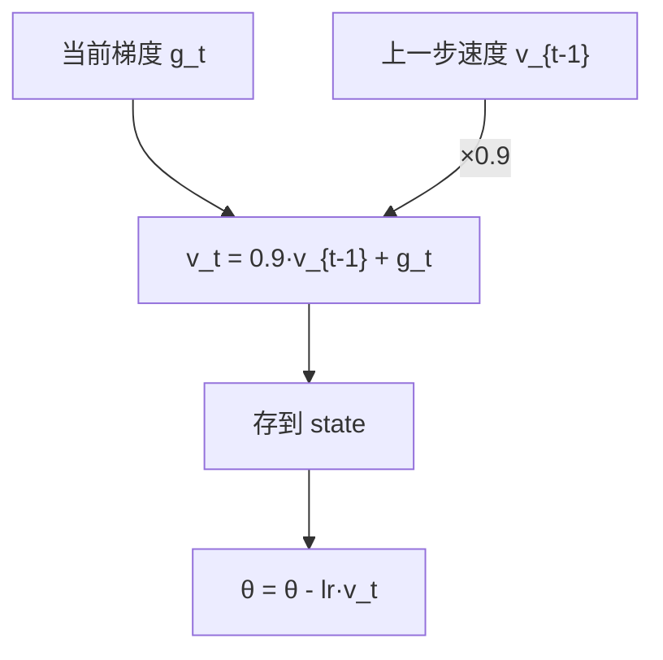
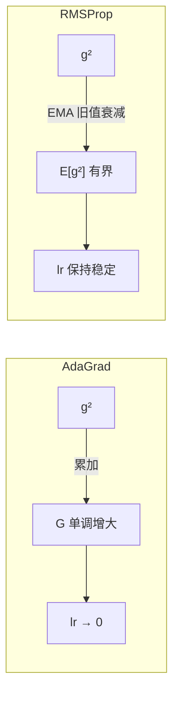
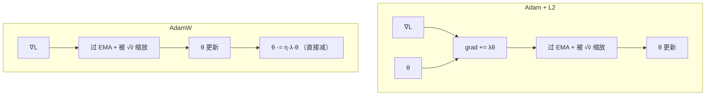

# Optimizer：从 SGD 到 AdamW

训练神经网络就是在找一个最低点。你站在 loss 曲面的某个位置，每步沿着梯度方向往下走一点，希望最后走到谷底。

SGD 做的就是这件事：

```python
for x, y in dataloader:
    loss = model(x, y)      # 前向：算出当前位置的 loss
    loss.backward()          # 反向：算出梯度 g_t
    optimizer.step()         # 更新：θ = θ - lr * g_t
```

听起来简单。但真正跑起来，你会发现 loss 降着降着不动了——不是到了最低点，梯度还不是零，参数也还在更新，但 loss 就是不降。

问题出在哪？梯度告诉你的是"当前脚下最陡的下坡方向"。但如果这座山的形状是一个又窄又长的峡谷呢？最陡的方向指向峡谷的侧壁，而不是谷底。你每一步都往侧壁走，走到对面再弹回来——来来回回，沿谷底的有效位移极小。

这就是 SGD 的第一个问题：**梯度方向和真正该去的方向之间有夹角。**


---

## 一、Momentum：让方向靠谱一点

Momentum 做的事可以用骑自行车来理解：你不可能每踩一脚就停下来重新判断方向，你会保持一个速度，根据当前路况微调。

$$v_t = \beta \cdot v_{t-1} + g_t$$

$$\theta_{t+1} = \theta_t - \eta \cdot v_t$$

$v_t$ 不是只看当前梯度，而是过去所有梯度的加权平均——离得越远的梯度，权重越小（以 $\beta^k$ 衰减）。默认 $\beta=0.9$。

效果是什么？如果梯度在某个方向上反复正负交替（比如峡谷两侧来回震荡），EMA 后它们互相抵消，$v_t$ 的这个分量很小。如果梯度在某个方向上持续同号（比如沿谷底的纵向），它们互相加强，$v_t$ 的这个分量越来越大。



代码上，Momentum 只比 SGD 多存一个跟参数同 shape 的 tensor：

```python
# torch.optim.SGD(params, lr=0.01, momentum=0.9)
# 每个参数多一个 buffer：
# state = {'momentum_buffer': v_t}    # 形状和参数一样，fp32

buf = state['momentum_buffer']
buf.mul_(0.9).add_(grad)    # v_t = 0.9 * v_{t-1} + g_t
p.data.add_(buf, alpha=-lr) # θ = θ - lr * v_t
```

到这一步，方向的问题大致解决了。但还有另一个问题：所有参数共用一个学习率。

想一下：一个 transformer 里，embedding 层的某一行可能在整个 batch 里只被一个 token 激活，梯度的量级很小。而最后一层 linear 的每一列都被 batch 里所有 token 用到，梯度量级大得多。给它们同一个学习率，embedding 层基本原地踏步。

这就是第二个问题：**不同参数的梯度尺度不一样，应该给不同的学习率。**

---

## 二、AdaGrad 和 RMSProp：给每个参数自己的步长

AdaGrad 的思路直截了当——给每个参数记一笔账：过去这个参数的梯度有多大。然后用这笔账反过来调它的学习率。

$$G_t = G_{t-1} + g_t^2$$

$$\theta_{t+1} = \theta_t - \eta \cdot \frac{g_t}{\sqrt{G_t + \epsilon}}$$

$g_t$ 和 $G_t$ 都是逐元素的。一个具体参数，如果历史上梯度一直很大，$\sqrt{G_t}$ 就大，现在这步会被除一个大的分母——等于自动压低了它的学习率。如果历史上梯度一直很小，分母就小——等于开了绿灯。

```python
# torch.optim.Adagrad
# state['sum'] 就是 G_t，跟参数同 shape：

state['sum'].addcmul_(grad, grad, value=1)    # G_t += g_t²
std = state['sum'].sqrt().add_(1e-8)            # √(G_t) + ε
p.data.addcdiv_(grad, std, value=-lr)           # θ -= lr * g_t / std
```

但这里藏着一个 bug。$G_t$ 是累加，只增不减。训练几万步之后，$\sqrt{G_t}$ 对所有参数都变得很大——学习率被压到接近零，模型不再学了。

RMSProp 改了这一行：不累加，改用指数移动平均。

$$E[g^2]_t = 0.9 \cdot E[g^2]_{t-1} + 0.1 \cdot g_t^2$$

$$\theta_{t+1} = \theta_t - \eta \cdot \frac{g_t}{\sqrt{E[g^2]_t + \epsilon}}$$

旧的平方值随时间衰减——100 步前的 $g^2$ 权重只剩 $0.9^{100} \approx 2.7\times 10^{-5}$。分母不再爆炸，学习率保持在一个合理范围。



代码层面，AdaGrad 和 RMSProp 的差异就是一行：

```python
# AdaGrad：
state['sum'].addcmul_(grad, grad, value=1)          # 累加，永不衰减

# RMSProp：
square_avg.mul_(0.9).addcmul_(grad, grad, value=0.1) # EMA，旧值自然遗忘
```

现在有两条线了。Momentum 帮所有参数把方向修直。RMSProp 给每个参数分配了合适的学习率。但这俩是分开用的——你只能选一个。

---

## 三、Adam：把两条线合到一起

Adam 把 Momentum 和 RMSProp 并到一个更新规则里：

$$m_t = 0.9 \cdot m_{t-1} + 0.1 \cdot g_t \qquad \text{（一阶矩：方向）}$$

$$v_t = 0.999 \cdot v_{t-1} + 0.001 \cdot g_t^2 \qquad \text{（二阶矩：步长）}$$

$$\theta_{t+1} = \theta_t - \eta \cdot \frac{m_t}{\sqrt{v_t} + 10^{-8}}$$

比 Momentum + RMSProp 多了一步：偏差修正。

$m_t$ 和 $v_t$ 初始化都是 0。第一步时 $m_1 = 0.1 \cdot g_1$——只有真实梯度的十分之一。因为 EMA 权重的累加和不等于 1。

打个比方：你第一次估一个城市的人口，只采访了 10 个人。你当然不会直接拿 10 个人的平均值当结论——你会心里把它"放大"，因为样本太少了。Adam 的偏差修正就是在做这件事：

$$\hat{m}_t = \frac{m_t}{1 - 0.9^t}$$

第一步：$1 - 0.9^1 = 0.1$，$\hat{m}_1 = m_1 / 0.1 = g_1$，正好是原始梯度。第 10 步：$1 - 0.9^{10} \approx 0.65$，$\hat{m}_{10} \approx m_{10} / 0.65$，修正量已经小多了。100 步以后基本不需要修正。

```python
# torch.optim.Adam 内部，每个参数维护：
# state = {
#     'step': 0,                            # t
#     'exp_avg':   m_t,                     # 一阶矩，跟参数同 shape
#     'exp_avg_sq': v_t,                     # 二阶矩，跟参数同 shape
# }

exp_avg.mul_(0.9).add_(grad, alpha=0.1)            # m_t = 0.9·m + 0.1·g
exp_avg_sq.mul_(0.999).addcmul_(grad, grad, value=0.001)  # v_t = 0.999·v + 0.001·g²

bias1 = 1 - 0.9 ** step
bias2 = 1 - 0.999 ** step
denom = exp_avg_sq.sqrt().div_(math.sqrt(bias2)).add_(1e-8)

p.data.addcdiv_(exp_avg, denom, value=-lr / math.sqrt(bias1))
```

---

## 四、AdamW：修一个藏了十年的 bug

训练时经常会加 L2 正则化——在 loss 里加一项让权重趋向 0，防止过拟合。

SGD 里，L2 正则化等价于 weight decay：loss 上加 $\lambda\|\theta\|^2$，等价于每步直接把参数往 0 的方向拉一点。

Adam 里不等价。因为 Adam 会把 L2 正则化的梯度也送进 EMA，还被 $\sqrt{v_t}$ 缩放。

拿一个具体例子说：两个参数，一个是高频特征对应的权重（梯度方差大，$v_t$ 大），一个是低频特征对应的（梯度方差小，$v_t$ 小）。

- 高频的那个：$\sqrt{v_t}$ 大 → weight decay 被除一个大的分母 → 几乎没衰减
- 低频的那个：$\sqrt{v_t}$ 小 → weight decay 被除一个小的分母 → 衰减过头

weight decay 的强度变得跟参数的"使用频率"挂钩了。这没有道理——一个参数用得频繁，不代表它不应该被正则化。

AdamW 的修正就是把 weight decay 从自适应机制里拆出来，直接作用在权重上：

$$\theta_{t+1} = \theta_t - \eta \cdot \frac{\hat{m}_t}{\sqrt{\hat{v}_t + \epsilon}} - \eta \cdot \lambda \cdot \theta_t$$

最后那项 $\eta \cdot \lambda \cdot \theta_t$ 没有经过 $\sqrt{\hat{v}_t}$ 的缩放，均匀作用在所有参数上。

```python
# Adam 里 weight_decay 的路径：
# grad += param * weight_decay     # 混入梯度 → 过 EMA → 被 √v̂ 缩放

# AdamW 里：
p.data.mul_(1 - lr * weight_decay)          # 直接衰减，不经过任何缩放
p.data.addcdiv_(exp_avg, denom, value=-lr)   # 然后再做 Adam 更新
```




2017 年 Loshchilov 和 Hutter 在 CIFAR-10 上做了对比：同样的 `weight_decay=0.01`，AdamW 比 Adam + L2 的准确率高了 1~2 个百分点。就一行代码的差别。

---

回过头看整条线。SGD 的方向不准——Momentum 用 EMA 把震荡抵消掉。多个参数共享一个学习率不公平——AdaGrad 给每个参数单独立账，RMSProp 修了账本只增不减的问题。两条线被 Adam 合并——最后 AdamW 把 weight decay 从自适应机制里拆出来，不再让正则化强度被 $\sqrt{\hat{v}_t}$ 绑架。

每次改动都不大。多存一个 buffer。把累加改成 EMA。把一行 `grad.add_` 换成 `p.mul_`。但每一步补的都是训练时真实遇到的坑。
