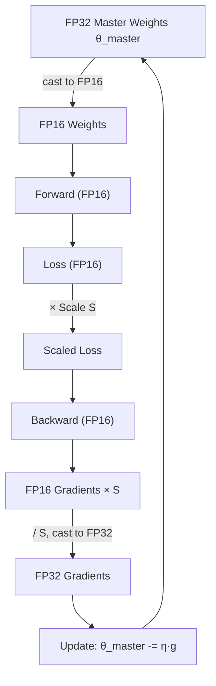
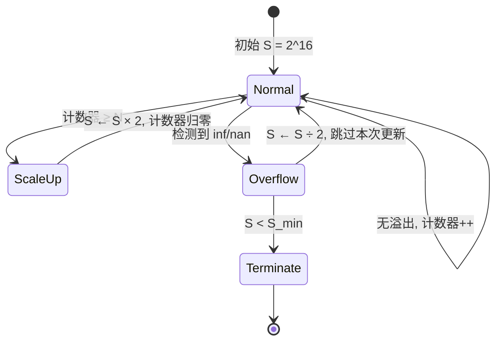
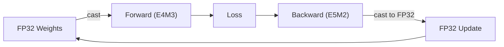

# Mixed Precision：从 FP32 到 FP8

> 一台 A100 80GB，一个 7B 模型。参数 28GB，梯度 28GB，Adam 的 $m_t$ 和 $v_t$ 共 56GB——合计 112GB。一张卡放不下，还没开始训练显存就先不够了。

## 一、训练时的显存分布

先把 FP32 训练的显存拆开算一遍。

一个 7B 模型，参数量 $N = 7 \times 10^9$，每个参数占 4 字节（FP32），参数本身 $4N \approx 28\text{GB}$。梯度与参数同 shape，又是 28GB。

但真正的大头是优化器状态。Adam 维护两个 FP32 buffer：

$$m_t = \beta_1 \cdot m_{t-1} + (1 - \beta_1) \cdot g_t \qquad \text{（一阶矩）}$$

$$v_t = \beta_2 \cdot v_{t-1} + (1 - \beta_2) \cdot g_t^2 \qquad \text{（二阶矩）}$$

每个 buffer 跟参数同 shape，两份加起来 $2 \times 4N = 56\text{GB}$。

```python
# Adam 优化器的状态，每个参数对应两个 FP32 buffer
state = {
    'step': 0,
    'exp_avg': m_t,      # 一阶矩，shape 同参数，FP32，28GB
    'exp_avg_sq': v_t,   # 二阶矩，shape 同参数，FP32，28GB
}
```

汇总一下：

$$\text{Total} = \underbrace{4N}_{\text{参数}} + \underbrace{4N}_{\text{梯度}} + \underbrace{2 \times 4N}_{\text{优化器状态}} = 12N \approx 112\text{GB}$$


一张 80GB 的 A100 放不下。

另一面是算力。A100 的 FP32 算力是 19.5 TFLOPS，BF16 Tensor Core 算力是 312 TFLOPS——差了 16 倍。FP32 训练不只费显存，还浪费了硬件的大部分算力。

## 二、FP16 的数值限制

FP32 和 FP16 的位宽结构：

```
FP32: 1 位符号 + 8 位指数 + 23 位尾数
FP16: 1 位符号 + 5 位指数 + 10 位尾数
```


指数位决定了动态范围。FP32 能表示 $10^{-38}$ 到 $10^{38}$，FP16 只能表示 $6 \times 10^{-5}$ 到 $65504$。

直接把训练全部换成 FP16 会撞三个问题。

**梯度下溢**：FP16 小于 $6 \times 10^{-5}$ 就是 0。训练后期很多梯度本身就很小，直接变成 0，参数不再更新。

拿一组具体数字看：

```python
# FP32 下正常的梯度
grad_fp32 = torch.tensor([1e-5, 2e-6, 5e-7], dtype=torch.float32)
print(grad_fp32)  # tensor([1.0000e-05, 2.0000e-06, 5.0000e-07])

# 转成 FP16
grad_fp16 = grad_fp32.half()
print(grad_fp16)  # tensor([9.9945e-06, 1.9073e-06, 0.0000e+00], dtype=torch.float16)
# 最后一个梯度直接变成 0
```

**激活值上溢**：FP16 大于 65504 变成 `inf`。某些层的激活值（比如没有归一化的 attention score）可能超过这个范围，一旦变成 `inf`，后续计算全部污染。

**参数更新被吞掉**：FP16 的尾数只有 10 位，精度不够。$\theta - \eta \cdot g$ 算完之后，如果更新量相对于 $\theta$ 太小，FP16 表示不出来，等于没更新。

```python
theta = torch.tensor([100.0], dtype=torch.float16)
update = torch.tensor([0.001], dtype=torch.float16)
result = theta - update
print(result)  # tensor([100.], dtype=torch.float16)
# 更新量太小，被精度截断吞掉了
```

用数学语言说：FP16 的机器精度 $\epsilon_{\text{FP16}} = 2^{-10} \approx 9.8 \times 10^{-4}$。当 $|\eta \cdot g| < |\theta| \cdot \epsilon_{\text{FP16}}$ 时，更新在浮点运算中完全消失。

## 三、Mixed Precision 的机制

2017 年 NVIDIA 在论文《Mixed Precision Training》里提出了核心思路：计算走 FP16，存储和更新留 FP32。

具体做三件事。

**Master Weights**：内存里始终保一份 FP32 参数（master weights $\theta_{\text{master}}$），前向和反向时临时 cast 成 FP16 参与计算。梯度在 FP16 下算完，转回 FP32 累加到 master weights 上。

$$\theta_{\text{master}} \leftarrow \theta_{\text{master}} - \eta \cdot \text{FP32}(g_{\text{FP16}})$$

```python
# 伪代码：Mixed Precision 训练的完整流程
master_weights = model.parameters()  # FP32，内存中的"真身"

for batch in dataloader:
    # 前向：临时转成 FP16
    fp16_weights = [w.half() for w in master_weights]
    loss = forward(fp16_weights, batch)  # 计算在 FP16 下完成
    
    # 反向：梯度是 FP16
    loss.backward()
    
    # 更新：梯度转回 FP32，累加到 master weights
    for w_master, w_fp16 in zip(master_weights, model.parameters()):
        w_master.data.add_(w_fp16.grad.float(), alpha=-lr)
```

整个流程的数据流：



**Loss Scaling**：把 loss 乘一个缩放因子 $S$（比如 1024），梯度等比放大，避开 FP16 下溢区间，更新前再除回来。

$$\text{scaled\_loss} = S \cdot L \qquad \Rightarrow \qquad g_{\text{scaled}} = S \cdot g$$

$$\theta \leftarrow \theta - \eta \cdot \frac{g_{\text{scaled}}}{S} = \theta - \eta \cdot g$$

数学上结果完全一样。区别在于 $g_{\text{scaled}}$ 在 FP16 下不会下溢，而 $g$ 会。

```python
# 没有 loss scaling
loss = model(x, y)
loss.backward()  # 梯度可能下溢变成 0

# 有 loss scaling
scale = 1024
loss = model(x, y) * scale
loss.backward()  # 梯度放大 1024 倍，避开下溢区间
# 更新前除回来
for p in model.parameters():
    p.grad.data.div_(scale)
optimizer.step()
```

**Dynamic Loss Scaling**：手动选一个固定的 $S$ 不现实——太小还是会下溢，太大又会上溢。做法是训练过程中自动调：连续 $N$ 步（比如 2000 步）没溢出就把 $S$ 乘 2，出现 `inf`/`nan` 就把 $S$ 除 2 并跳过这次更新。



PyTorch 的 `torch.amp` 把这套机制封装好了：

```python
from torch.amp import autocast, GradScaler

scaler = GradScaler('cuda')  # 自动管理 loss scaling

for batch in dataloader:
    optimizer.zero_grad()
    
    # autocast 自动把合适的算子转成 FP16
    with autocast('cuda'):
        loss = model(batch)
    
    # scaler 自动做 loss scaling
    scaler.scale(loss).backward()
    
    # scaler 自动处理 unscale、检查溢出、更新 master weights
    scaler.step(optimizer)
    scaler.update()  # 根据是否溢出调整 scale 因子
```

`autocast` 背后有一个白名单和黑名单机制。不是所有算子都适合 FP16——矩阵乘法、卷积这类算术密集型算子在 FP16 下快很多，放进白名单。LayerNorm、Softmax、Loss 计算对数值精度敏感，放进黑名单，强制在 FP32 下跑。

Tensor Core 的触发也有条件：不是用了 FP16 就自动快，矩阵维度要对齐（通常是 8 或 16 的倍数）。shape 不对的话 Tensor Core 不参与，退化成普通 CUDA Core，速度提升为零。

## 四、BF16 和训练稳定性

BF16 把指数位从 5 扩到 8（跟 FP32 一致），动态范围拉到 $10^{\pm 38}$，尾数从 10 位缩到 7 位。

```
FP32: 1 + 8 + 23
BF16: 1 + 8 + 7
```

动态范围够了，Loss Scaling 就不需要了。训练代码少一个超参，也少了溢出风险。

```python
# BF16 训练不需要 GradScaler
from torch.amp import autocast

for batch in dataloader:
    optimizer.zero_grad()
    
    with autocast('cuda', dtype=torch.bfloat16):
        loss = model(batch)
    
    loss.backward()
    optimizer.step()
    # 没有 scaler，没有 unscale，没有溢出检查
```

A100 之后的框架默认推 BF16，原因不是它更精确，而是它更省事。

实际 MFU（Model FLOPs Utilization）数据：Megatron-LM 跑 LLaMA 系列，BF16 下通常能到 40%-60%（理论峰值的百分比）。这个数字在 FP32 下不可能达到，因为 FP32 下 Tensor Core 根本不参与。

稳定性的坑也会遇到：BF16 的尾数截断（只有 7 位）在特定场景下会有累积误差，偶尔出现 loss spike。Infra 层面的应对通常是梯度范数监控 + checkpoint 恢复，不需要展开太多。

## 五、分布式训练叠加 Mixed Precision

Mixed Precision 和数据并行（DDP）叠加时，梯度 allreduce 用 FP16 还是 FP32？

用 FP16 通信量减半（每个梯度 2 字节而不是 4 字节），带宽省一半。但 allreduce 涉及跨 GPU 的累加，FP16 精度可能不够。实践中通常是：梯度在 FP16 下算完，转回 FP32 做 allreduce，allreduce 完了再更新 master weights。

```python
# DeepSpeed 的 Mixed Precision 配置
{
    "fp16": {
        "enabled": true,
        "loss_scale": 0,  # 0 表示动态 loss scaling
        "loss_scale_window": 1000,
        "initial_scale_power": 16,
        "hysteresis": 2,
        "min_loss_scale": 1
    },
    "zero_optimization": {
        "stage": 2,  # ZeRO Stage 2 + Mixed Precision
    }
}
```

Mixed Precision + ZeRO：ZeRO 把优化器状态切分到多张卡上。Mixed Precision 下，优化器状态本身是 FP32（master weights + Adam 的 m_t 和 v_t），切分后每张卡只存 1/N。叠加效果：

```
FP32 训练（无 ZeRO）：每张卡 112GB
BF16 Mixed Precision（无 ZeRO）：每张卡约 56GB（参数 FP16 14GB + 梯度 FP16 14GB + 优化器 FP32 28GB）
BF16 + ZeRO-2（8 卡）：每张卡约 14GB（优化器状态切分）
```


Megatron-LM 的配置片段：

```python
# Megatron-LM 的 Mixed Precision 配置
args.bf16 = True  # 启用 BF16
args.fp16 = False  # 不用 FP16
args.loss_scale = None  # BF16 不需要 loss scaling
args.initial_loss_scale = 2**32  # 如果用 FP16，初始 loss scale
```

## 六、推理侧的精度策略

训练最多降到 BF16/FP16，推理可以走更远——不需要梯度和优化器状态，精度容忍度更高。

**FP16 推理**：直接加载半精度权重。7B 模型参数从 28GB 降到 14GB，不需要 optimizer states，显存占用大约是训练时的 1/4。

**INT8/INT4 量化**：GPTQ、AWQ 的思路是权重静态量化成 INT4/INT8，激活动态量化。跟 Mixed Precision 训练的本质区别是"一次性压到位，不保留高精度副本"。

```python
# 用 bitsandbytes 做 INT8 量化推理
from transformers import AutoModelForCausalLM
import bitsandbytes

model = AutoModelForCausalLM.from_pretrained(
    "meta-llama/Llama-2-7b-hf",
    load_in_8bit=True,  # 权重 INT8，激活动态 FP16
    device_map="auto"
)
```

## 七、FP8

FP8 有两种格式：E4M3（4 位指数 + 3 位尾数，精度优先）和 E5M2（5 位指数 + 2 位尾数，范围优先）。

```
FP8 E4M3: 动态范围 $\pm 448$，精度高
FP8 E5M2: 动态范围 $\pm 57344$，精度低
```

H100 上 FP8 Tensor Core 的算力是 990 TFLOPS，比 BF16 的 312 TFLOPS 高约 3 倍。

NVIDIA 的 Transformer Engine 支持 FP8 训练和推理。实践中常见的做法是前向用 E4M3（精度够），反向用 E5M2（梯度范围更大），形成一种 FP8 内部的 mixed precision。



目前 FP8 训练的工程成熟度还在爬坡阶段。主要挑战不在算力，而在于量化误差的管理——8 位浮点的表示能力有限，需要更精细的 per-tensor 或 per-channel scaling 策略。Transformer Engine 的 `DelayedScaling` 就是为这个问题设计的：用前几个 step 的统计量（amax history）来估算当前 step 的 scaling factor，避免每个 step 都要扫一遍数据算最大值。

---

## 总结

Mixed Precision 的本质是在数值精度与硬件算力之间做显存-算力-稳定性的三角权衡。下表汇总了各精度方案的关键指标：

| 精度方案 | 位宽 | 动态范围 | 显存占用（7B 模型） | 训练算力（A100） | 关键工程约束 |
|----------|------|----------|---------------------|------------------|-------------|
| FP32 | 32 bit | $10^{\pm 38}$ | 112 GB | 19.5 TFLOPS | 无 |
| FP16 Mixed | 16 + 32 bit | $[6 \times 10^{-5}, 65504]$ | ~56 GB | 312 TFLOPS | Loss Scaling、Master Weights |
| BF16 Mixed | 16 + 32 bit | $10^{\pm 38}$ | ~56 GB | 312 TFLOPS | 尾数截断误差 |
| FP8 | 8 bit | $[\text{E4M3}: \pm 448,\; \text{E5M2}: \pm 57344]$ | ~28 GB | 990 TFLOPS（H100） | Delayed Scaling、量化误差管理 |

从 FP32 到 FP8，每一代精度方案的演进都遵循同一模式：降低位宽以换取显存节省和 Tensor Core 算力，同时引入新的数值约束，再由框架层面提供相应的工程补偿（Loss Scaling、Master Weights、DelayedScaling）。硬件定义了理论上限，框架决定了工程可行性，而最终的精度选择取决于具体场景下的约束条件——目标硬件的算力规格、模型对数值误差的敏感度、以及对训练稳定性的容忍阈值。
