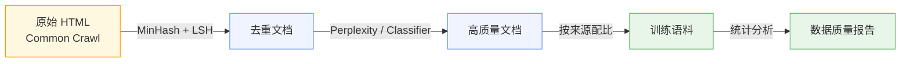

> 你在终端里输入一段 prompt，几秒后模型返回了一段流畅的回答。
> 但在模型"看到"你的 prompt 之前，它已经花了数月时间阅读互联网上的万亿级文本。
> 这些文本——HTML、PDF、代码、论坛帖子——是如何变成模型能理解的数字的？

本文是系列第一篇，回答一个问题：**如何把人类语言变成模型能吃的数字？**

链路分三步：清洗原始语料 → 将文本切分为 Token → 将 Token 映射为向量。每一步的输出是下一步的输入，每一步的设计决策都直接影响模型的最终能力。

---

## 一、语料工程：从互联网到训练数据集

### 原始数据长什么样

Common Crawl 每月抓取数十亿网页，原始数据是 HTML。随便取一条：

```html
<html><head><title>Buy cheap shoes!!!</title></head>
<body>
  <div class="ad">CLICK HERE FOR DEALS</div>
  <p>The mitochondria is the powerhouse of the cell.</p>
  <p>The mitochondria is the powerhouse of the cell.</p>
  <footer>© 2024 spam-site.com</footer>
</body></html>
```

广告、重复内容、样板文字混在一起。直接拿去训练，模型会把网页噪声当作语言模式来学习。

### 去重：MinHash + LSH

同一段文字在互联网上可能出现几千次——Wikipedia 镜像、转载文章、CMS 模板生成的页面。如果不去重，模型会在相同数据上过拟合：背下来而不是学进去。

MinHash 用哈希签名近似计算两篇文档的 Jaccard 相似度。对于文档 $A$ 和 $B$：

$$J(A, B) = \frac{|A \cap B|}{|A \cup B|}$$

MinHash 的概率性质保证了签名匹配的概率恰好等于 Jaccard 相似度：

$$P(\text{minhash}(A) = \text{minhash}(B)) = J(A, B)$$

实际操作中，对每篇文档计算多个哈希函数的最小值，组成签名向量。签名相近的文档通过 LSH（Locality-Sensitive Hashing）分到同一桶中，同桶文档视为近似重复。

```
文档 A: "The cat sat on the mat"
文档 B: "The cat sat on the mat."   (多了一个句号)
文档 C: "The dog ran in the park"

J(A, B) ≈ 0.83 → MinHash 签名几乎相同 → 去重
J(A, C) ≈ 0.25 → MinHash 签名差异大 → 保留
```

### 质量过滤

去重之后，还需要过滤低质量文本。两种常见方法：

**Perplexity Filter：** 用一个小型语言模型计算文档的困惑度：

$$\text{PPL} = \exp\left(-\frac{1}{N}\sum_{i=1}^{N} \log P(x_i | x_{<i})\right)$$

Perplexity 过高意味着文本不自然（乱码、机器生成的垃圾），过低意味着文本过于简单或重复（"the the the..."）。保留 perplexity 在合理范围内的文档。

**Classifier Filter：** 训练一个二分类器，正例是 Wikipedia 和高质量书籍，负例是随机网页。用分类器的概率分数作为质量分数，保留高分文档。

### 数据配比与 Scaling Law

清洗后的数据来自不同来源，配比直接影响模型能力：

| 来源 | Llama 1 | Llama 3 |
|------|---------|---------|
| Web | 67% | ~85% |
| Code | 4.5% | ~8% |
| Books | 4.5% | — |
| 学术 | 2.5% | — |

Code 数据的比例影响模型的编程能力，学术数据影响推理能力。这不是一个有标准答案的问题——不同团队根据目标能力做不同取舍。

Chinchilla Scaling Law 给出了数据量的理论约束。给定计算预算 $C$，最优的模型参数量 $N$ 和数据量 $D$ 满足：

$$C \propto ND$$

早期模型（GPT-3，175B 参数，300B token）参数多、数据少，处于欠训练状态。Chinchilla 证明：同等计算预算下，更小模型 + 更多数据优于更大模型 + 更少数据。Llama 1 的 7B 模型用 1T token 训练，正是这一发现的工程实践。

整个数据清洗流程可以用一张图概括：



到这里，我们有了干净的文本语料。但文本是给人看的字符流，不是给机器看的数字序列。下一个问题：怎么把这些字符串切成模型能处理的单元？

---

## 二、Tokenization：文本的数字化

### 字符级、单词级、子词级

最直接的想法是按字符切分。问题在于词表太小（英文只有 ~256 个字节），序列太长。"understanding" 需要 13 个字符 token，模型需要学会拼接才能理解词义——这把简单问题复杂化了。

另一个极端是按单词切分。词表爆炸（英文 50 万+），无法处理未登录词。"tokenization" 如果不在词表中，就变成 `<UNK>`——模型完全丢失了这个词的信息。

**子词级（Subword）** 取中间路线：常见词保持完整，罕见词拆分为子词片段。"unhappiness" → ["un", "happiness"]，即使模型没见过完整词，也能从子词组合推断含义。

### BPE 算法：从字节到子词

Byte-Pair Encoding（BPE）是最主流的子词切分算法。GPT 系列、Llama 系列都使用 BPE 或其变体。

合并过程：

1. 初始词表：所有单个字节（256 个）
2. 统计语料中所有相邻字节对的出现频率
3. 合并频率最高的字节对为新 Token，加入词表
4. 重复步骤 2-3，直到词表达到目标大小

用一个具体字符串走一遍：

```python
# 语料
text = "the cat sat on the mat the cat ate the rat"

# 第一步：转为字节序列
# 't'=116, 'h'=104, 'e'=101, ' '=32, 'c'=99, 'a'=97, ...
ids = list(text.encode('utf-8'))

# 统计相邻 pair 频率
# (116, 104) = 'th' → 3 次
# (104, 101) = 'he' → 3 次
# (32, 116)  = ' t' → 3 次
# (101, 32)  = 'e ' → 4 次  ← 最高频

# 第一次合并：'e ' (101, 32) → 新 token 256
# 第二次合并：'th' (116, 104) → 新 token 257
# 第三次合并：'he' (257, 101) → 新 token 258  ('the')
```

完整实现只需要两个函数：

```python
def get_stats(ids):
    """统计相邻 pair 的频率"""
    counts = {}
    for pair in zip(ids, ids[1:]):
        counts[pair] = counts.get(pair, 0) + 1
    return counts

def merge(ids, pair, new_id):
    """将语料中所有 (a, b) 替换为 new_id"""
    new_ids = []
    i = 0
    while i < len(ids):
        if i < len(ids) - 1 and ids[i] == pair[0] and ids[i+1] == pair[1]:
            new_ids.append(new_id)
            i += 2
        else:
            new_ids.append(ids[i])
            i += 1
    return new_ids

text = "the cat sat on the mat the cat ate the rat"
ids = list(text.encode('utf-8'))

for i in range(14):
    stats = get_stats(ids)
    pair = max(stats, key=stats.get)
    new_id = 256 + i
    ids = merge(ids, pair, new_id)
    print(f"合并 #{i}: {pair} -> {new_id} (频率: {stats[pair]})")
```


### 真实模型的 Tokenizer 长什么样

用 GPT-2 的 tokenizer 跑几个例子：

```python
import tiktoken
enc = tiktoken.get_encoding("gpt2")

# 常见词：每个词是 1 个 token
text = "The quick brown fox jumps over the lazy dog"
tokens = enc.encode(text)
print(tokens)    # [464, 2159, 7586, 21831, 18045, 625, 262, 16901, 3290]
print([enc.decode([t]) for t in tokens])
# ['The', ' quick', ' brown', ' fox', ' jumps', ' over', ' the', ' lazy', ' dog']

# 罕见词：被拆成多个子词
text2 = "antidisestablishmentarianism"
tokens2 = enc.encode(text2)
print(tokens2)   # [415, 72, 8810, 31282, 4965, 290, 5842]
print([enc.decode([t]) for t in tokens2])
# ['ant', 'id', 'is', 'establish', 'ment', 'ar', 'ianism']
```

"The"、"fox" 是单个 token，"antidisestablishmentarianism" 被拆成 7 个子词。Tokenization 的粒度直接决定了模型处理每个词需要多少步计算。

### 词表大小的工程权衡

| 词表大小 | 序列长度 | Embedding 参数量 | 效果 |
|----------|----------|-----------------|------|
| 小 (8K) | 长 | 少 | 拆分多，中文/代码效率低 |
| 中 (32K) | 中 | 中 | Llama 1/2 的选择 |
| 大 (128K) | 短 | 多 | Llama 3 的选择，多语言更友好 |

Embedding 参数量 = 词表大小 × 隐藏维度。Llama 1 用 32K 词表，Embedding 占 $32000 \times 4096 = 131\text{M}$ 参数；Llama 3 扩到 128K，Embedding 占 $128256 \times 4096 = 525\text{M}$ 参数——增加 4 倍，但序列长度缩短，推理更快。

到这里，文本被切成了 Token ID 序列——一个整数列表。但 Token ID 是离散的，ID=42 和 ID=1337 之间的数值差异没有语义含义。"cat" 和 "dog" 的 ID 之间没有天然的相似性。如何让模型知道这两个词是相关的？

---

## 三、Embedding：从离散 ID 到连续语义空间

### 从 one-hot 到稠密向量

最朴素的表示方式是 one-hot：token ID=42 对应一个 32000 维的向量，只有第 42 位是 1，其余全是 0。

这种表示有一个根本问题：任意两个 one-hot 向量的内积都是 0。"cat" 和 "dog" 之间的相似度 = "cat" 和 "democracy" 之间的相似度 = 0。模型无法从 one-hot 中获得任何语义信息。

**Embedding 的做法：** 用一个查找表把离散 ID 映射到低维稠密向量。

$$\mathbf{e}_t = E[t] \in \mathbb{R}^{d}$$

其中 $E \in \mathbb{R}^{|V| \times d}$ 是可学习的参数矩阵，$|V|$ 是词表大小，$d$ 是隐藏维度。

```python
import torch
import torch.nn as nn

# 词表大小 32000，隐藏维度 4096
embedding = nn.Embedding(32000, 4096)

# token ID 42 → 4096 维向量
vec = embedding(torch.tensor(42))
print(vec.shape)  # torch.Size([4096])
print(vec[:5])    # tensor([ 0.0134, -0.0087,  0.0201, -0.0156,  0.0043])
```

这个查找表是模型的第一个可学习参数。训练过程中，embedding 向量会逐渐学到语义关系——"cat" 和 "dog" 的向量会逐渐靠近，而与 "democracy" 拉远。这个矩阵定义了模型的语义空间：在这个空间里，距离代表语义相似度。


### 位置编码：让模型知道顺序

Embedding 解决了语义表示的问题，但还有一个问题：Self-Attention 是排列不变的（permutation invariant）。"猫追狗" 和 "狗追猫" 如果只看 token 集合不看顺序，模型得到的表示完全相同。

需要在 embedding 上叠加位置信息。

**正弦位置编码（原始 Transformer）：**

$$PE_{(pos, 2i)} = \sin\left(\frac{pos}{10000^{2i/d}}\right), \quad PE_{(pos, 2i+1)} = \cos\left(\frac{pos}{10000^{2i/d}}\right)$$

不同维度用不同频率的正弦/余弦函数。任意两个位置的相对距离可以用线性变换表示，不需要学习，可以泛化到训练时未见过的长度。

**RoPE（旋转位置编码）：**

现代 LLM（Llama、DeepSeek、Qwen）普遍使用 RoPE。RoPE 通过旋转 query 和 key 向量来编码位置。

对于位置 $m$ 的 query $\mathbf{q}_m$ 和位置 $n$ 的 key $\mathbf{k}_n$，attention score 只依赖相对位置 $(m-n)$：

$$\mathbf{q}_m^\top \mathbf{k}_n = f(\mathbf{x}_m, \mathbf{x}_n, m-n)$$

具体做法是将 $d$ 维向量两两配对，每对按位置旋转不同角度。RoPE 成为标准的原因有三：相对位置编码天然支持不同序列长度；通过 NTK-aware 插值可以外推到训练时未见过的长度；计算开销小，直接作用在 Q/K 上，不增加额外参数。


### Embedding 层的工程参数

Llama 2 7B 的 Embedding 矩阵 $E \in \mathbb{R}^{32000 \times 4096}$，包含 131M 参数，占总参数量的 1.9%。这些参数在训练中和其他层一起更新。

初始化通常使用 $\mathcal{N}(0, 0.02)$。Embedding 层的梯度通常比其他层大，需要配合学习率 warmup 使用，否则训练初期容易出现梯度爆炸。

---

到这里，我们完成了从原始文本到连续向量的全部变换：


每个 token 现在是一个 $d$ 维向量，语义相近的 token 距离相近，位置信息已经注入。但这些向量是独立的——token $i$ 不知道 token $j$ 的存在。"bank" 在 "river bank" 和 "bank account" 中的向量完全相同——模型还没有能力根据上下文调整每个 token 的表示。

**→ 第二篇：Transformer 的 Self-Attention 机制让每个 token 能"看到"整个序列的上下文。**
