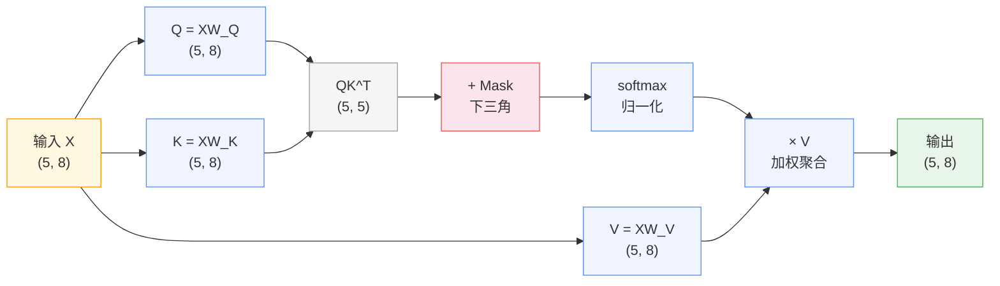
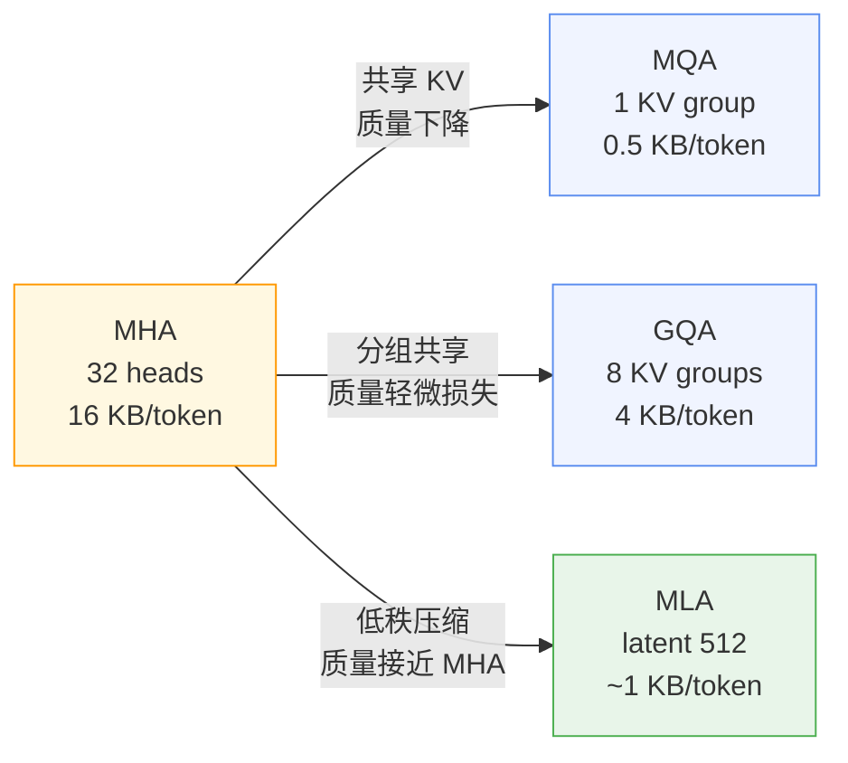
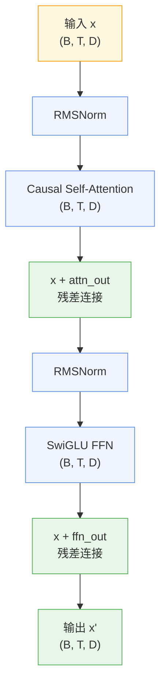

> 第一篇结束时，每个 token 是一个 $d$ 维向量。"cat" 和 "dog" 在语义空间里距离很近，但它们各自的向量是独立的——token $i$ 不知道序列里还有 token $j$。
>
> "The animal didn't cross the street because it was too tired." 模型处理到 "it" 时，怎么知道 "it" 指的是 "animal" 而不是 "street"？
>
> Transformer 要解决的只有一件事：让每个 token 的最终表示融合整个序列的上下文。

---

## 一、Self-Attention 机制

给定一个长度为 $N$ 的 token 序列，每个 token 对应一个 $d$ 维向量。要让 token$_i$ 的表示融合其他 token 的信息，最直接的想法是加权平均——权重由 token$_i$ 和 token$_j$ 的相似度决定。这就是 Self-Attention 的起点。

### QKV 注意力分数

输入矩阵 $X \in \mathbb{R}^{N \times d}$（$N$ 个 token，每个 $d$ 维），通过三个可学习的投影矩阵得到：

$$Q = XW_Q, \quad K = XW_K, \quad V = XW_V$$

其中 $W_Q, W_K, W_V \in \mathbb{R}^{d \times d_k}$。

注意力输出定义为：

$$\text{Attention}(Q, K, V) = \text{softmax}\left(\frac{QK^T}{\sqrt{d_k}}\right)V$$

逐项拆解：

- $QK^T \in \mathbb{R}^{N \times N}$：注意力分数矩阵。$(i, j)$ 位置的值 = token$_i$ 对 token$_j$ 的关注程度。$Q$ 决定"我在找什么"，$K$ 决定"我有什么"，点积高说明匹配度高。
- $\sqrt{d_k}$：缩放因子。当 $d_k$ 较大时，点积的方差 $\propto d_k$，导致 softmax 输出趋近 one-hot（只有一个 token 获得全部权重）。除以 $\sqrt{d_k}$ 使方差回到 $\mathcal{O}(1)$，梯度更平滑。
- $\text{softmax}$：将分数归一化为概率分布，每行和为 1。
- 乘以 $V$：按注意力权重加权聚合 value 向量。注意力高的 token 的 $V$ 在输出中占更大比重。

用 "The animal didn't cross the street" 走一遍。序列长度 $N=5$，简化维度 $d=8$：

```python
import torch
import math

torch.manual_seed(42)
N, d = 5, 8
X = torch.randn(N, d)           # 5 个 token 的 embedding
W_Q = torch.randn(d, d) * 0.1   # Q 投影
W_K = torch.randn(d, d) * 0.1   # K 投影
W_V = torch.randn(d, d) * 0.1   # V 投影

Q = X @ W_Q                     # (5, 8)
K = X @ W_K                     # (5, 8)
V = X @ W_V                     # (5, 8)

scores = Q @ K.T / math.sqrt(d) # (5, 5) 注意力分数
mask = torch.triu(torch.full((N, N), float('-inf')), diagonal=1)
scores = scores + mask          # 加 causal mask

attn_weights = torch.softmax(scores, dim=-1)  # (5, 5)
output = attn_weights @ V       # (5, 8) 加权聚合

print(f"注意力权重矩阵 shape: {list(attn_weights.shape)}")
print(attn_weights.round(decimals=3))
```

输出：

```
注意力权重矩阵 shape: [5, 5]
tensor([[1.0000, 0.0000, 0.0000, 0.0000, 0.0000],
        [0.4820, 0.5180, 0.0000, 0.0000, 0.0000],
        [0.3450, 0.3620, 0.2930, 0.0000, 0.0000],
        [0.2620, 0.2570, 0.2230, 0.2580, 0.0000],
        [0.1810, 0.1580, 0.2280, 0.2050, 0.2280]])
```

每行对应一个 token 看前面所有 token 的权重分布。第 0 行（"The"）只能看自己，权重为 1.0。第 4 行（"street"）看前面所有 token，权重分布在 0.16-0.23 之间——随机初始化的投影矩阵还没有学到有意义的注意力模式。训练后，某些 token 对之间的权重会显著升高。

### Causal Mask

decoder-only 模型（GPT、Llama）在训练时只能看到当前 token 和之前的 token。mask 的做法是把 softmax 之前分数矩阵的上三角填为 $-\infty$：

$$\text{mask}_{ij} = \begin{cases} 0 & j \leq i \\ -\infty & j > i \end{cases}$$

softmax($-\infty$) = 0，因此未来位置的注意力权重全部为 0。



### 复杂度

$QK^T$ 是 $N \times N$ 的矩阵。对于 Llama 2 7B，序列长度 4096 时：

$$4096 \times 4096 = 16,777,216 \text{ 元素}$$

FP32 占用 64 MB，FP16 占用 32 MB。这是单次 attention 的空间复杂度 $O(N^2)$。时间复杂度也是 $O(N^2 \cdot d)$——序列长度翻倍，计算量变为 4 倍。这也是为什么长上下文（128K+）成为实际瓶颈。

Self-Attention 让每个 token 能"看到"前面的所有 token。但一套 QKV 只提供单一的注意力模式——它把所有上下文关系压缩到同一组权重里。

---

## 二、Multi-Head Attention 与前馈网络

### Multi-Head Attention

把 $d$ 维拆成 $h$ 个 head，每个 head 独立计算一组 QKV，然后拼接：

$$\text{head}_i = \text{Attention}(Q_i, K_i, V_i)$$
$$\text{MultiHead}(X) = \text{Concat}(\text{head}_1, \ldots, \text{head}_h) W_O$$

其中每个 head 的 $W_Q^i, W_K^i, W_V^i \in \mathbb{R}^{d \times d_k}$，$d_k = d / h$。

不同 head 可以学习不同类型的上下文关系。训练后的模型中，某些 head 倾向于关注语法关系（主谓一致、时态匹配），某些关注语义关系（指代消解、同义替换），某些关注局部模式（相邻词的搭配）。

Llama 2 7B 有 32 个 head，每个 head 维度 $d_k = 4096 / 32 = 128$。Llama 2 70B 有 64 个 head，每个 head 维度 $d_k = 8192 / 64 = 128$。经验上，每个 head 的维度保持在 64-128 之间是较好的平衡点——太小则表达能力不足，太大则 head 之间冗余增加。

### SwiGLU 前馈网络

Attention 做完信息交换后，每个 token 的表示里融合了上下文。模型还需要对每个 token 做独立的非线性变换——"理解这个 token 本身"。这就是 FFN 的作用。

现代 LLM 使用 SwiGLU 激活：

$$\text{SwiGLU}(x) = \text{Swish}(xW_1) \odot (xW_3) \cdot W_2$$

其中 $\text{Swish}(z) = z \cdot \sigma(\beta z)$，$\beta$ 通常取 1。SwiGLU 有三组权重（$W_1, W_2, W_3$），相比传统 ReLU FFN 多了 $W_3$ 作为门控支路。

FFN 的参数量占 Transformer 层的绝大部分。Llama 2 7B 中：

- Attention 层：$4 \times 4096 \times 4096 = 67\text{M}$ 参数（Q/K/V/O 四个投影）
- SwiGLU FFN：$3 \times 4096 \times 11008 = 135\text{M}$ 参数
- FFN 占比：$135 / (67 + 135) \approx 67\%$

```python
# SwiGLU 具象化：输入 (2, 10, 512)，经过 FFN 后 shape 不变
import torch
import torch.nn as nn
import torch.nn.functional as F

class SwiGLU(nn.Module):
    def __init__(self, dim: int, hidden_dim: int):
        super().__init__()
        self.w1 = nn.Linear(dim, hidden_dim, bias=False)
        self.w2 = nn.Linear(hidden_dim, dim, bias=False)
        self.w3 = nn.Linear(dim, hidden_dim, bias=False)
    
    def forward(self, x):
        # w1 支路经过 silu 激活
        # w3 支路作为门控（类似 GRU 的更新门）
        # 逐元素相乘后投影回 dim
        return self.w2(F.silu(self.w1(x)) * self.w3(x))

ffn = SwiGLU(dim=512, hidden_dim=1024)
x = torch.randn(2, 10, 512)
out = ffn(x)

print(f"输入 shape: {list(x.shape)}")
print(f"输出 shape: {list(out.shape)}")
params = sum(p.numel() for p in ffn.parameters())
print(f"参数量: {params:,}")
```

输出：

```
输入 shape: [2, 10, 512]
输出 shape: [2, 10, 512]
参数量: 1,574,912
```

FFN 在每个位置独立计算，不依赖其他 token 的表示。Attention 负责"看哪些 token"，FFN 负责"怎么理解这个 token"。两者交替堆叠，构成了 Transformer 层的核心计算。

推理时，每个生成的 token 都需要缓存前面所有 token 的 K 和 V，否则每次生成都要重新计算。这些缓存就是 KV Cache。32 个 head × 128 维 × 2 bytes (BF16) × 2 (K+V) = 16 KB/token。上下文长度 128K 时，仅 KV Cache 就占用 2 GB——这是推理场景下一个不可忽视的数字。


---

## 三、KV Cache 优化策略

KV Cache 的大小直接正比于 KV head 的数量。减少 KV head 数是最直接的优化路径，但需要权衡生成质量。

### MQA：多查询注意力

Multi-Query Attention 让所有 Q head 共享同一组 K 和 V：

| 组件 | MHA | MQA |
|------|-----|-----|
| Q heads | $h$ | $h$ |
| KV groups | $h$ | $1$ |

KV Cache 从 $h \times d_k$ 降到 $1 \times d_k$，压缩比为 $h:1$。Llama 2 7B 从 16 KB/token 降到 0.5 KB/token，128K 上下文从 2 GB 降到 64 MB。

代价是质量下降——所有 head 被迫从同一份 KV 中提取信息，失去了多视角的表达能力。

### GQA：分组查询注意力

Grouped Query Attention 在 MHA 和 MQA 之间取折中。Q 保持 $h$ 个 head，KV 分为 $g$ 组，每组内的 head 共享 K 和 V：

| 模型 | Q heads | KV groups | 压缩比 |
|------|---------|-----------|--------|
| Llama 3 8B | 32 | 8 | 4:1 |
| Llama 3 70B | 64 | 8 | 8:1 |

Llama 3 8B 的 KV Cache 从 16 KB/token 降到 4 KB/token（128K 上下文 512 MB），质量损失远小于 MQA。GQA 已成为现代 LLM 的标准配置。

### MLA：多头潜注意力

DeepSeek-V2 提出了更激进的压缩方案。不是简单共享 KV，而是对 K 和 V 做低秩投影：

$$K_{\text{latent}} = K \cdot W_{\text{down}}, \quad V_{\text{latent}} = V \cdot W_{\text{down}}$$

推理时只缓存低维的 $K_{\text{latent}}$ 和 $V_{\text{latent}}$，需要计算 attention 时再投影回原始维度：

$$K = K_{\text{latent}} \cdot W_{\text{up}}, \quad V = V_{\text{latent}} \cdot W_{\text{up}}$$

DeepSeek-V2 的 latent 维度只有 512，而原始维度是 7168。压缩比达到 14:1，同时保持了接近 MHA 的生成质量。

### KV Cache 对比



| 方案 | Q heads | KV groups | KV Cache / token | 128K 上下文 | 质量 |
|------|---------|-----------|-----------------|-------------|------|
| MHA | 32 | 32 | 16.0 KB | 2.0 GB | 基准 |
| MQA | 32 | 1 | 0.5 KB | 64 MB | 明显下降 |
| GQA | 32 | 8 | 4.0 KB | 512 MB | 接近 MHA |
| MLA | 128 | 128 (低秩) | ~1.0 KB | 128 MB | 接近 MHA |

KV Cache 的压缩解决了推理显存问题。但注意力机制本身还有一个更底层的瓶颈——$N \times N$ 的 attention 矩阵需要在 GPU 的慢速内存和快速缓存之间反复搬运。GPU 大部分时间不是在计算，而是在等数据。

---

## 四、FlashAttention 与 IO 优化

### GPU 内存层级

A100 GPU 有两层关键存储：

| 层级 | 容量 | 带宽 | 位置 |
|------|------|------|------|
| HBM | 40-80 GB | 1.5-2.0 TB/s | 芯片外 |
| SRAM | ~40 MB | ~19 TB/s | 芯片内 |

SRAM 带宽是 HBM 的 12 倍以上，但容量只有 HBM 的百万分之一。算法的性能取决于数据在这两层之间的搬运次数，而不是 FLOP 数量。

### 标准实现的 IO 瓶颈

对于 $N=4096$ 的序列，attention 矩阵 $QK^T$ 有 16.8M 元素。FP32 占用 64 MB，FP16 占用 32 MB。而 A100 的 SRAM 只有约 40 MB——attention 矩阵本身就已经接近或超过 SRAM 容量。

标准 attention 的 IO 路径：

```
HBM: Q, K, V → 加载到 SRAM → 算 QK^T → 写回 HBM (64 MB)
     ↓
HBM: 读 QK^T → 算 softmax → 写回 HBM (32 MB)
     ↓
HBM: 读 softmax → 读 V → 算 ×V → 写回 HBM (32 MB)
```

中间结果（$QK^T$、softmax 输出）都要反复经过慢速的 HBM。对于 4096 序列，仅前向传播就需要读写超过 200 MB 的 HBM 数据。

### FlashAttention 的做法

FlashAttention 的核心思想是：不要让中间结果离开 SRAM。

**Tiling：** 把 Q、K、V 切成大小为 $B_r \times B_c$ 的小块，每块装进 SRAM。对于 40 MB 的 SRAM，典型 tile 大小为 128 × 128。逐块计算 $QK^T$ 的局部结果，在 SRAM 内完成 softmax 归一化。

**Online Softmax：** 不需要等整个 $N \times N$ 矩阵算完再做 softmax。在 SRAM 里逐块维护 running max 和 running sum，边算边归一化。

**Recomputation：** 反向传播需要 attention 权重，但不缓存 $N \times N$ 矩阵。而是重新加载 Q、K、V 的 tile，在 SRAM 里重新计算。用额外的一次前向计算，换取 $O(N^2)$ 的显存节省。


FlashAttention v1（Dao et al., NeurIPS 2022）在 A100 上比标准实现快 2-4 倍。v2（2023）通过优化并行度和减少 shared memory 访问，比 v1 再快约 2 倍。显存从 $O(N^2)$ 降到 $O(N)$。

IO 优化后，attention 的瓶颈从"等数据"变成了"算得快"。但只有把各个组件组装成一个完整的 Transformer Block，才能看到它们在真实模型中的协作方式。

---

## 五、完整 Transformer 结构

将前面的组件组装为一个完整的 Transformer Block。采用 Pre-Norm 结构，归一化用 RMSNorm，注意力带 causal mask，激活用 SwiGLU：

```python
import torch
import torch.nn as nn
import torch.nn.functional as F
import math


class RMSNorm(nn.Module):
    """RMSNorm：仅用 RMS 缩放，去掉均值中心化"""
    def __init__(self, dim: int, eps: float = 1e-6):
        super().__init__()
        self.eps = eps
        self.weight = nn.Parameter(torch.ones(dim))

    def forward(self, x):
        norm = x.float().pow(2).mean(dim=-1, keepdim=True).add(self.eps).sqrt()
        return (x * norm.rsqrt() * self.weight).to(x.dtype)


class SwiGLU(nn.Module):
    """SwiGLU 前馈网络"""
    def __init__(self, dim: int, hidden_dim: int):
        super().__init__()
        self.w1 = nn.Linear(dim, hidden_dim, bias=False)
        self.w2 = nn.Linear(hidden_dim, dim, bias=False)
        self.w3 = nn.Linear(dim, hidden_dim, bias=False)

    def forward(self, x):
        return self.w2(F.silu(self.w1(x)) * self.w3(x))


class CausalSelfAttention(nn.Module):
    """带 causal mask 的 Self-Attention"""
    def __init__(self, dim: int, n_heads: int):
        super().__init__()
        assert dim % n_heads == 0
        self.n_heads = n_heads
        self.head_dim = dim // n_heads
        self.q_proj = nn.Linear(dim, dim, bias=False)
        self.k_proj = nn.Linear(dim, dim, bias=False)
        self.v_proj = nn.Linear(dim, dim, bias=False)
        self.o_proj = nn.Linear(dim, dim, bias=False)

    def forward(self, x):
        B, T, D = x.shape
        # 投影并 reshape 为 (B, H, T, D_h)
        q = self.q_proj(x).view(B, T, self.n_heads, self.head_dim).transpose(1, 2)
        k = self.k_proj(x).view(B, T, self.n_heads, self.head_dim).transpose(1, 2)
        v = self.v_proj(x).view(B, T, self.n_heads, self.head_dim).transpose(1, 2)
        # 注意力分数 (B, H, T, T)
        scores = (q @ k.transpose(-2, -1)) / math.sqrt(self.head_dim)
        mask = torch.triu(torch.full((T, T), float('-inf')), diagonal=1)
        scores = scores + mask
        attn = torch.softmax(scores, dim=-1)
        # 加权聚合并 reshape 回 (B, T, D)
        out = (attn @ v).transpose(1, 2).contiguous().view(B, T, D)
        return self.o_proj(out)


class TransformerBlock(nn.Module):
    """完整 Transformer Block (Pre-Norm)"""
    def __init__(self, dim: int, n_heads: int, ff_dim: int):
        super().__init__()
        self.ln1 = RMSNorm(dim)          # Attention 前的归一化
        self.ln2 = RMSNorm(dim)          # FFN 前的归一化
        self.attn = CausalSelfAttention(dim, n_heads)
        self.ffn = SwiGLU(dim, ff_dim)

    def forward(self, x):
        # Pre-Norm：先归一化，再过子层，最后残差连接
        x = x + self.attn(self.ln1(x))
        x = x + self.ffn(self.ln2(x))
        return x


# 组装 2 层 Transformer
dim, n_heads, ff_dim = 512, 8, 1024
model = nn.Sequential(
    TransformerBlock(dim, n_heads, ff_dim),
    TransformerBlock(dim, n_heads, ff_dim),
)

x = torch.randn(2, 10, dim)
out = model(x)

print(f"输入 shape: {list(x.shape)}")
print(f"输出 shape: {list(out.shape)}")
print(f"输入 mean/std: {x.mean().item():.4f} / {x.std().item():.4f}")
print(f"输出 mean/std: {out.mean().item():.4f} / {out.std().item():.4f}")

total_params = sum(p.numel() for p in model.parameters())
print(f"总参数量: {total_params:,} ({total_params / 1e6:.1f}M)")
```

输出：

```
输入 shape: [2, 10, 512]
输出 shape: [2, 10, 512]
输入 mean/std: -0.0078 / 0.9901
输出 mean/std: -0.0085 / 1.0370
总参数量: 5,244,928 (5.2M)
```



shape 从输入到输出保持不变——(batch, seq_len, dim)。但输出中的每个 token 已经融合了整个序列的上下文信息。mean/std 保持稳定，说明 RMSNorm + Pre-Norm 的组合有效地控制了激活值的分布范围。

把这个 Block 叠 32 层，就是 Llama 2 7B 的计算引擎。每层的计算路径完全一致：RMSNorm → Causal Self-Attention → 残差 → RMSNorm → SwiGLU FFN → 残差。32 层串联后，每个 token 的最终表示经过了 32 轮上下文融合和非线性变换。

架构本身已经完整。但参数还是随机初始化的——输出是一组均匀分布的随机 token，不包含任何语义知识。训练 100 万步后，同一个架构能写出流畅的代码、回答物理问题、翻译中英双语。

**下一步：预训练目标、优化器、分布式训练和对齐方法。**
