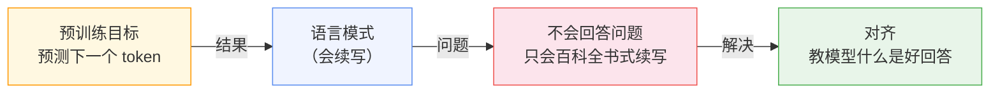
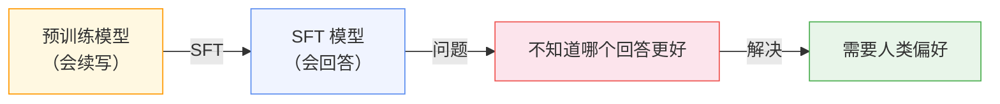
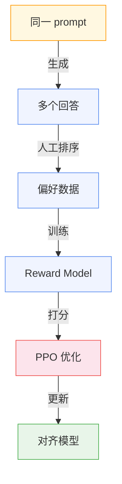
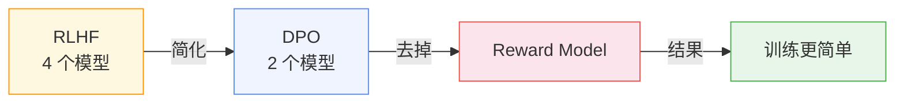
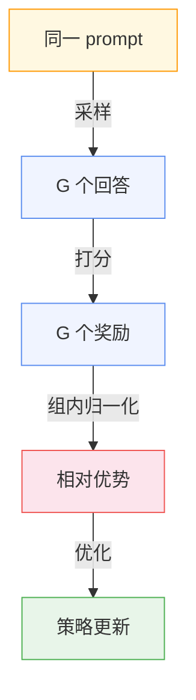
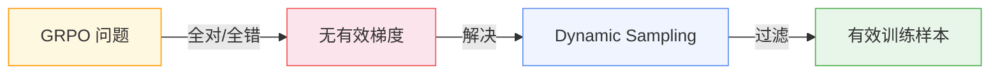
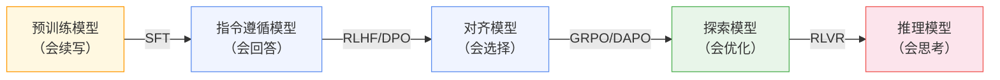

> 你做了一个客服机器人。用户问："我的订单什么时候到？"
> 
> 预训练模型的回答是："我的订单什么时候到？这是一个常见的问题。订单的到达时间取决于多个因素，包括发货地、目的地、物流公司..."
> 
> 用户要的是一个具体的日期，不是一篇物流科普文章。

这是每个做 LLM 应用的人都会遇到的问题：预训练模型会写文章，但不会回答问题。

你可能觉得这是 prompt 的问题，试了各种 prompt engineering 技巧，发现效果有限。根本原因不在 prompt，而在模型本身——它没有学过"什么是好的回答"。

本篇讲的就是如何让模型从"会写"变成"会答"。

---

## 一、预训练模型为什么不会回答问题

预训练的目标是预测下一个 token。这个目标让模型学会了语言的统计规律，但没有教它什么是"好的回答"。

你问它"我的订单什么时候到"，它会续写"我的订单什么时候到？这是一个常见的问题..."——因为它在训练数据里见过最多的就是这种"百科全书式"的写法。

问题出在损失函数：

$$\mathcal{L} = -\frac{1}{T}\sum_{t=1}^{T} \log P(x_t | x_1, \ldots, x_{t-1}; \theta)$$

这个函数只关心"预测准不准"，不关心"回答好不好"。模型学会了语言的模式，但不知道人类想要什么样的回答。

**核心洞察：** 预训练让模型学会了"怎么说"，但没有教它"说什么"。这是两个完全不同的能力。



---

## 二、SFT：教模型模仿人类

最直接的解决方案是：给模型看一批人类写好的回答，让它学会模仿。

这就是 SFT（Supervised Fine-Tuning）。你收集一批 `(instruction, response)` 对，用监督学习微调模型。

```python
# SFT 数据：客服场景
sft_example = {
    "instruction": "我的订单什么时候到？",
    "response": "您的订单预计明天到达。如有问题，请联系客服。"
}
```

SFT 的损失函数和预训练一样是交叉熵，但只在 response 部分计算：

```python
def sft_loss(model, instruction, response):
    input_ids = tokenize(instruction + response)
    labels = input_ids.clone()
    labels[:len(tokenize(instruction))] = -100  # 忽略 instruction 部分
    
    logits = model(input_ids)
    loss = nn.CrossEntropyLoss()(logits.view(-1, vocab_size), labels.view(-1))
    return loss
```

为什么 instruction 部分的 loss 要忽略？因为 instruction 是输入，不是模型要学习的输出。模型只需要学会"看到这个 instruction 后，生成这个 response"。

**认知反转：** SFT 的效果取决于数据质量，不是数量。LIMA 论文用 1000 条高质量数据就达到了不错的效果。这说明模型在预训练阶段已经学到了足够的知识，SFT 只是教它"怎么说"。

但 SFT 有个根本问题：它只能模仿，不能选择。



---

## 三、RLHF：让人类告诉模型哪个更好

SFT 只教了模仿，没有教选择。同一个问题可能有多个回答，哪个更好？

```python
prompt = "我的订单什么时候到？"

response_a = "您的订单预计明天到达。"
response_b = "您的订单预计明天到达。如有问题，请联系客服。"
response_c = "您的订单什么时候到？这是一个常见的问题。订单的到达时间取决于多个因素..."

# 哪个更好？SFT 无法判断
# 需要人类告诉模型：response_b > response_a > response_c
```

RLHF（Reinforcement Learning from Human Feedback）的核心思想是：让人类告诉模型"哪个回答更好"，然后用强化学习优化模型。

**三步流程：**

**第一步：收集偏好数据**

对同一个 prompt，让模型生成多个回答，人工排序。

```python
prompt = "我的订单什么时候到？"
responses = [
    "您的订单预计明天到达。",
    "您的订单预计明天到达。如有问题，请联系客服。",
    "您的订单什么时候到？这是一个常见的问题..."
]
# 人工排序：response_b > response_a > response_c
preferences = [
    (responses[1], responses[0]),  # response_b 优于 response_a
    (responses[1], responses[2]),  # response_b 优于 response_c
    (responses[0], responses[2]),  # response_a 优于 response_c
]
```

**第二步：训练 Reward Model**

用偏好数据训练一个打分模型 $r_\phi(x, y)$。这个模型学会预测人类偏好：给一个 (prompt, response) 对，输出一个分数。

```python
class RewardModel(nn.Module):
    def __init__(self, base_model):
        super().__init__()
        self.base_model = base_model
        self.reward_head = nn.Linear(hidden_dim, 1)
    
    def forward(self, input_ids):
        hidden = self.base_model(input_ids)[:, -1, :]  # 取最后一个 token
        reward = self.reward_head(hidden)
        return reward

# 训练：让偏好回答的分数高于被拒绝回答
def reward_loss(rm, prompt, preferred, rejected):
    preferred_reward = rm(tokenize(prompt + preferred))
    rejected_reward = rm(tokenize(prompt + rejected))
    loss = -torch.log(torch.sigmoid(preferred_reward - rejected_reward))
    return loss
```

**第三步：PPO 优化策略**

用 Reward Model 的打分来优化语言模型。但不能直接最大化 reward——那样模型可能会生成"讨好" Reward Model 的回答，而不是真正好的回答。所以要用 KL 散度约束，让模型不要偏离 SFT 模型太远。

$$\mathcal{L}_{\text{PPO}} = \mathbb{E}_{y \sim \pi_\theta}\left[r_\phi(x, y) - \beta \text{KL}(\pi_\theta \| \pi_{\text{ref}})\right]$$

这个公式里：
- $r_\phi(x, y)$：Reward Model 的打分，告诉模型"这个回答有多好"
- $\beta \text{KL}(\pi_\theta \| \pi_{\text{ref}})$：KL 散度惩罚，防止模型偏离 SFT 模型太远

如果删掉 KL 项会怎样？模型会生成"讨好" Reward Model 的回答——可能语法正确、逻辑通顺，但不是人类真正想要的。这就是所谓的"reward hacking"。



**RLHF 的问题：** 需要维护 4 个模型（Policy, Reference, Reward, Value），显存开销大，工程复杂。训练时需要同时跑 4 个模型的前向传播，对硬件要求很高。

ChatGPT 就是用 RLHF 训练的。但 OpenAI 有大量 GPU 资源，普通团队很难复现。有没有更简洁的方案？

---

## 四、DPO：去掉 Reward Model

RLHF 的复杂性主要来自 Reward Model 的训练和 PPO 的优化。DPO（Direct Preference Optimization）的核心 insight 是：可以绕过 Reward Model，直接从偏好数据优化策略。

这个 insight 来自一个数学推导：RLHF 的最优解可以重写为一个简单的分类损失。

DPO 的损失函数：

$$\mathcal{L}_{\text{DPO}} = -\mathbb{E}_{(x, y_w, y_l)}\left[\log \sigma\left(\beta \log \frac{\pi_\theta(y_w|x)}{\pi_{\text{ref}}(y_w|x)} - \beta \log \frac{\pi_\theta(y_l|x)}{\pi_{\text{ref}}(y_l|x)}\right)\right]$$

其中 $y_w$ 是偏好回答，$y_l$ 是被拒绝回答。

这个公式里：
- $\log \frac{\pi_\theta(y_w|x)}{\pi_{\text{ref}}(y_w|x)}$：策略模型相对于参考模型对偏好回答的"偏好程度"
- $\log \frac{\pi_\theta(y_l|x)}{\pi_{\text{ref}}(y_l|x)}$：策略模型相对于参考模型对被拒绝回答的"偏好程度"
- 两者相减：让模型更倾向于生成偏好回答，远离被拒绝回答

如果删掉参考模型的 log 概率会怎样？模型会直接最大化偏好回答的概率，忽略与参考模型的差异。这会导致模型生成"奇怪"的回答——虽然概率高，但不是人类想要的。

**核心洞察：** DPO 的本质是让模型学习"相对偏好"，而不是"绝对好坏"。这比 RLHF 更稳定，因为相对偏好比绝对打分更容易标注。



DPO 是离线方法，只能从已有的偏好数据学习。有没有在线方法，让模型在训练过程中自己探索？

---

## 五、GRPO：让模型自己探索

DPO 的局限是它只能从已有的偏好数据学习。DeepSeek-R1 提出了 GRPO（Group Relative Policy Optimization），让模型在训练过程中自己生成回答，然后组内比较。

**核心思想：** 对每个 prompt 采样 G 个回答，用组内相对排名估计优势：

$$\text{Advantage}_i = \frac{r_i - \text{mean}(r)}{\text{std}(r)}$$

这个公式的含义是：一个回答的好坏不是绝对的，而是相对于同组其他回答的。如果一个回答比组内平均好，它的 advantage 就是正的；反之就是负的。

**认知反转：** GRPO 去掉了 Critic（Value Model），用组内相对比较代替绝对打分。这让训练更简单，显存需求更低。DeepSeek-R1 用 GRPO 训练出了强大的推理能力，证明了这种方法的有效性。



---

## 六、DAPO：工业级改进

GRPO 在工业实践中遇到了新问题：某些 prompt 的所有回答都对或都错，无法提供有效梯度。

举个例子：假设一个简单的数学题 "1+1=?"，模型生成的 8 个回答全是 "2"。所有回答的奖励都一样，advantage 全是 0，梯度为 0，模型无法从这个 prompt 学到任何东西。

DAPO（Dynamic Sampling Policy Optimization）解决了这个问题。

**四个关键技术：**

**Clip-Higher：** 放宽正 Advantage 的 clipping 上界，鼓励探索。PPO 的 clipping 会限制策略更新幅度，但 DAPO 发现对正 Advantage 放宽限制可以让模型更积极地探索好的回答。

**Dynamic Sampling：** 过滤全对/全错的 prompt。如果一个 prompt 的所有回答都对或都错，说明这个 prompt 对当前模型没有学习价值，直接跳过。

**Overlong Filtering：** 超长回答 reward 设为 0（非负奖励），避免惩罚短回答。有些模型会生成很长的回答来"凑"奖励，DAPO 通过设置长度上限来避免这个问题。

**Token-level Loss：** 按 token 计算损失，避免长序列被过度加权。传统方法按 sequence 计算 loss，长序列的梯度会更大。DAPO 改为按 token 计算，让每个 token 的贡献相等。



---

## 七、RLVR：可验证领域的对齐

前面的对齐方法都需要人类标注或学习得到的奖励模型。在数学、代码等可验证领域，可以用基于规则的确定性验证器提供奖励。

**数学验证：**

```python
def math_verifier(question, response):
    """数学验证器"""
    # 从 response 中提取答案
    extracted_answer = extract_answer(response)
    # 与标准答案比较
    ground_truth = get_ground_truth(question)
    return 1.0 if extracted_answer == ground_truth else 0.0
```

**代码验证：**

```python
def code_verifier(question, response):
    """代码验证器"""
    # 提取代码
    code = extract_code(response)
    # 在沙箱中运行测试用例
    test_cases = get_test_cases(question)
    for input_data, expected_output in test_cases:
        actual_output = run_in_sandbox(code, input_data)
        if actual_output != expected_output:
            return 0.0
    return 1.0
```

RLVR 的好处是：不需要人类标注，奖励信号完全自动化。这使得训练可以大规模扩展，不需要昂贵的人工标注。

DeepSeek-R1 使用 RLVR + GRPO 训练，模型自发涌现出自我反思、多路径探索等推理行为。这说明 RLVR 不仅能提升准确性，还能激发模型的推理能力。

**DeepSeek-R1 的完整流程：**
1. **SFT 冷启动：** 用含思维链的指令数据微调，学会格式与基础推理
2. **RL 推理训练 (RLVR)：** 在数学、代码等可验证领域用 GRPO/DAPO 训练
3. **偏好对齐：** 用 DPO 或 RLHF 进行最终对齐
4. **蒸馏（可选）：** 用大模型生成推理数据，蒸馏至小模型

---

回到开篇的问题："我的订单什么时候到？"

预训练模型会续写，SFT 模型会回答，RLHF/DPO 模型会选择好的回答，GRPO/DAPO 模型会优化回答，RLVR 模型会推理后回答。

对齐方法的演进遵循同一模式：从模仿到选择，从离线到在线，从人工标注到自动验证。




每一步改进都在解决前一步的问题：SFT 解决了"会回答"，RLHF 解决了"会选择"，DPO 去掉了 Reward Model，GRPO 去掉了 Critic，DAPO 解决了工业实践问题，RLVR 解决了标注成本问题。
