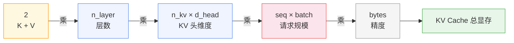
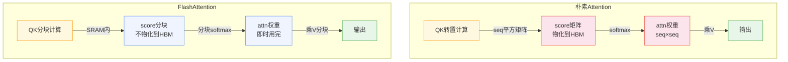

> 一个 Llama 2 7B 模型，FP16 权重 13GB。把它装进 A100 40GB，看上去绰绰有余。batch size 拉到 8，上下文设 4096，跑两步 OOM 了。13GB 的模型在 40GB 的卡上怎么会爆？
>
> 原因是显存的主体不止权重。KV Cache 随请求数和上下文长度线性增长，注意力中间结果随序列长度平方膨胀，框架的 workspace、通信 buffer 还要再吃一块。三块加起来，部署前不算清楚，运维线上就要在 dashboard 里看 OOM 告警。
>
> 这篇文章回答一个具体问题：给定模型、上下文长度和并发请求数，一张卡到底会占多少显存。

## 一、权重的显存

最直觉的部分。模型的参数量 $N$ 是一个固定数字，权重显存等于参数量乘以每个参数占的字节数：

$$\text{WeightMem} = N \times \text{bytes/param}$$

Llama 2 7B 标称 7B，实际参数量约 6.7B（含 embedding 与每一层的 attention/FFN 矩阵，typical 配置下 HF safetensors 实测 13.0GB 左右）。把它用不同精度加载：

| 精度 | bytes/param | Llama 2 7B | Llama 3 70B |
|------|-------------|------------|-------------|
| FP32 | 4 | 26.8 GB | 262.8 GB |
| FP16 / BF16 | 2 | 13.4 GB | 131.4 GB |
| FP8 | 1 | 6.7 GB | 65.7 GB |
| INT4 | 0.5 | 3.4 GB | 32.9 GB |

```python
# 权重的显存本质就是参数量 × 字节宽度
params_7b = 6.7e9
for name, b in [("FP32",4), ("FP16",2), ("FP8",1), ("INT4",0.5)]:
    print(f"{name:5s}: {params_7b * b / 1024**3:.2f} GB")
# FP32 : 24.91 GB
# FP16 : 12.45 GB
# FP8  : 6.23 GB
# INT4 : 3.11 GB
```


权重的结构里，embedding 与 lm_head 是两个候选大头。Llama 2 7B 采用 embedding tying（输入 embedding 和输出 lm_head 共享权重），词表 32000 × 4096 ≈ 131M 参数只算一次，占总参数 2%；Llama 3 70B 取消 tying，且词表扩到 128256，embedding + lm_head 各占约 1.05B 参数，合计 2.1B，占 70B 总量的 3%。占比都不高——推理显存里真正的大头来自随请求线性膨胀的运行时部分，下面这一项就是。

KV Cache 概念本身（为什么要缓存、命中前后的计算量差异）在上一篇已经讲过，这里不再展开。聚焦到显存视角：KV Cache 是常驻权重之外、与请求规模直接挂钩的占用。

## 二、KV Cache 的显存

每生成一个 token，模型要在每一层保留这个 token 的 Key 和 Value 向量，后续 token 才能复用——这些向量在显存里堆起来就是 KV Cache。它随上下文长度和 batch size 线性增长，是推理显存里最容易失控的一项。

正确的公式对 GQA/MHA 都成立：

$$\text{KVMem} = \underbrace{2}_{K\text{ 和 }V} \times n_{\text{layer}} \times n_{\text{kv}} \times d_{\text{head}} \times \text{seq} \times \text{batch} \times \text{bytes}$$

其中 $d_{\text{head}}$ 是每个注意力头的维度，$n_{\text{kv}}$ 是 KV 分组数。对原始的 MHA，$n_{\text{kv}} = n_{\text{head}}$，公式化简为 $2 \times n_{\text{layer}} \times d_{\text{hidden}} \times \text{seq} \times \text{batch} \times \text{bytes}$。

这里特别要注意一个常见错误。网上不少估算文章直接拿 $d_{\text{hidden}}$ 写公式：

$$\text{KVMem} \stackrel{?}{=} 2 \times n_{\text{layer}} \times d_{\text{hidden}} \times \text{seq} \times \text{batch} \times \text{bytes}$$

这个形式只在 MHA 下成立。换成 GQA 模型它会把 KV Cache 高估 $\frac{n_{\text{head}}}{n_{\text{kv}}}$ 倍。Llama 3 70B 用 GQA，$n_{\text{head}}=64$，$n_{\text{kv}}=8$，这个错估正好是 8 倍。实测算一下：

```python
llama3_layers, hidden, n_head, n_kv, d_head = 80, 8192, 64, 8, 128

# 错误公式（沿用 MHA 的 hidden 维度）
wrong = 2 * llama3_layers * hidden * 2          # bytes=2 (FP16)
# 正确公式（用 GQA 实际的 n_kv_head × d_head）
right = 2 * llama3_layers * (n_kv * d_head) * 2

print(f"错误公式: {wrong / 1024**2:.2f} MB/token")
print(f"正确公式: {right / 1024**2:.2f} MB/token")
print(f"高估倍数: {wrong/right:.0f}x")
# 错误公式: 2.50 MB/token
# 正确公式: 0.31 MB/token
# 高估倍数: 8x
```

按正确公式逐项算单 token 的 KV Cache：

| 模型 | 精度 | 单 token KV Cache |
|------|------|-------------------|
| Llama 2 7B（MHA） | FP16 | 0.50 MB |
| Llama 2 7B（MHA） | INT8 | 0.25 MB |
| Llama 3 70B（GQA） | FP16 | 0.31 MB |
| Llama 3 70B（GQA） | FP8 / INT8 | 0.16 MB |

Llama 3 70B 的 GQA 把单 token KV Cache 压到 Llama 2 7B 的六成左右，正是 GQA 在显存侧的核心收益——架构端就把 KV 的乘子做小了，下游一切请求数和上下文长度的乘积都跟着下降。



单 token 是 0.5MB 看着很小，乘上序列长度和 batch 立刻放大几个数量级：

```python
def kv_total(seq, batch, b=2):
    return 0.5 * 1024**2 * seq * batch    # Llama2 7B 0.5MB/token FP16

# batch=8 / 上下文 4096
print(f"bs8 / ctx4K: {kv_total(4096, 8) / 1024**3:.2f} GB")
# bs8 / ctx4K: 16.00 GB
# 拉长上下文
print(f"bs1 / ctx32K: {kv_total(32768, 1) / 1024**3:.2f} GB")
# bs1 / ctx32K: 16.00 GB
```

batch 8、上下文 4K 的多轮客服场景，单个服务的 KV Cache 就吃掉 16GB；batch 1 单把上下文拉到 32K，文档摘要这种长上下文场景也是 16GB。这就是所谓的显存墙：上下文变长 8 倍，KV Cache 也变长 8 倍，几乎不存在"反正模型才 13GB，留 27GB 给运行时怎么也够"这种话——只要业务上需要长上下文或多并发，这块就会撞上来。


到这里常驻权重和运行时 KV Cache 两项抓到位了。但每跑一层 Transformer，中间张量也要在显存里分配空间，这一块同样要算。

## 三、激活值的显存

激活值是前向传播里每一层中间计算的张量：attention 的 projection 结果、softmax 之前的 score 矩阵、FFN 中间层等等。它们在算完一层后理论上能释放，但峰值会卡住显存。

其中最敏感的是 attention score 矩阵。每一层、每个 head、每个样本，都要存一个 $\text{seq} \times \text{seq}$ 的矩阵：

$$\text{AttnScorePeak} = \text{batch} \times n_{\text{head}} \times \text{seq} \times \text{seq} \times \text{bytes}$$

这是随序列长度平方增长的项——seq 翻一倍，这一项涨 4 倍。代入具体场景：

```python
def attn_peak(n_head, seq, batch, b=2):
    return batch * n_head * seq * seq * b

print(f"Llama2-7B bs8 / ctx4K: {attn_peak(32, 4096, 8) / 1024**3:.2f} GB")
# Llama2-7B bs8 / ctx4K: 8.00 GB
print(f"Llama2-7B bs1 / ctx32K: {attn_peak(32, 32768, 1) / 1024**3:.2f} GB")
# Llama2-7B bs1 / ctx32K: 64.00 GB
print(f"Llama3-70B bs1 / ctx4K: {attn_peak(64, 4096, 1) / 1024**3:.2f} GB")
# Llama3-70B bs1 / ctx4K: 2.00 GB
```

Llama 2 7B 在 batch 8、上下文 4K 时，光 attention score 峰值就要 8GB；把上下文推到 32K，单条请求就 64GB——比模型的全部权重还大 5 倍。回到开篇 OOM 的场景，把权重 13GB、KV Cache 16GB、attention 峰值 8GB 加起来已经 37GB，A100 40GB 撑在边缘，加上 PyTorch workspace 与框架临时 buffer，OOM 几乎是必然结果。

朴素 attention 这个 $O(\text{seq}^2)$ 的峰值正是 FlashAttention 解决的核心问题。它把 score 矩阵从显存里的"先物化再 softmax"改成分块在 SRAM 里算，峰值从 $\text{seq}^2$ 降到 $\text{seq}$ 的常数量级。序列长度从 4K 拉到 32K：朴素 attention 的峰值涨 64 倍，Flash 只涨 8 倍。具体机制下一篇单独展开，这里只是先点出：实际推理框架默认都开 FlashAttention，激活显存的工程上限远低于公式给的平方峰值。



除了 attention score，其它激活（Q/K/V 投影、FFN 中间层、RoPE、RMSNorm 输出）随 $\text{batch} \times \text{seq} \times d_{\text{hidden}}$ 线性增长，量级是权重显存的 10%–20%。这部分通常不显式计算，靠推理框架的内存规划（PagedAttention 的 block 分配、vLLM 的 KVCache 池）吸收掉。工程估算时可以往权重显存的 0.15 倍打一个保守数。

到这里常驻权重、KV Cache、激活峰值三块都收入公式了。剩下的问题是——上面所有数字都还有一张牌没翻：精度和切分。

## 四、量化与张量并行

工程上很少让一个 7B 模型以 FP16 在单卡上裸跑——要么压精度换显存，要么多卡摊销。这两件事都是直接乘上文公式里的某个因子。

### 量化的乘法效应

权重显存公式 $\text{WeightMem} = N \times \text{bytes/param}$ 里，量化是直接把 bytes/param 从 2 砍到 0.5。KV Cache 也一样——FP8 KV Cache 把单 token 占用对半砍。

把 Llama 3 70B 用不同精度组合跑（bs1 / ctx32K）：

| 方案 | 权重 | KV Cache | 总计 |
|------|------|----------|------|
| FP16 权重 + FP16 KV | 131 GB | 10.0 GB | 141 GB |
| INT8 权重 + INT8 KV | 65.7 GB | 5.0 GB | 70.7 GB |
| INT4 权重 + INT8 KV | 32.9 GB | 5.0 GB | 37.9 GB |

第三行 INT4 权重 + INT8 KV（GPTQ/AWQ 量化配 FP8 KV 是常见组合）能把 70B 模型压进单张 80GB 卡里跑 32K 上下文。精度损失在现代量化方案下通常小于 1 个点，对生产可用。

### 张量并行的切分

70B 模型 FP16 权重 131GB，单卡无论如何装不下，必须切到多卡。张量并行（TP）按 head 维度把 attention 矩阵切到各卡，权重和激活都按 $\frac{1}{n}$ 分摊：

| 配置 | 每卡权重 | 每卡 KV | 每卡可用 KV 池（80GB 卡） |
|------|----------|---------|--------------------------|
| 单卡 | 131 GB | 装不下 | — |
| TP=2 | 65.7 GB | 5.0 GB/卡 (bs1) | 不到 10 GB |
| TP=4 | 32.9 GB | 2.5 GB/卡 | 47 GB |
| TP=8 | 16.4 GB | 1.25 GB/卡 | 62 GB |

TP 对权重的切分是干净线性；对 KV Cache 的切分稍有出入——KV 分组能均匀切到各卡，但 batch 维度共享的部分（在做 PagedAttention 的 block 池时）框架实现有差异。粗算按 $\frac{1}{n}$ 摊到每卡是合理的下限。

TP 还需要一份 all-reduce 通信的临时 buffer，大小是 $\text{batch} \times \text{seq} \times d_{\text{hidden}} \times \text{bytes}$，正比于激活——这一项大概几百 MB 量级，相对权重和 KV 可忽略，但记在小本本上别漏。


至此，公式里每一个变量都对应到工程上一个真实字段。最后把它们组合起来。

## 端到端公式

把全文的项汇总成一个可直接代入的公式：

$$\boxed{\text{Total} \approx \underbrace{N \cdot b_w}_{\text{权重}} + \underbrace{2 \cdot n_{\text{layer}} \cdot n_{\text{kv}} \cdot d_{\text{head}} \cdot \text{seq} \cdot \text{batch} \cdot b_k}_{\text{KV Cache}} + \underbrace{0.15 \cdot N \cdot b_w}_{\text{激活+workspace}}}$$

$b_w$ 是权重的字节宽度，$b_k$ 是 KV 的字节宽度，二者通常一致但 V8 KV 可以选 FP16/FP8 与权重的 INT4/INT8 不同步。

常见部署目标的速查表（A100 80GB / H100 80GB）：

| 模型 | 精度 | 上下文 | batch | 单卡显存需求 | 推荐配置 |
|------|------|--------|-------|--------------|----------|
| Llama 2 7B | FP16 | 4K | 8 | 约 37 GB（朴素 attn）/ 29 GB（Flash） | 单卡 80GB |
| Llama 2 7B | INT4 | 4K | 8 | 约 27 GB | 单卡 40GB |
| Llama 3 70B | FP16 | 32K | 1 | 141 GB | TP=2 × 80GB |
| Llama 3 70B | INT4+INT8 KV | 32K | 1 | 38 GB | 单卡 80GB |

这张表里每一行都是把上面三项加起来再贴一点框架开销得来的。把部署场景的模型/精度/上下文/batch 代入公式，再算上 10%—15% 的裕量，就是上线前应该摆在容量规划文档里的数字。

公式给的是上限。工程上同一份模型、同一份请求，实际显存峰值仍然会受推理框架的实现影响——PagedAttention 把 KV Cache 拆成 block 池做碎片化管理，vLLM 在连续批处理里按需分配 KV 块，FlashAttention 把 attention score 峰值从显存拽回 SRAM。这些都是把上面公式里的某一项进一步压低。下一篇就讲其中最关键的一项：FlashAttention 是怎么把 $O(\text{seq}^2)$ 的 score 矩阵碾平的。