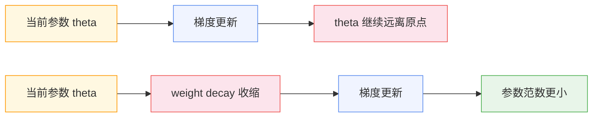
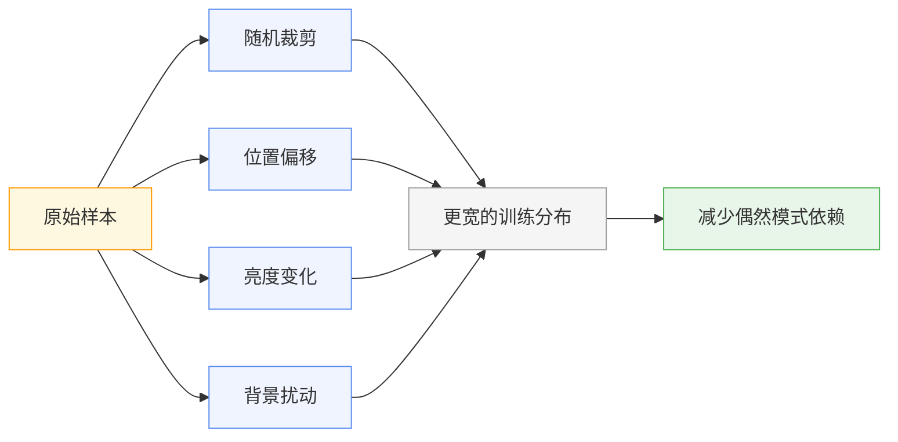

> 最烦人的训练曲线不是 loss 爆炸。
>
> loss 爆炸至少很诚实：学习率太大、梯度溢出、数据有脏样本，问题通常摆在明面上。更麻烦的是另一种情况：train loss 一路下降，val loss 却从某个 checkpoint 开始慢慢抬头。
>
> 训练日志还在告诉你模型变好了，验证集已经在提醒你：它学偏了。

---

## 一、泛化误差与过拟合信号

训练初期，两条曲线通常会一起下降。这个阶段很好判断：模型还在学通用模式，词和词之间的搭配、图像里的边缘和纹理、分类任务里的主要判别特征，都会同时改善训练集和验证集。

真正容易误判的是分叉之后。train loss 继续下降，val loss 反而上升。训练集还在给模型发奖励，验证集已经开始扣分。

这类曲线有欺骗性。你看 optimizer，没有异常；看梯度，没有爆；看训练 loss，还在变好。问题不在模型不学习，问题在它开始学习那些只对训练集有用的东西。

```text
step 1000: train loss = 2.41, val loss = 2.50
step 2000: train loss = 1.92, val loss = 2.05
step 3000: train loss = 1.61, val loss = 2.08
step 4000: train loss = 1.38, val loss = 2.21
```


这组日志里，3000 step 之后已经变味了。train loss 从 1.61 降到 1.38，val loss 却从 2.08 升到 2.21。多训练的 1000 step 没有带来更好的泛化，只是在训练集上刷分。

用误差分解看，这个落差就是 generalization gap：

$$\text{generalization gap} = \mathcal{L}_{\text{val}} - \mathcal{L}_{\text{train}}$$

gap 不是一个抽象指标。它对应的是模型在训练集里多学出来、但验证集不认的那部分能力：噪声、重复样本、偶然相关性。

正则化处理的就是这部分多余能力。它不负责让优化器走得更快，也不保证 train loss 更低。它更像一个刹车：模型想在训练集上继续钻细节时，把自由度往回拉一点。

第一处最容易失控的位置，是参数本身。

---

## 二、参数范数约束

先看参数。

过拟合开始时，模型不一定会出现明显异常。更常见的情况是某些权重悄悄长大：训练集里一个局部模式碰巧有效，模型就不断放大它。只要这个模式能让 train loss 再低一点，优化器就会继续奖励它。

麻烦在验证集上出现。权重越大，模型对输入扰动越敏感；一个本来很弱的特征，可能被放大成决策依据。训练集里它是捷径，验证集里它就是噪声。

L2 正则的做法很粗暴：既然你想把权重推大，那我就在 loss 里给大权重加一笔成本。

$$\mathcal{L}' = \mathcal{L} + \lambda \|\theta\|_2^2$$

这项惩罚会随着参数变大而变大。参数越想长大，loss 里付出的代价越高。

对 SGD 来说，L2 正则和 weight decay 是等价的。因为 L2 项对参数的梯度是 $2\lambda\theta$，更新时会多减掉一项和当前参数成正比的值：

$$\theta_{t+1} = \theta_t - \eta \nabla \mathcal{L}(\theta_t) - 2\eta\lambda\theta_t$$

最后一项就在把参数往 0 拉。

拿一个二维参数做个小例子。初始参数是 $[3, -4]$，范数是 5。每一步使用同样的梯度，比较加不加 weight decay 的差异：

```python
import math

w_no_decay = [3.0, -4.0]
w_decay = [3.0, -4.0]
lr = 0.1
weight_decay = 0.1
grad = [0.2, -0.1]

for _ in range(5):
    w_no_decay = [w - lr * g for w, g in zip(w_no_decay, grad)]
    w_decay = [w * (1 - lr * weight_decay) - lr * g for w, g in zip(w_decay, grad)]

norm = lambda v: math.sqrt(sum(x * x for x in v))
print("no_decay_norm", round(norm(w_no_decay), 4))
print("decay_norm", round(norm(w_decay), 4))
print("no_decay_weight", [round(x, 4) for x in w_no_decay])
print("decay_weight", [round(x, 4) for x in w_decay])
```

输出：

```text
no_decay_norm 4.9003
decay_norm 4.6572
no_decay_weight [2.9, -3.95]
decay_weight [2.755, -3.755]
```



两边都沿着梯度方向更新，但 weight decay 额外压低了参数范数。这个例子只有两个参数，范数差距已经从 4.9003 拉到 4.6572。真实模型里，参数有几十亿个，这种持续收缩会改变整个参数空间的偏好。

在 Adam 这类自适应优化器里，L2 和 weight decay 不再等价。这个坑在 Optimizer 那篇里已经展开过：AdamW 的修正是把 weight decay 从自适应梯度缩放里拆出来，让它直接作用在参数上。放到正则化这条线里看，AdamW 解决的是同一个问题：不要让参数规模在训练集上无限扩张。

但参数被拉住以后，模型还有别的路。它可以不把单个权重推得很大，而是让一组神经元形成固定配合。训练集里的套路，照样能被记下来。

---

## 三、特征共适应抑制

神经网络里，一个特征很少单独工作。某一层的几个神经元可能形成稳定组合：A 激活时 B 也激活，B 激活后 C 给出最终判断。

这类组合在训练集上很容易变成捷径。比如某个背景纹理、某种固定句式、某个位置上的 token pattern，总是和标签一起出现。模型不需要理解更稳的规律，只要沿着这条路径走，就能继续降低 train loss。

Dropout 堵的是这条路。训练时，它会随机把一部分激活置 0，让模型不能每次都依赖同一组神经元。

常见实现使用 inverted dropout：训练时保留下来的激活会除以 $1-p$，这样期望值和原始输入保持一致。推理时不再随机失活，直接使用完整网络。

```python
import random

random.seed(42)
x = [1.0] * 10
p = 0.5

y = [0.0 if random.random() < p else value / (1 - p) for value in x]
print(y)
print("nonzero", sum(1 for value in y if value != 0.0))
print("mean", round(sum(y) / len(y), 4))
```

输出：

```text
[2.0, 0.0, 0.0, 0.0, 2.0, 2.0, 2.0, 0.0, 0.0, 0.0]
nonzero 4
mean 0.8
```

这一次随机只保留了 4 个位置。样本太短，所以均值只有 0.8；维度变大、多次采样后，平均值会接近原来的 1.0。


重点不在少算了几个激活，而在路径被打乱了。某条路径这一步能用，下一步可能就被关掉。模型想继续靠固定组合刷训练集，就没那么顺手。

Transformer 里，dropout 通常出现在 attention 权重之后、FFN 激活之后、residual 分支之后。它们压的都是同一类风险：某一组激活关系稳定得过头。

但这件事有个反直觉的地方。很多现代大模型的 dropout 直接设成 0。LLaMA 这类模型的训练数据规模足够大，数据本身已经提供了大量变化。继续加 dropout，有时反而是在有效信号上叠噪声。

这一步很关键：正则化不一定来自模型结构。数据本身如果足够丰富，也会不断打断模型的固定套路。反过来，数据本身太窄时，dropout 再怎么随机，也只是在同一个小世界里随机。

---

## 四、训练分布扩展

如果训练数据本身分布很窄，模型会更容易背题。这个问题比参数过大更隐蔽，因为模型没有做错任何事。它只是认真相信了训练集给它看的世界。

图像分类里，如果猫总是出现在画面中央，模型可能学到“中央有一团毛茸茸纹理”就判成猫。训练集上这条规则很好用，测试时猫偏到角落，规则立刻失效。

数据增强改变的是这个世界。随机裁剪、水平翻转、颜色扰动表面上制造了更多文件，真正传递给模型的是另一条信息：同一个语义对象可以出现在不同位置、不同亮度、不同局部背景里。

```text
原始样本：一只猫在画面中央
增强样本：猫偏左、猫偏右、亮度更暗、背景裁掉一部分
```



这些变化会压低模型对偶然模式的依赖。它不能只记住“中央纹理”，因为同一只猫被移动过、裁剪过、调色过。

文本任务麻烦一些。图像左右翻转后，猫还是猫；一段文本替换几个词后，语义可能已经变了。尤其是指令数据和代码数据，随便改 token 很容易破坏约束。

所以在 LLM 训练里，更常见的数据侧正则化通常不是硬造增强样本。去重、清洗和控制混合比例更常见。

重复样本尤其危险。如果一段文本在训练集中出现很多次，模型会得到过多机会记住它。它学到的会逐渐偏离“这类句子该怎么写”，更接近“这段原文就是答案”。对语言模型来说，这不仅影响泛化，还可能带来记忆和泄露风险。

去重做的是另一种限制：不让某些样本在训练分布里获得过高权重。清洗减少噪声样本对模型的牵引。混合比例控制更像是在调训练世界的地形：代码、数学、网页、书籍、对话数据各占多少，会直接影响模型最后偏向哪些能力。

这部分和数据处理文章可以衔接起来看。数据 pipeline 不只是把原始语料变成 token，它也在决定模型会反复看见什么、忽略什么、记住什么。

模型看到的数据分布被扩展后，还有一类问题会留在输出端：它可能答得没那么错，但答得太满。

---

## 五、输出分布校准

分类模型还有一种坏习惯：答错时也很自信。

这类模型在训练集上经常很好看。正确类别概率被推到 0.99，其他类别被压到接近 0，cross entropy 很低。但实际使用时，置信度本身也会参与决策：是否拒答、是否触发人工审核、是否把结果交给下游系统。

one-hot 目标会放大这个倾向：正确类别是 1，其他类别全是 0。

```text
真实类别 = cat
目标分布 = [dog: 0.0, cat: 1.0, car: 0.0]
```

这种目标很硬。模型会被鼓励把正确类别的概率推到尽可能接近 1，把其他类别压到接近 0。训练集上，loss 会很好看；验证集上，模型可能变得过度自信。

Label Smoothing 把目标分布软化一点。假设有 3 个类别，$\epsilon=0.1$，原来的 $[1, 0, 0]$ 会变成：

$$[0.9333, 0.0333, 0.0333]$$

正确类别仍然最高，但不再是绝对的 1。其他类别也不再是绝对的 0。

用一组 logits 看交叉熵变化：

```python
import math

logits = [4.0, 0.5, -1.0]
max_logit = max(logits)
exp_values = [math.exp(v - max_logit) for v in logits]
probs = [v / sum(exp_values) for v in exp_values]

hard_target = [1.0, 0.0, 0.0]
eps = 0.1
classes = 3
smooth_target = [eps / classes] * classes
smooth_target[0] += 1 - eps

cross_entropy = lambda target: -sum(t * math.log(p) for t, p in zip(target, probs))

print("probs", [round(v, 4) for v in probs])
print("hard_ce", round(cross_entropy(hard_target), 4))
print("smooth_ce", round(cross_entropy(smooth_target), 4))
print("smooth_target", [round(v, 4) for v in smooth_target])
```

输出：

```text
probs [0.9644, 0.0291, 0.0065]
hard_ce 0.0363
smooth_ce 0.3196
smooth_target [0.9333, 0.0333, 0.0333]
```


这个输出已经很尖了。模型对第一个类别给出 96.44% 的概率，hard label 几乎不再惩罚它，loss 只有 0.0363。label smoothing 下，loss 变成 0.3196。它在提醒模型：答对就够了，没必要把分布压成一根针。

这能改善一类实际问题：模型准确率不差，但置信度不可靠。它答错时也很自信，下游系统就很难用阈值控制风险。

不过 label smoothing 也不是默认正确。某些生成任务需要模型精确拟合目标 token 分布，过强的 smoothing 会降低学习信号。尤其是数据本身已经有噪声时，继续软化标签可能把边界弄得更模糊。

到这里，几类正则化手段对应的位置就清楚了：参数空间、激活路径、训练分布、输出分布。最后的问题变成工程判断：什么时候该用哪一个，用多强。

---

## 六、正则化强度选择

同样是 val loss 反弹，不能上来就把所有正则化开关都调大。那样很容易把问题从过拟合改成欠拟合。

先看参数范数。如果训练中参数范数一路变大，weight decay 是第一优先级。它直接限制参数规模，通常也是最稳定的正则化手段。训练大模型时，AdamW 里的 weight decay 几乎是默认配置。

再看激活路径。如果模型明显依赖固定特征组合，或者数据规模不大，dropout 可以削弱特征共适应。它对中小模型和数据量有限的任务更常见。到了大规模预训练，dropout 经常被关掉。原因并不复杂：数据规模已经承担了很大一部分正则化作用。

然后回到数据。如果训练样本重复、来源单一、分布太窄，先处理数据。继续调 dropout 或 weight decay 只能缓解表面现象。重复样本给模型提供了背题机会，分布狭窄让模型误以为局部模式就是普遍规律。

最后看输出。如果模型准确率还行，但置信度明显偏高，再考虑 label smoothing 或后处理校准。这个问题通常不只看 loss，还要看预测概率分布和 calibration 指标。

还有一种情况最容易误伤：train loss 和 val loss 都高。这个时候优先加正则，往往会让问题更糟。模型本来还没学会，再加约束只会更难拟合。该先检查学习率、模型容量、数据质量和训练步数。

正则化不是训练脚本里的几个开关。它更像一次排查：模型在哪里获得了过多自由，就从哪里把它拉回来。

有时候该拉权重，有时候该断路径，有时候该清数据，有时候该软化输出。麻烦的是，拉多了也会出问题。模型还没学会时先把它绑住，最后只会得到欠拟合。
