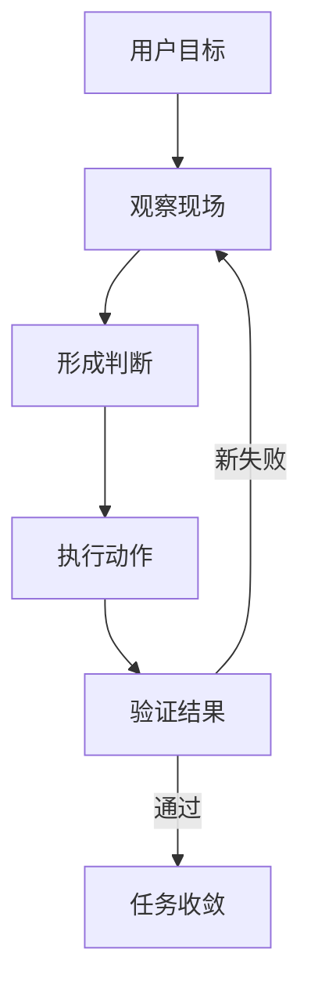
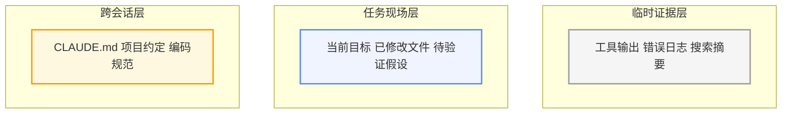
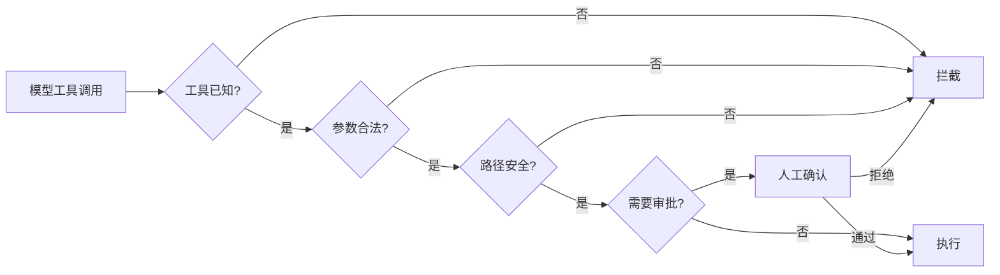

> 同一个 LLM，放在聊天框里和放在 Agent Harness 里，面对同一个任务表现可以差很远。
>
> 让一个普通聊天模型修测试失败。它会解释可能的原因——某个分支没判空、测试断言过期或者环境配置不一致。然后停下来等你决定下一步。
>
> 把它放进 Harness 里，同一模型会先跑测试，读错误堆栈，打开源文件，定位问题，修改代码，再跑一次验证。如果新错误出现，它继续处理。
>
> 两套输出来自同一个模型。决定表现的差异不在模型内部，在模型外那层软件框架里。

Sebastian Raschka 在他 2026 年 4 月的文章里给过一个直接的说法："I suspect that if we dropped one of the latest, most capable open-weight LLMs, such as GLM-5, into a similar harness, it could likely perform on par with GPT-5.4 in Codex or Claude Opus 4.6 in Claude Code。"

这句话不是在夸模型迭代多快，是在说：**Agent Harness 的品质对最终任务表现的影响，可能不亚于模型升级。** 它解释了为什么同一个模型在 chat 界面里只会回答，在 Claude Code 或 Codex CLI 里却能修 bug、做重构、走通一整套工程流程。

Harness 不是一个外层包装箱。它是把 LLM 从单次文本生成器驱动成持续执行系统的那层软件基础设施。Parallel.ai 的定义更彻底——"everything except the LLM itself"。

这篇文章不打算展开整个 Harness Engineering 的概念谱系，只讲三个工程切口：回路怎么建立，信息怎么分层，边界和分工怎么设计。

## 一、执行回路

复杂任务很难用一个 prompt 一次性解决。修一个测试的背后是一串动作：跑测试拿失败信号，读错误堆栈找到问题文件，搜索相关代码建立上下文，修改实现，再次运行验证。每一步都是在上一步的基础上推进，而不能提前计划好。

这个问题本质上和 LLM 的生成方式有关——它生成下一个 token 时能看到前面的所有 token，但它看不到未来的执行结果。没有工具反馈，它的规划只能停在文本层：可以写出一个看起来不错的修复路线，但不知道测试有没有真的通过，不知道改动有没有破坏其他路径。

Agent Harness 解决这个问题的办法是让 LLM 进入一个执行回路。

Claude Code 官方文档把核心工作方式描述为三个阶段：**gather context、take action、verify results**。这三个阶段不是顺序执行的，而是每轮工具调用都会走一遍：看到新信息（gather），决定做什么（take action），观察结果（verify），然后决定下一步。Parallel.ai 把这套回路拆得更细一些——Intent Capture、Tool Call Execution、Context Management、Verification、Handoff——五个阶段形成了一个闭环，每一步的输出都可能改变下一步的方向。

从工程角度看，这个回路在做一件简单但关键的事：让 LLM 每次输出都变成可以被环境验证的动作。

- 模型输出 `run tests` → Harness 执行并返回输出
- 模型根据输出决定 `read_file("src/foo.py")` → Harness 返回文件内容
- 模型判断问题位置并 emit `edit` → Harness 应用到文件系统
- 模型再次触发 `run tests` → Harness 返回新结果

每一步都在真实环境里落地，再把结果写回上下文。输出不再是最终答案，而是任务推进过程中的一个中间状态。

Sebastian Raschka 在他的 Mini Coding Agent 实现里放了一个 Live Repo Context 组件，每次启动时自动收集 git 状态、README、AGENTS.md 等工作区摘要。这不是 prompt 技巧，是 Harness 层在模型任何判断之前，先做一次环境快照。模型的第一轮输入就已经包含了仓库的当前状况，而不需要靠猜测。

LangChain 的文章说 "Bash + code exec is a big step towards giving models a computer。" 本质上，Harness 给了 LLM 一个可以观察和操作的世界，而模型每一次输出都变成了这个世界的真实操作。

回路一旦建立起来，复杂任务的执行就变成了「感知－判断－动作－验证」的反复交织。反馈真实，模型才能收敛到正确的方向上。但回路每跑一轮都会产生新信息——日志、代码片段、搜索结果、中间假设——这些信息如果全部留存在上下文里，多轮之后任务会被噪音拖垮。

## 二、上下文分层

Anthropic 在 2025 年 9 月发布了一篇工程博客，专门讲 context engineering。里面有一个核心观察：transformer 的注意力机制是 n² 的，token 越多 recall 越差。这不是等上下文窗口满了才出问题，而是从加载第一个额外 token 就开始退化。他们把这种现象叫做 **context rot**——信息退化，不是信息溢出。

这就意味着，让模型在多轮工具调用后仍然能做出正确判断，不是靠塞更多 token，而是靠让上下文里的 token 更相关。

Claude Code 的做法是做 compaction。官方博客描述得很具体：当上下文窗口接近上限时，Harness 主动压缩——丢弃冗余的工具调用记录和输出，只保留最近 5 个访问过的文件和一段结构化摘要，然后重新开始一轮上下文。注意，这个决策是 Harness 层做的，不是模型自己判断哪些内容可以丢。

更底层的信息分层不只在 compaction 时才发生。Anthropic 的文章还提到了两种策略：

- **JIT context loading**：模型不预加载所有信息，而是通过轻量级工具（文件大小、命名约定、目录结构）先判断哪些值得读，再按需读入。这比把整个工作区都塞进 prompt 给模型要高效。一个只读少量关键配置文件和按需取文件的模式，远好于试图加载全部。
- **Progressive disclosure**：先用低成本方式获取概况，再决定是否深入。这对应人类工程师的工作习惯——先看目录结构，再决定打开哪个文件，而不是同时读所有文件。

Sebastian Raschka 的 prompt 设计理念也基于类似的分层：把上下文切成 **Stable Prompt Prefix**（工具描述、工作区摘要——基本不变，可以缓存）和 **Changing Session State**（用户最新请求、最近几轮工具结果）。前者节省每次的 token 消耗，后者保持当前任务的连续性。

LangChain 的文章则指出 filesystem 是 Harness 最基础的上下文管理原语。Git 提供版本记录，AGENTS.md / CLAUDE.md 提供跨会话知识，工作区文件是自然的信息载体。Harness 不需要把所有信息塞进 prompt——它只需要让模型知道信息在哪里、怎么取。

信息生命周期在这里大致分三层：
- **跨会话层**：CLAUDE.md、AGENTS.md、项目约定——每次会话都加载但不频繁变化
- **任务现场层**：当前目标、已修正的文件、待验证假设——当前会话持有时更新
- **临时证据层**：单次工具调用返回结果、错误输出、搜索摘要——用完可丢弃

这三层对应不同的管理策略。第一层靠每次启动时注入，第二层靠 compaction 和摘要保持，第三层靠 progressive disclosure 和结果截断处理。Anthropic 的文章给了这段话一个精练的指导原则：**"Find the smallest possible set of high-signal tokens."**

但当模型能观察、能跨多轮、能记住以后，它就能真实改变环境。这时下一个问题就会出现：一个能写文件和跑命令的模型，也会把错误判断执行得很彻底。

## 三、边界与分工

执行回路和上下文分层让 LLM 能够持续推进复杂任务，但也带来了两类风险。

第一类是操作风险。LLM 可能误写关键配置文件、执行不安全命令、访问越权路径。这些错误在 chat 模式下最多给出坏建议，但在 Harness 模式下可能直接破坏系统状态。

第二类是上下文污染风险。长任务中的探索过程会大量消耗上下文——读十几个文件、排除三条错误假设、做两次局部重构尝试。如果所有中间结果都留在主线上下文里，等到真正定位到根因时，上下文里已经堆满了无用信息。

Agent Harness 对这两种风险的应对，分别是权限与 Hooks、sub-agent 分工。

### 权限验证

Sebastian Raschka 在归纳 coding agent 的六大组件时，把工具验证和权限作为一个独立层次来描述。模型发出工具调用后，Harness 不是直接执行，而是走一个检查链：工具是否已知 → 参数是否合法 → 文件路径是否在工作区内 → 操作是否需要用户批准。每一步都可能阻止这次调用或要求人工确认。

Claude Code 的 Hooks 提供了更细粒度的控制。PreToolUse hook 可以在工具即将执行前触发——匹配写入工具，检查目标路径是否为 `.env`，如果命中则返回 deny。这意味着敏感操作不在模型的能力范围内，而是在模型和系统之间由 Harness 层拦截。

LangChain 文章从另一个角度讨论这个问题：sandbox。提供隔离的文件系统和网络环境，模型可以自由操作但不会影响生产系统。这和安全验证是互补的——验证拦截已知风险，sandbox 隔离未知风险。

### Sub-agent 分工

长任务里，探索污染和主线保持之间的矛盾天然存在。主线需要干净和连续，探索需要充分和试错。把两者塞进同一个上下文窗口会导致两件事都做不好。

Anthropic 的工程博客描述了这个工程模式：主 agent 协调整个任务，把深度探索交给专门的 sub-agent。每个 sub-agent 有独立的上下文窗口和工具权限，做完后只返回一段结构化的结果摘要——官方提到大约 1000-2000 token——给主线。探索过程中的噪音在 sub-agent 的上下文里消耗掉，不会出现在主线的判断路径上。

这种设计和并行没有直接关系。它解决的是上下文的隔离问题。主线负责保持目标、约束和最终决策，sub-agent 负责消耗噪音并返回结构化结论。

### 三者合起来才能工作

回路、上下文分层、边界分工这三层不是独立的组件，而是互为前提：

- 没有回路，模型无法接触真实环境
- 没有上下文分层，多轮任务无法持续
- 没有边界和分工，能动手的模型要么不安全，要么在大任务里被噪音冲散

LangChain 文章里有一句总结恰当：**"Harnesses today are largely delivery mechanisms for good context engineering。"** 如果把上下文工程理解为信息的生命周期管理——什么信息在什么时候进入、什么时候留下、什么时候丢弃——那回路就是让信息流动的管道，边界和分工就是控制每股信息流向的阀门和路线。

---

Agent Harness 不是给 LLM 套了一层 UI 卡壳，也不是简单地组合工具、记忆、规划几个模块。它真正在做的事情是：建立一个让 LLM 的输出能够进入真实环境、被验证、被反馈、被管理、被约束的工程系统。

Sebastian Raschka 多次提到一个观点——"a lot of apparent 'model quality' is really context quality。" 模型的迭代当然在推动 Agent 的能力边界，但在当前阶段，同等模型在不同 Harness 里的表现差距，很大程度上来自回路设计、上下文工程和控制机制的成熟度，而不是一个模型的 prompt 写得更长。

这也是这篇文章想表达的主线：讨论 Agent 能力时，问题不该只停在模型是不是更强。更有工程价值的问题是：它能不能看到现场、能不能把判断带到环境里、能不能在几十轮之后还记得目标和约束、能不能在出错时被拦下来。

**参考资料**

- Anthropic, "Effective Context Engineering for AI Agents," Sep 2025. https://www.anthropic.com/engineering/effective-context-engineering-for-ai-agents
- Parallel.ai, "What is an agent harness in the context of large-language models?," Dec 2025. https://parallel.ai/articles/what-is-an-agent-harness
- Sebastian Raschka, "Components of A Coding Agent," Apr 2026. https://magazine.sebastianraschka.com/p/components-of-a-coding-agent
- Vivek Trivedy (LangChain), "The Anatomy of an Agent Harness," 2026. https://www.langchain.com/blog/the-anatomy-of-an-agent-harness
- Claude Code documentation. https://code.claude.com/docs/en/how-claude-code-works
