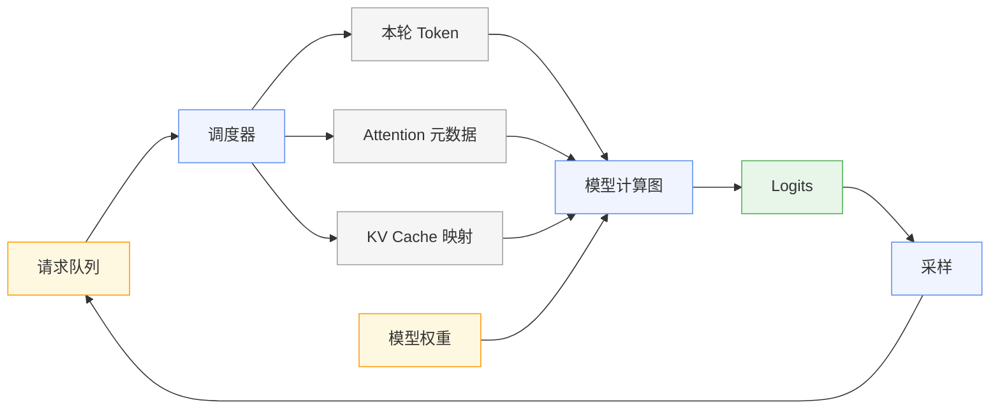
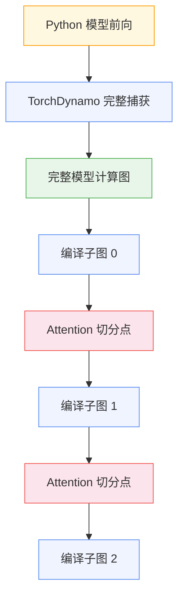
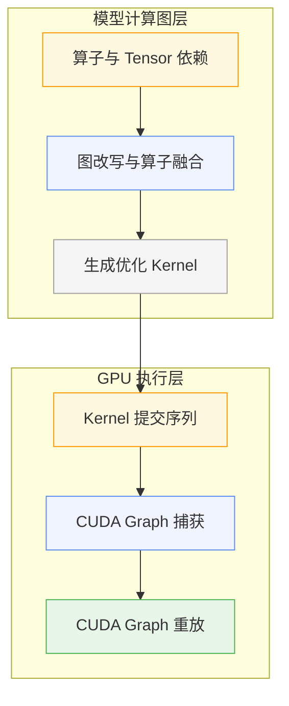
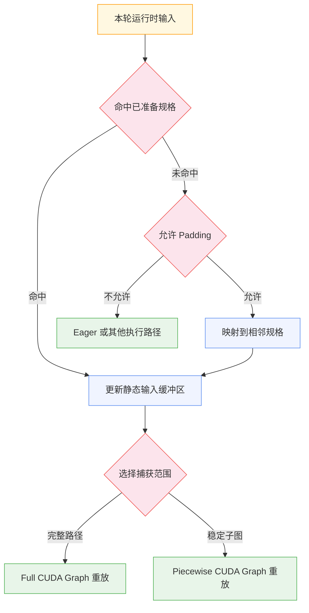

> 同一个 Transformer 模型，连续两轮 Decode 执行的层结构几乎完全一致。第一轮可能有 32 条序列参与计算，下一轮只剩 27 条，同时又有一段新 Prompt 等待 Prefill。模型权重没有改变，参与计算的 Token、KV Cache 位置和 Attention 元数据却全部发生了变化。
>
> 这正是 LLM 推理计算图面对的基本矛盾：模型结构相对稳定，在线负载持续变化。

直接调用 PyTorch 模型时，一次前向可以简化为输入 Tensor 经过若干算子后产生 Logits。推理框架面对的工作更多：它要持续接收请求、组织批次、分配 KV Cache、执行模型、采样 Token，再把未完成的序列送入下一轮调度。即使模型层没有变化，每轮前向的输入形状和运行时状态也可能不同。

计算图提供了一种处理这种矛盾的方式。框架先把模型前向表示成可分析的图，在其中识别稳定结构、改写算子并生成 Kernel；随后从 GPU 执行序列中选择适合捕获的部分，用 CUDA Graph 降低重复提交的成本。调度器仍然保留动态决策能力，并在每轮执行前准备新的输入与元数据。

理解 vLLM 中的计算图，需要同时分清三个层次：调度器组织的一轮工作负载、编译器看到的模型计算图，以及 GPU 运行时捕获的 CUDA Graph。三者沿着一轮推理串联起来，却解决不同的问题。

## 一、计算图从调度结果开始

单请求离线推理很容易形成一种简化印象：输入进入模型，模型执行前向，采样器选出下一个 Token，然后重复这个过程。在线服务无法长期维持这条固定路径。请求到达时间不同，Prompt 长度不同，生成结束时间也不同。让所有请求组成固定 Batch，会使先完成的请求等待最慢的请求，并让空出来的计算位置得不到及时补充。

Continuous Batching 将调度边界缩小到推理迭代。每轮开始时，调度器重新判断哪些请求参与计算、各自处理多少 Token，以及可用的 KV Cache 空间如何分配。某条请求可以完成并离开，等待队列中的请求也可以进入下一轮。模型仍然执行熟悉的 Transformer 前向，但这一轮的实际工作负载已经由调度器重新定义。



这张图划出了第一条边界。请求队列、优先级、抢占和 KV Cache Block 分配属于图外控制逻辑；Linear、RMSNorm、RoPE、Attention 和 MLP 等 Tensor 运算组成模型计算图。调度器先完成本轮决策，再把 Token、位置、序列长度和缓存映射整理成模型能够消费的运行时输入。

KV Cache 在这条边界上具有特殊地位。它由模型计算读取和写入，却不会随着单次前向结束而消失。它保存序列此前计算出的 Key 和 Value，并在后续 Decode 中持续复用。调度器管理它的生命周期与物理位置，Attention Kernel 根据本轮收到的映射信息访问对应数据。计算图无需记录某个请求经历过多少轮调度，只需知道本轮从哪里读取缓存、向哪里写入新结果。

推理计算图描述的是一轮选定工作负载如何完成 Tensor 计算。它不覆盖请求从到达到结束的完整生命周期，也不替代调度器。这个边界让动态服务与模型编译能够各自演进：调度器可以改变组批策略，模型图仍然保留 Transformer 的主要数据依赖。

## 二、模型前向进入编译器

模型的模块树适合开发者组织代码。一个 Transformer Block 可以由 Attention、MLP 和若干 Norm 模块构成，模块内部还会继续调用 Linear、激活函数和自定义算子。模块树表达所有权与代码层次，却没有完整展开一次前向真正发生的 Tensor 运算。

计算图采用另一种观察方式。节点表示算子或某段计算，边表示 Tensor 及其数据依赖。节点还可以携带 Shape、Dtype、Device 等信息，参数与常量也会进入图的分析范围。编译器由此能够看到某个中间结果被谁使用、相邻算子是否存在固定模式，以及某段计算是否依赖运行时数据。

在 vLLM V1 的典型路径中，`torch.compile` 参与模型前向的捕获与编译。可以把这条链路压缩成三个角色：

- TorchDynamo 从 Python 程序中捕获 Tensor 计算；
- FX 风格的图表示承载算子和数据依赖；
- Inductor 一类后端进一步优化并生成可执行 Kernel。

捕获过程有明确边界。依赖 Tensor 实际数值的 Python 分支、不受支持的操作、难以追踪的副作用，都可能使编译器无法把前后计算留在同一张图中。程序仍然可以执行，但图会在相应位置中断，剩余部分以新子图或普通 Python 路径继续运行。这种现象通常称为 Graph Break。

Graph Break 的影响不止是多执行一段 Python。编译器会失去跨边界观察和改写程序的机会。假设边界两侧存在可以合并的操作，它们进入不同子图后，后端便无法把二者识别成同一个融合模式。边界也会增加编译区域与普通执行区域之间的切换。

模型能够执行，与模型能够被稳定捕获，是两项不同的兼容性要求。为 vLLM 接入自定义模型时，完成一次正确前向只能说明语义成立；想获得预期的编译收益，还要检查捕获范围、动态 Shape 和自定义算子的行为。推理框架需要先尽量看见完整模型前向，后续图优化才有足够的操作空间。

## 三、完整捕获后的主动切图

意外 Graph Break 发生在模型捕获阶段。编译器无法继续追踪程序，只能在当前位置结束当前图。主动切图发生得更晚：框架已经取得模型计算关系，再按照已知的特殊操作划分子图。前者意味着信息丢失，后者属于执行规划。



Attention 经常出现在切分位置，因为它与 LLM 运行时状态结合得最紧密。普通前馈层主要处理当前激活，Attention 还要读取动态增长的 KV Cache，并消费 Block Table、Slot Mapping、上下文长度等元数据。Prefill 和 Decode 的 Token 规模差异也会改变 Attention 的执行特征。不同 Attention Backend 对动态 Shape、工作空间和图捕获的支持条件并不完全相同。

将这类特殊操作作为边界后，前后的稳定 Tensor 计算可以分别交给编译后端，Attention 则由对应实现处理。运行时依照原有数据依赖串联这些片段，一轮模型前向由多个编译子图和特殊操作共同完成。这就是 Piecewise Compilation 的基本思路。

这里的“切分点”不代表 Attention 永远无法编译。随着 Attention Backend、编译能力和 CUDA Graph 支持变化，能够纳入编译或捕获的范围也会变化。主动切图表达的是一种可控制边界：框架先保证特殊操作正确执行，再逐步扩大编译覆盖范围。

切图会付出代价。跨子图融合受到边界限制，子图越多，运行时连接这些片段的次数也越多。完整图则会提高动态行为的处理难度，并要求更多操作满足同一编译后端和捕获模式的约束。推理框架需要在全局优化范围、后端兼容性、动态内存行为和运行稳定性之间选择边界。

图越大，性能不一定越高。更大的可见范围只提供更多潜在优化机会，最终收益还要经过图改写、代码生成和运行时执行才能兑现。Piecewise Compilation 选择了较稳妥的中间位置：保留对完整模型的理解，再把适合优化的区域分段交给编译器。

## 四、图的可见范围决定优化空间

逐算子 Eager 执行时，框架按照 Python 调用顺序启动 Kernel。每个算子只完成自己的工作，中间结果通常要写回显存，再由下一个 Kernel 读取。模型计算图让编译器同时观察多个操作，从数据依赖中寻找可以消除或合并的步骤。

以 Norm 后接量化为例。分开执行时，Norm Kernel 生成中间激活并写回显存，量化 Kernel 随后重新读取该激活。若后端识别出固定模式，可以在一个融合 Kernel 中完成两段计算，减少一次中间数据的写回与读取，也减少一次 Kernel Launch。SiLU 与逐元素乘法、Residual Add 与 RMSNorm 等组合具有相似的分析路径。

```text
独立执行：RMSNorm -> 写回中间结果 -> Quantize
融合执行：RMSNorm 和 Quantize -> 写回最终结果
```

融合是否成立，取决于图中同时出现哪些节点、数据依赖是否符合模式，以及目标硬件是否存在合适实现。部分融合只需观察相邻算子，在局部子图内就能完成；另一些优化需要更大的图可见范围。图切分位置因此会直接改变后端能够识别的模式。

计算图本身不会自动提高吞吐。它提供了一块可以分析和改写的程序范围，真正的执行效率仍由编译 Pass、生成的 Kernel、输入规模和硬件特征共同决定。同一项融合在小 Token 批次中可能明显减少 Launch 开销，在大规模 Prefill 中则可能被矩阵计算时间掩盖。

编译还会引入准备成本。模型首次启动时需要捕获图、执行优化并生成代码。若把这项工作推迟到业务请求到达之后，某个请求可能承担完整编译延迟，尾延迟会出现尖峰。因此，服务通常会在正式处理请求前准备所需编译产物，并用编译缓存减少重复启动工作。

编译缓存改善的是准备阶段。它不能替代运行时优化，也不能证明某项融合已经命中。稳态性能仍要观察实际 Kernel、显存访问和 GPU 时间线。成功加载编译缓存与每轮推理获得加速属于两个不同问题。

完成编译后，模型已经可以运行优化 Kernel。但一轮 Decode 往往由许多 Kernel 组成，CPU 仍要逐个向 GPU 提交工作。模型计算较短或 Batch 较小时，提交开销和 Kernel 之间的空隙更容易进入关键路径。CUDA Graph 处理的正是这一层问题。

## 五、CUDA Graph 记录 GPU 执行

模型计算图与 CUDA Graph 共享“图”这个名字，描述对象却处于不同层级。模型计算图记录算子、Tensor 和数据依赖，供编译器分析和改写；CUDA Graph 记录已经确定的 GPU 工作及其依赖，供 CUDA Runtime 重放。



`torch.compile` 主要改变计算如何组织：它捕获模型程序、应用图优化并生成 Kernel。CUDA Graph 主要改变 GPU 工作如何提交：首次运行时捕获一段操作序列，后续迭代直接重放，减少 CPU 反复发起 Kernel Launch 的成本。编译后的 Kernel 可以继续成为 CUDA Graph 中的执行节点，两项机制能够叠加。

Decode 很适合利用重放。每轮只为活跃序列生成少量新 Token，模型层和主要算子顺序高度重复；当单轮 GPU 计算时间缩短后，CPU 提交开销占比会上升。捕获并重放稳定执行片段，可以减少重复提交产生的空隙。

CUDA Graph 要求执行具有足够稳定性。捕获期间使用的 Tensor 地址需要在重放时保持有效，操作序列和资源使用不能任意变化。推理框架通常会准备地址稳定的输入缓冲区，每轮先把新的 Token、位置和元数据写入缓冲区，再重放已经捕获的图。业务请求持续变化，CUDA Graph 看到的内存入口仍然可以保持稳定。

完整模型路径并不总能一次捕获。某个特殊操作可能依赖动态内存行为，或者当前 Backend 尚未满足捕获条件。Piecewise CUDA Graph 沿用前文的子图边界，只捕获适合稳定重放的编译片段，特殊操作继续通过普通路径执行：

```text
子图重放 -> Attention 普通执行 -> 子图重放 -> Attention 普通执行
```

这种模式保留动态操作的兼容性，也让稳定片段获得重放收益。它增加了若干 CPU 与 GPU 的交界，覆盖范围有限，却比全程 Eager 更接近理想执行。随着更多操作满足捕获要求，框架可以扩大到 Full CUDA Graph，进一步压缩提交边界。

Full CUDA Graph 同时会收紧约束。完整路径中的每个操作都要适应捕获和重放，动态 Shape、临时内存以及 Backend 能力都可能限制覆盖范围。Piecewise 与 Full 反映的是兼容性与捕获范围之间的取舍。

## 六、动态负载映射到有限规格

LLM 在线服务中的变化维度很多。Prefill 长度由用户输入决定，Decode 批次中的活跃序列数会随请求完成而下降，新请求又可能在后续迭代加入。启用 Chunked Prefill 后，一段长 Prompt 还会被拆进多轮计算。若为每一种精确 Shape 都生成一份编译产物和 CUDA Graph，组合数量会迅速膨胀，准备时间与显存占用也随之增加。

框架无需让图直接承载所有业务状态。请求 ID、逻辑序列和物理 KV Cache Block 之间的变化，可以压缩到固定格式的 Tensor 和元数据中。每轮只更新缓冲区内容，模型仍从相同入口读取数据。对于真正影响 Kernel 形状的 Token 数量，框架可以准备有限的捕获规格，再将运行时负载映射到合适规格。



Padding 提供了一种直接映射方式。假设实际 Token 数小于某个已捕获规格，运行时可以补齐到该规格并复用对应 CUDA Graph。代价是 GPU 会处理一部分填充位置。规格越密集，额外计算通常越少，预捕获数量和资源成本则越高；规格越稀疏，复用管理更简单，Padding 浪费可能增加。

编译阶段还要面对 Dynamic Shape Guard。编译器会记录某些输入条件，以保证生成代码只用于满足假设的 Shape。新输入突破已有约束时，普通 `torch.compile` 程序可能重新编译。在线推理需要避免把这种成本交给真实请求，因此框架会控制动态维度的表达、提前覆盖预期规格，并在开始服务前完成必要准备。

稳定执行不要求真实请求稳定。框架把连续变化的请求投影到有限、可复用的执行规格：预分配缓冲区稳定地址，运行时元数据携带变化状态，Bucket 或 Padding 收敛 Shape，回退路径处理未覆盖输入。CUDA Graph 面对的是经过整理后的执行入口，而非原始业务请求。

这套映射也解释了一些性能现象：相近的请求规模可能落入不同执行路径，延迟因此出现台阶；提高捕获覆盖范围可能减少 CPU Launch，却增加初始化时间和显存成本；为了减少 Padding 而增加规格数量，也可能让部署准备过程变重。图优化改变的是冷启动、稳态延迟、吞吐与资源占用之间的平衡。

## 七、沿执行层级定位性能问题

当推理吞吐或延迟没有达到预期，只确认 `torch.compile` 已开启远远不够。整个链路至少存在四类相互独立的问题。

第一类发生在模型捕获阶段。自定义模型代码出现意外 Graph Break，编译器只能处理碎片化子图。此时应检查断图位置以及触发它的 Python 逻辑，确认模型是否被完整捕获。

第二类发生在图优化阶段。模型成功进入编译器，目标融合模式却没有匹配。原因可能是图切分隔开了相关算子，也可能是 Dtype、Shape、硬件或 Backend 不满足优化条件。此时应该查看生成图和编译产物，不能只看服务是否启动成功。

第三类发生在 CUDA Graph 阶段。子图能够执行，但捕获范围有限，或者运行时输入没有命中已准备规格，最终回退到普通执行路径。此时要确认捕获发生在哪些规格、实际请求落入哪种模式，以及 Padding 和回退条件是否符合预期。

第四类问题位于计算图之外。调度策略、KV Cache 容量、请求长度分布和内存带宽仍可能成为主导瓶颈。即使编译和 CUDA Graph 全部生效，过小的可用 Batch、频繁抢占或高度离散的输入也会限制吞吐。继续调节图优化参数无法修复图外瓶颈。

排查时可以沿执行层级逐步收集证据：

1. 检查模型前向是否出现意外 Graph Break；
2. 检查目标算子是否进入同一编译区域，融合是否真正生成；
3. 检查 CUDA Graph 捕获范围和运行时命中情况；
4. 在 GPU 时间线中观察 Kernel 数量、Launch 间隙与显存活动；
5. 结合调度队列、Batch 规模和 KV Cache 使用情况判断图外限制。

这条顺序可以避免一个常见误判：将所有性能差异都归因于有没有使用计算图。计算图负责暴露和组织可优化的 Tensor 程序；Piecewise Compilation 决定程序怎样划分；编译后端决定生成哪些 Kernel；CUDA Graph 决定稳定 GPU 工作怎样重放；调度器决定每轮向这套执行系统提交什么负载。

vLLM 没有维护一张覆盖所有请求状态的固定大图。它先由调度器收敛本轮动态状态，再捕获相对稳定的模型前向，主动划分编译边界，并把适合的 GPU 执行片段变成可重放对象。持续变化的在线负载，最终被映射成一组可以编译、缓存、选择和重放的执行规格。

这正是推理计算图在 LLM Serving 中的工程价值：它在动态调度与 GPU 执行之间建立了可分析、可优化、也允许回退的接口。
