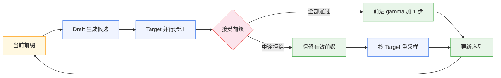
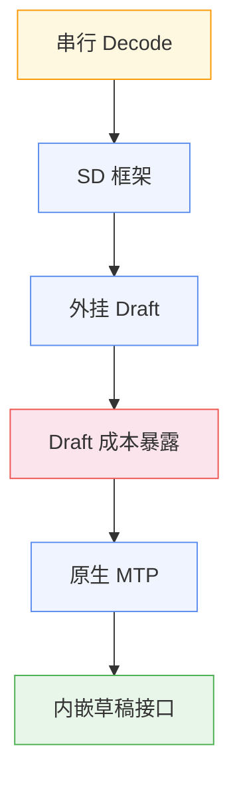

> 同一个 70B 模型，Prefill 可以把几千个 token 的 Prompt 一次吃进 GPU，Decode 却只能一个 token 一个 token 往前走。
>
> 权重没有变化，慢的是生成方式本身：每推进 1 个 token，140GB 权重就要从显存里完整读一遍。
>
> 投机解码（Speculative Decoding，SD）先用廉价草稿多猜几步，再让大模型一次验证。MTP（Multi-Token Prediction）继续往前走，把多 token 预测写进训练目标，让草稿能力从外挂变成模型原生接口。

## 一、串行 Decode

Decode 慢的根源不在算力，在访存。

每生成一个 token，模型要把全部权重从 HBM 读进计算单元。batch=1 时，一次 forward 的算术强度约为 $2N$ FLOPs 对应 $2N$ 字节访存，即 $\sim 1$ FLOP/byte。H100 的 ridge point 在 $\sim 300$ FLOP/byte 量级，decode 离它有近三百倍差距。计算单元大量空转，延迟下限由显存带宽直接决定：

| 硬件 | HBM 带宽 | 70B FP16 单 token 下界 |
|------|----------|------------------------|
| A100 40GB | 1555 GB/s | $\sim$90 ms |
| H100 SXM | 3.35 TB/s | $\sim$42 ms |

Prefill 没有这个困境。整段 Prompt 一起进模型，同一遍权重读取被成百上千个位置分摊，算术强度被拉回 compute-bound 区间。Decode 则每轮只推进一个位置，权重读取无法分摊，还要严格遵守 $t+1$ 依赖 $t$ 的串行链。

这带来一个和直觉相反的判断。decode 慢的时候，常规反应是压精度、换小模型，这些手段压低的是每步的访存量。但只要一步仍只产出一个 token，步数这个变量就没有被动过。生成 $K$ 个 token 仍是 $K$ 次串行 forward，带宽墙撞 $K$ 次。

SD 改的就是步数：一次 target forward，能不能推进多个 token。

## 二、先猜再验

SD 的结构分四步：

1. 用一个更快的 draft 模块自回归生成 $\gamma$ 个候选 token；
2. 把当前序列连同候选拼成一段，target model 一次 forward 并行算出 $\gamma+1$ 个位置的分布；
3. 逐位置决定接受还是拒绝，取最长有效前缀，拒绝点之后的候选丢弃；
4. 在拒绝点按 target 分布补采一个 token，进入下一轮。

这里真正成立的是角色分工：

- Draft 负责便宜地提出路径；
- Target 负责裁定哪些 token 可以进入最终输出。

验证规则因解码策略而异。greedy 下最简单：接受 draft token 当且仅当它等于 target 在该位置的 argmax，首个不匹配处截断，并取 target 的 argmax 补上。sampling 下用 Leviathan 等人的拒绝采样规则：draft 分布 $q$ 提出的 token $x$，以

$$\min\left(1,\; \frac{p(x)}{q(x)}\right)$$

的概率接受；拒绝时从归一化的残差分布 $\text{norm}\big(\max(0,\; p - q)\big)$ 重采。这条规则保证最终序列的分布与 target 独立采样完全一致——draft 猜错只会浪费这一轮提议，不会改变任何输出概率。

验证本身近乎免费，这是整个机制成立的物理基础。target 一次验证 $\gamma+1$ 个位置，权重仍只读一遍，多出来的只是几行矩阵运算。decode 本就困在访存上，这些计算落在空闲的算力余量里，单轮延迟几乎不变。Leviathan 等人在 T5-XXL 上报告了 2–3 倍加速，输出逐位一致。

一次 forward 从"确认一个 token"变成"裁定一段前缀"，串行步数被压缩，带宽墙撞的次数随之减少。

## 三、Draft 的成本

框架成立，不等于一定加速。收益可以用一个式子估出来。

设单 token 接受率为 $\alpha$，draft 长度 $\gamma$，draft 与 target 的单步耗时比为 $c$。一轮迭代的期望前进长度与期望代价分别是：

$$\mathbb{E}[A] = \frac{1-\alpha^{\gamma+1}}{1-\alpha}, \qquad \text{Speedup} = \frac{\mathbb{E}[A]}{\gamma c + 1}$$

代入几组数：

| $\alpha$ | $\gamma$ | $c$ | $\mathbb{E}[A]$ | 加速 |
|----------|----------|-----|-----------------|------|
| 0.75 | 5 | 0.1 | 3.29 | 2.19x |
| 0.60 | 5 | 0.1 | 2.38 | 1.59x |
| 0.75 | 10 | 0.1 | 3.83 | 1.92x |
| 0.75 | 5 | 0.3 | 3.29 | 1.32x |

三个结论直接读出来。接受率从 0.75 掉到 0.60，加速从 2.2 倍掉到 1.6 倍，$\alpha$ 是最敏感的变量。$\gamma$ 从 5 加到 10，加速反而从 2.19x 退回 1.92x——期望前进长度增长放缓，draft 成本线性增加，$\gamma$ 存在最优值而非越大越好。draft 耗时比从 0.1 涨到 0.3，同样的接受率只剩 1.32x，draft 必须比 target 便宜一个数量级才玩得动。

负载形态会改写这笔账。低并发时 GPU 有算力余量，验证的额外计算白捡，SD 降的是单请求延迟。高并发大 batch 时，decode 被 batch 拉回 compute-bound，验证 $\gamma+1$ 个位置从"利用余量"变成"真实开销"：被拒绝的候选位置消耗的是本可以服务其他请求的 FLOPs，吞吐可能不升反降。追延迟和追吞吐，对 SD 是两种相反的场景。

draft 形态也在这条压力下分化：

- 独立小模型：通用性最好，代价是 tokenizer 对齐、双模型调度、额外显存一整套成本；
- n-gram / suffix：从 prompt 自身检索候选，零模型成本，在代码补全、RAG 回显这类重复度高的场景命中率可观，开放域生成里则迅速失效；
- Medusa：在主模型上加多个并行预测头，训练量小，但各头独立预测、缺乏位置间依赖；
- EAGLE：在特征层面做单层自回归草稿头，接受率高，需要后训练一个外挂模块；
- 树状候选：SpecInfer 把单链候选扩成 token tree，一次验证覆盖多条路径，分布式推理报告 1.5–2.8 倍加速，代价是树注意力与调度复杂度。

问题到这里已经换位：从"能不能先猜再验"，变成"draft 从哪里来"。外挂 draft 带着三笔账——部署账、对齐账、调度账。

## 四、MTP 进模型

MTP 直接回应这三笔账：把草稿能力做进模型训练里。

Meta 2024 年的工作把训练目标从 next-token 扩成同时预测未来 $n$ 个 token：共享 trunk 之上加 $n$ 个并行输出头，作为辅助损失训练，不增加训练时长。结果超出"只为加速"的预期——13B 模型 HumanEval 多解 12%、MBPP 多解 17%，收益随模型规模放大；推理时复用这些头做自投机，报告最高 3 倍加速。多 token 目标同时改善了模型质量和推理速度。

DeepSeek-V3 换了一种结构。它放弃了并行独立头，让每个 MTP 模块保持完整因果链地顺序预测：第 $k$ 层模块把上一层的表示与下一个 token 的 embedding 各自 RMSNorm 后拼接，经线性投影进入一个 Transformer block，再共享主模型的输出头：

$$h'^k_i = M_k\big[\text{RMSNorm}(h^{k-1}_i);\ \text{RMSNorm}(\text{Emb}(t_{i+k}))\big], \qquad P^k_{i+k+1} = \text{OutHead}\big(\text{TRM}_k(h'^k_i)\big)$$

embedding 与输出头全部与主模型共享，MTP 深度 $D=1$，即每个位置额外预测第二个 token，损失权重 $\lambda$ 在前 10T token 取 0.3、后续降到 0.1。技术报告给了两个关键数字：第二 token 接受率 85–90%，复用 MTP 模块做投机解码达到 1.8 倍 TPS。代回上节的公式，$\alpha \approx 0.88$、$\gamma=1$ 时 $\mathbb{E}[A] \approx 1.88$，数字自洽。

和 EAGLE 对比能看清 MTP 的位置。EAGLE 是训后外挂：冻结主模型，在特征层训练一个草稿头，对齐靠蒸馏逼近。MTP 是训中内生：多 token 能力随预训练一起长出来，草稿模块与主模型共享表示空间和词表头，对齐是训练目标保证的，接受率天然更稳。

两个误解需要拆开。其一，MTP 不是 SD 的替代名词——SD 是 decode 框架，规定谁提议、谁验证、如何保持分布；MTP 是模型侧能力，提供原生草稿来源。其二，MTP 不等于"一次 forward 免校验输出多个 token"——serving 里它仍然走 draft-verify，无损加速依赖验证，不依赖"多预测几个"这个动作本身。

## 五、从外挂到原生

把整条线串起来：

SD 证明 decode 不必一步只走一个 token。它利用访存与算力之间的余量，把串行采样改造成并行验证，且输出分布逐位不变。这是 serving 侧的框架突破，其收益上界由接受率和 draft 成本共同写死。

外挂 draft 让框架先落地，也暴露了下一层瓶颈：草稿与 target 分离，就要持续支付对齐、显存和调度成本，接受率一旦不稳，加速迅速蒸发。MTP 把多 token 预测写进训练目标，草稿模块与主模型共享 trunk 和输出头，对齐成本在训练期一次性付清。框架还在，draft 的位置从服务层挪进了模型权重。

落地时的观察指标也该随之调整：

- 接受率与平均接受长度：草稿是否有效，这是 SD 收益的唯一来源；
- TTFT 与 ITL：延迟形态是否改善，注意 SD 对 TTFT 几乎没有帮助；
- 同卡 batch 上限：draft 权重与激活是否挤占了 KV Cache 空间；
- 峰值吞吐：高负载下验证开销是增益还是负担，SGLang 在 DeepSeek-V3 上开启 MTP 报告的 1.2–2.1 倍提升，区间跨度本身就说明收益强依赖负载形态。

从 SD 到 MTP，真正推进的是 decode 优化的边界：先用框架证明多 token 验证可行，再用模型把草稿能力内生化。后续更值得关注的，是原生多 token 接口如何与 continuous batching、KV Cache 管理和编译执行路径稳定衔接，而不是继续堆叠越来越重的外挂 draft。
