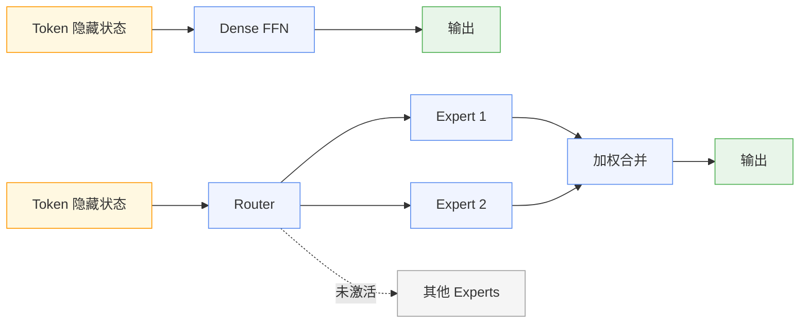
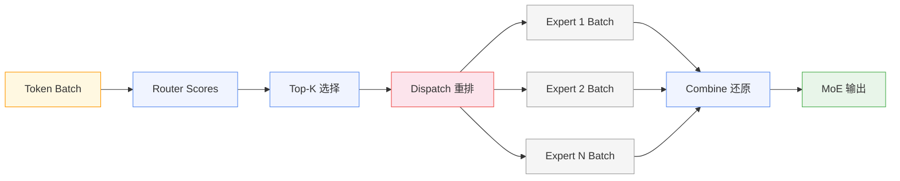
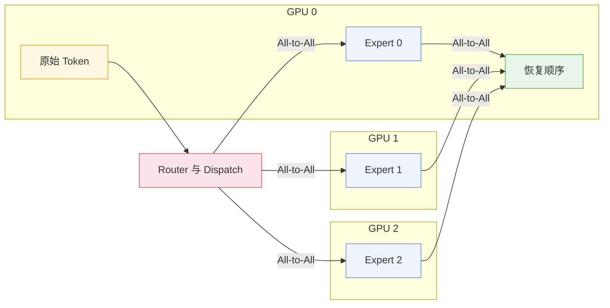

> DeepSeek-V3 包含 671B 参数，每个 Token 实际激活 37B。单看前向计算，它更接近一个 37B 模型；单看权重存储，它仍然要为 671B 参数寻找位置。
>
> 少算的参数没有消失。它们以专家权重的形式分布在设备上，等待 Router 选择。被选中的专家若位于其他 GPU，Token 还要先离开当前设备，完成跨卡传输后才能进入 FFN。
>
> MoE 解耦了模型容量与单 Token 计算量，也把一部分矩阵计算问题转化成了路由、负载和通信问题。

Dense Transformer 扩大模型时，参数量与前向计算量通常同步增长。MoE（Mixture of Experts）在 FFN 中引入条件计算，让模型保留大量专家参数，同时只为每个 Token 激活少数专家。按 DeepSeek-V3 公布的数据计算，单 Token 激活的参数约占总参数的 5.5%。

这个比例说明了 MoE 如何控制前向计算，却无法单独解释显存占用、吞吐和延迟。要理解两类成本为何出现分歧，需要先看它对 Transformer Block 做了什么改动。

## 一、参数与计算解耦

Transformer Block 的主要参数集中在 Attention 和 FFN。Dense 模型让每个 Token 经过同一组 FFN 权重，稀疏 MoE 则将这组 FFN 扩展成专家池，并在入口增加 Router。Router 根据当前 Token 的隐藏状态计算专家分数，从中选择 Top-K 专家参与前向。

设输入为 $x$，专家数量为 $N$，Router 为每个专家产生分数 $s_i(x)$。选出集合 $T(x)$ 后，MoE 层可以写成：

$$
y = \sum_{i \in T(x)} g_i(x)E_i(x), \qquad |T(x)| = K
$$

式中各项对应 MoE 的三个基本组件：

- $E_i$：第 $i$ 个专家 FFN；
- $g_i(x)$：被选中专家的组合权重；
- $T(x)$：Router 为输入 $x$ 选择的 Top-K 专家集合。

单 Token 的计算量主要由 $K$ 和专家规模决定，总参数量则会随专家总数 $N$ 增长。当 $K$ 远小于 $N$ 时，新增专家可以扩大参数空间，而无需进入每个 Token 的计算路径。

Mixtral 8×7B 展示了这种解耦。它在每个 MoE 层设置 8 个专家，每个 Token 选择其中 2 个；模型总参数约 47B，单 Token 激活约 13B，激活比例约为 27.7%。名称中的“8×7B”不能直接换算成 56B，13B 也不等于模型的存储规模。Attention、Embedding 等参数由所有 Token 共享，专家池只替换 FFN 部分。

至此，参数容量与单 Token 计算量已经分开。这个结构能否有效运行，取决于 Router 能否在大量专家之间持续给出既有学习价值、又能被系统高效执行的选择。

## 二、路由的双重目标

Router 通常是一个从隐藏维度投影到专家数量的线性层。它先为一批 Token 生成路由分数，Top-K 再据此决定每个 Token 进入哪些专家。选择完成后，系统把原本按序列排列的 Token 按专家重新分组，形成各自的输入批次；FFN 计算结束后，再将结果还原到原位置并加权合并。

分发路径由路由分数决定，也因此同时承载两项目标：

- **模型目标**：将 Token 交给亲和度较高的专家，让不同专家逐渐形成分工；
- **系统目标**：让各专家收到相近数量的 Token，避免计算和通信集中在少数设备上。

若 Router 只按亲和度独立选择 Top-K，这两个目标很容易偏离。

假设某层有 8 个专家，4096 个 Token 各选择 2 个专家。完全均衡时，每个专家得到 1024 个 Token；实际路由却可能让一个专家收到 1800 个，另一个只收到 300 个。热门专家的输入矩阵更大，所在设备需要更长时间；冷门专家获得的训练样本更少，参数更新也更有限。整层计算必须等待所有专家完成，最慢的专家最终进入关键路径。

训练系统通常为每个专家设置容量：

$$
C = \left\lceil \frac{T \times K}{N} \times \text{CapacityFactor} \right\rceil
$$

其中，$T$ 是本批 Token 数，$K$ 是单 Token 激活的专家数，$N$ 是专家总数。`CapacityFactor` 大于 1，意味着系统为负载波动预留了缓冲：

- 容量不足时，超出的 Token 只能被丢弃、改道或进入额外路径；
- 预留过多时，中间 Buffer 随之扩大，设备需要长期承担峰值空间。

容量限制处理的是一次前向能否完成，训练过程还会放大长期失衡。某个专家若在早期偶然得到更多 Token，便会获得更多梯度更新，随后更容易继续被 Router 选中；长期缺少 Token 的专家则逐渐失去参与训练的机会。路由坍缩会让名义上的大专家池退化成少数活跃专家，新增参数也就无法转化为有效容量。

这种训练过程形成的专家分工，很难直接对应人工划分的领域。Router 在每一层、每个 Token 上独立决策：同一句子中的不同 Token 可以走向不同专家，同一 Token 到了下一层也可能改变路径。较低层专家可能偏向词法和局部结构，较高层专家则可能形成更抽象的分工。用“数学专家”或“代码专家”概括它们，会遗漏实际路由的粒度。

Router 因而同时参与表示学习和运行时调度：亲和度影响模型质量，Token 分布影响执行效率。MoE 需要主动约束两者的偏离，但均衡控制本身也会介入专家的学习过程。

## 三、均衡与专门化

最直接的控制方式，是在语言模型损失之外加入负载均衡辅助损失。以 Token Choice 路由为例，可以统计专家被实际选中的比例 $f_i$，以及 Router 分配给该专家的平均概率 $P_i$，再通过两者的乘积惩罚负载集中：

$$
L_{balance} = \alpha N \sum_{i=1}^{N} f_iP_i
$$

当少数专家同时获得较高概率和较多 Token 时，辅助损失会推动 Router 分散流量。系数 $\alpha$ 太小，约束不足；系数太大，Router 又可能为了接近平均分配，放弃更有价值的专家选择。模型质量和设备利用率由此进入同一个训练目标，系数也需要随模型规模、路由方式和数据分布调整。

DeepSeekMoE 同时调整了专家结构和均衡方式：

- **细粒度专家**：拆分单个专家，在相近的激活计算量下组合更多路由专家；
- **共享专家**：让所有 Token 都经过一部分公共参数，减轻路由专家重复学习通用知识的压力。

在此基础上，DeepSeek-V3 为每个路由专家维护一个偏置项。Top-K 根据“亲和度加偏置”的结果做选择：专家过载时降低对应偏置，负载不足时提高偏置。专家输出的组合权重仍由原始亲和度计算，因此偏置主要影响谁能进入 Top-K。系统可以据此修正实际负载，同时减少均衡信号对主损失梯度的直接干预。

“Auxiliary-Loss-Free”描述的是主要负载均衡策略，并不意味着训练目标完全移除了均衡辅助项。DeepSeek-V3 仍保留较弱的序列级辅助损失，用来防止单条序列内部出现极端失衡。工程上也无需追求每个局部批次绝对平均。只要批次级负载足够稳定、设备没有持续热点，专家仍能形成有效分工，均衡控制就达到了目的。

## 四、稀疏计算的通信代价

均衡策略让各专家获得了相对稳定的输入，但专家池继续扩大后，单张 GPU 很快无法容纳全部权重。Expert Parallel 因而把专家分散到不同设备：每张 GPU 保存一部分专家，Token 再根据路由结果前往对应设备。一个 MoE 层由此增加两次数据交换，先将激活分发给专家，再把专家输出送回原来的序列位置。

**权重驻留。** 专家分散之后，首先要处理的仍是权重。稀疏激活允许未选中的专家跳过本次计算，却不会自动减少存储需求。671B 参数若采用 BF16，仅权重的理论体积就约为 1.34 TB。量化可以降低占用，但系统仍需为全部专家安排设备空间。若将冷专家临时卸载到 CPU 或磁盘，权重加载延迟又会进入请求路径，是否可行取决于专家命中分布和延迟目标。

**跨卡通信。** 权重就位之后，Token 还要到达对应专家。Dense FFN 的激活通常留在当前并行组中完成矩阵计算，Expert Parallel 则需要依据每轮路由结果执行 All-to-All。通信量由 Token 数、隐藏维度、激活精度和 Top-K 共同决定，具体路由还会改变各设备实际收发的数据量。网络带宽不足或跨节点链路较慢时，数据搬运可能抵消节省的计算时间。

**专家组批。** Token 到达专家后，计算形态本身也发生了变化。MoE 会把一个大批次拆成多个 Expert Batch。若 128 个 Token 在一层中各选择 8 个专家，并分给 64 个专家，即使完全均衡，每个专家平均也只有 16 个 Token。此时 Expert FFN 面对的矩阵高度很小，GPU 难以通过大 GEMM 充分利用计算单元。FLOPs 虽然下降，Kernel Launch、数据重排和访存的占比却会上升。

这种差异在 Prefill 和 Decode 之间尤其明显：

- **Prefill** 一次处理 Prompt 中的大量 Token，专家往往能获得较大的输入批次，通信与 Kernel 开销更容易被摊薄；
- **Decode** 中每条活跃序列每轮只增加少量 Token，并发不足时，专家输入会迅速变得零散。

Continuous Batching 能够汇集不同请求的 Token，但最终批量仍受实时并发、请求完成时间和调度策略限制。

模型侧的负载均衡到这里还不够。即便每个专家收到相近数量的 Token，每张 GPU 的工作量也未必相同：多个热门专家若被放在同一设备，计算和通信热点依然会集中。系统还要结合历史路由、专家亲和关系和硬件拓扑安排专家放置，在吞吐、跨节点流量和迁移成本之间取舍。

这些环节共同解释了 MoE 对高速互联的敏感性。峰值算力决定 Expert FFN 完成矩阵乘法的速度，互联带宽和拓扑则制约激活的传输效率。训练时的大 Token 批次通常更容易摊薄额外成本；在线推理，尤其是低并发 Decode，还需要依靠专家组批、通信重叠、融合 Kernel 和负载观测来缓解稀疏执行的碎片化。

## 五、MoE 的收益边界

前面的代价最终落在三组彼此关联的指标上：

- **容量与计算**：总参数决定权重存储和模型容量，激活参数近似描述单 Token 的主要计算路径；
- **负载与算子**：专家负载与 Expert Batch Size 影响设备长尾和 GEMM 利用率；
- **通信与请求**：互联带宽与请求并发决定 All-to-All 和专家组批的实际效率。

训练场景通常拥有大量 Token 和稳定的并行拓扑，更容易用大批次摊薄路由与通信成本。推理收益则更依赖实际负载：高并发 Prefill 可以形成较大的专家批次，低并发 Decode 可能同时受到权重访存、跨卡通信和小 GEMM 限制。因此，两个激活参数相近的模型，也会因为专家数量、Top-K、专家放置和硬件互联不同，表现出截然不同的延迟。

MoE 用动态选择把更多参数放进模型，同时约束每个 Token 经过的计算路径。未激活参数仍然占用存储，被激活专家也不会天然获得高效执行。总参数与激活参数之间省下的计算，只有依次经过 Router、Dispatch、All-to-All 和 Expert Kernel，才可能转化为真实的吞吐收益。
