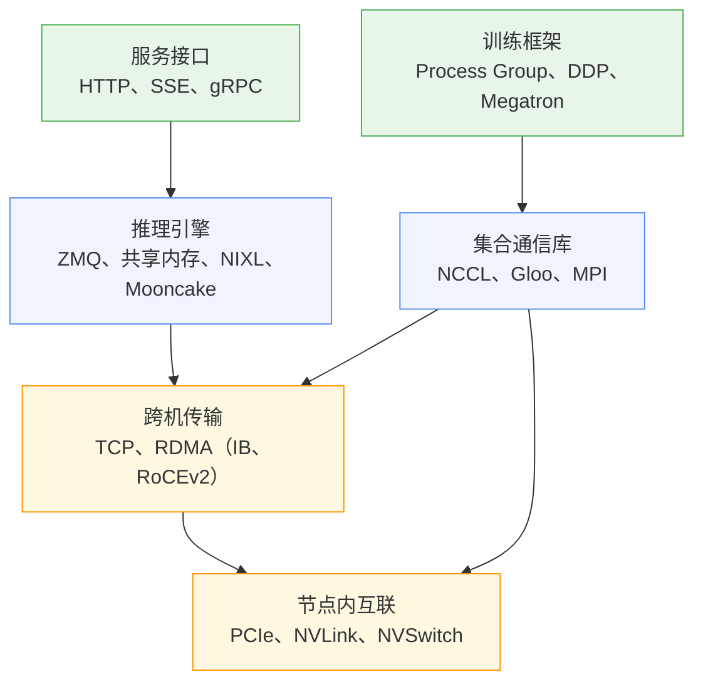
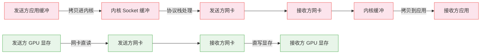
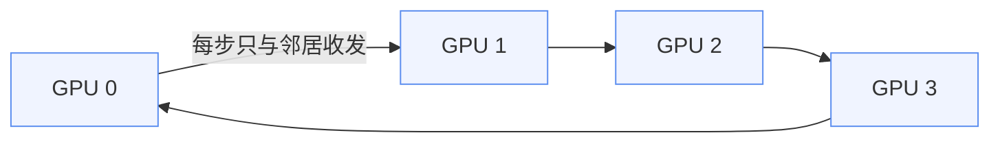
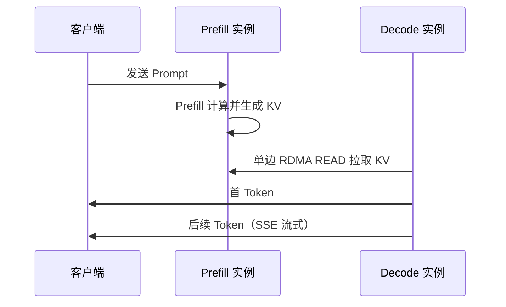

> 一条 100K 上下文的请求，在 Llama-3-70B（bf16）上会产生约 33GB 的 KV Cache。Prefill 与 Decode 分离部署后，这些数据必须在首 Token 返回之前搬到另一台机器。按 400G InfiniBand 端口的理论带宽估算，全量传输需要约 0.66 秒，而 TTFT 的预算通常只有几百毫秒。
>
> 训练侧面对的是同一挑战的另一种形态。一次梯度 AllReduce 要求上千张 GPU 同步完成收发，任何一张卡的迟到都由全体承担。
>
> 两类负载调用的协议栈几乎不重叠，回答的却是同一个问题：数据还要被搬几次，每次要等多久。

NCCL、RDMA、InfiniBand、RoCE、NVLink、NIXL、gRPC——这些名词在 AI Infra 的文档里通常以速查表的形式并列出现。速查表能解释名词，应付不了选型。换一张网卡、换一种并行度、把 Prefill 拆出去，每一步都要判断通信栈的哪一层会受影响。

下面分层组织，从物理通路开始逐层向上。箭头代表调用关系：传输与互联是公共底座，训练与推理各自向下取用。

## 一、节点内互联

单机内部 GPU 之间、GPU 与 CPU 和网卡之间的数据搬运有两种物理通路。走哪条路，决定了一台机器内部能跑什么样的并行。

PCIe 是通用路线。GPU 挂在 PCIe 交换树或 CPU 的 Root Complex 上，Gen5 x16 单向约 64GB/s，双向 128GB/s。拓扑是树形的：挂在同一台交换机下的 GPU 可以直连，跨插槽的 GPU 间 P2P 流量则要上行穿过两颗 CPU 之间的互联链路（Intel UPI 或 AMD xGMI），路径变长，实际带宽再打折扣。这对张量并行是直接的约束——TP 每层都要在所有参与的卡之间交换激活，只要其中两张卡隔着 CPU 互联，整层的通信就被这段最慢的链路拖住。

NVLink 是另一条路线：GPU 之间用专用链路直连，H100 上每张卡聚合双向 900GB/s，是 PCIe 的七倍。早期 NVLink 是点对点连接，拓扑受每张卡的链路数限制；NVSwitch 把它变成全互联——任意两张 GPU 之间最多一跳，且带宽一致。全互联对集合通信是关键属性：AllReduce、AllToAll 这类原语要求任意两张参与卡都要交换数据，拓扑上存在薄弱链路，短板就会被原语放大。NVL72 把这个互联域从单机扩大到整个机架，72 张 GPU 共享一套 NVLink 织物，「节点」本身的边界开始模糊。

节点内外的这条带宽落差，出口管制给它做了一次对照实验。H800 的 NVLink 从 900GB/s 削到 400GB/s，DeepSeek 在硬件反思报告中给出了实测数字：单向口径下节点内 NVLink 约 200GB/s（实际可达约 160GB/s），跨节点的单个 400Gbps IB 端口 50GB/s（小消息有效按 40GB/s）。Scale-up 与 Scale-out 之间约 4:1 的落差直接写进了模型结构：DeepSeek-V3 的 Node-Limited Routing 限制每个 Token 最多路由到 4 个节点，把专家并行的主要流量封锁在节点内部。

带宽余量决定并行策略的选择。差一个数量级的地方，模型结构也要跟着弯腰。

## 二、跨机传输

跨出机箱后，第一个问题变成：数据由谁来搬。

传统的答案是 CPU。TCP 路径上，发送方把应用缓冲拷进内核 Socket 缓冲，协议栈分段、封装、交给网卡；接收方再沿协议栈还原、拷回应用空间。每一步都是 CPU 驱动的拷贝和协议处理，小消息的端到端延迟在数十微秒级别。对 AI 集群这有两层代价：延迟直接加在每次集合通信的同步点上，全体等最慢的那一跳；CPU 被数据面占满后，留给调度、预取和检查的余量也被挤掉。

RDMA 的答案是让 CPU 退出数据面。通信前先把一段虚拟地址范围注册给网卡——注册就是锁定物理页面、填充页表、写入网卡的地址翻译缓存，确保网卡能 DMA 访问这段内存。之后发送不经过内核，接收不需要对端 CPU 配合：READ 和 WRITE 都是单边语义，由发起方独立完成。这套语义又沿数据路径继续下移了两步。GPUDirect RDMA 把注册对象换成 GPU 显存，省掉显存到内存的一次中转拷贝。IBGDA（GPUDirect Async）再进一步：GPU 线程直接给网卡写门铃、提交发送请求，连发起动作都不需要 CPU。DeepSeek 的 DeepEP 走的就是这条路径，dispatch 与 combine kernel 的端点延迟被压到接近网卡的物理极限。

RDMA 是一套语义，落地有三种实现，分歧集中在一件事上：怎么对待丢包。RDMA 的可靠传输建立在网络无损的假设上，一旦丢包，重传代价极高。

- **InfiniBand** 从源头解决：链路层用基于信用的流控，发送前先确认对端有缓冲空间，丢包在设计上就不发生。延迟三者最低，代价是整套网络都要专用设备。
- **RoCEv2** 把 RDMA 搬上标准以太网，设备通用，但以太网本身会丢包，无损要靠额外机制模拟：PFC 在拥塞时按优先级暂停整条链路，ECN 在包头上打拥塞标记让发送方提前降速。这套组合在规模变大后有自己的代价——PFC 的暂停帧会把同优先级的无关流量一起按住（队头阻塞），拥塞还会沿交换机逐级反压扩散。DeepSeek 在报告里把延迟方差和可扩展性列为 RoCE 当前的局限。
- **iWARP** 在 TCP 之上实现 RDMA，兼容性最好，但 TCP 的丢包重传和滑动窗口恰好是 RDMA 要绕开的负担，AI 场景基本不用。

DeepSeek 公布的 64 字节端到端延迟可以校准量级：IB 同 Leaf 2.8μs、跨 Leaf 3.7μs，RoCE 同 Leaf 3.6μs、跨 Leaf 5.6μs，NVLink 3.33μs。对照之下 NVLink 更值得琢磨：单向带宽是单个 IB 端口的约四倍，小消息延迟却几乎在同一数量级。带宽由介质决定，延迟的大头在软件栈与协议处理——中断、队列管理、可靠传输的状态机，每一跳都要付一次。选传输层时，带宽管大消息的吞吐，延迟的账要另算。

## 三、集合通信的组织

传输层解决两台机器之间的点对点搬运。训练要的是另一件事：组织 K 张 GPU 协同完成一次集体规约，任何一张卡迟到都由全体承担。这个任务由集合通信库承接，GPU 世界的事实标准是 NCCL。

NCCL 的原语族沿用了 MPI 定义的 API 形态：AllReduce、Broadcast、Reduce、AllGather、ReduceScatter、AllToAll，加上点对点 send/recv。MPI 自己在 AI 集群里已经退化为进程启动器，通信本体由 NCCL 接管；CPU 侧的张量操作与控制消息（比如初始化阶段的 barrier）由 Gloo 兜底——Meta 的 CPU 集合通信库，PyTorch 默认的 CPU 后端。

同样的原语，在不同消息尺寸和拓扑上有不同的最优分解。NCCL 把这个问题拆成算法与协议两个正交的维度，Demystifying NCCL 一文对内核的分析给出了完整的二维矩阵。

算法决定数据沿什么拓扑流动，有四种。

- **Ring**：K 张卡连成环，每张卡只与前后邻居收发。一次 AllReduce 分 $2(K-1)$ 步：前 $(K-1)$ 步做 ReduceScatter，每张卡收一块、规约一块、转发一块；后 $(K-1)$ 步做 AllGather，把规约结果沿环分发。链路在每一步都满载，带宽利用率最高，是大消息的首选；代价是步数随卡数线性增长。
- **Tree**：双二叉树把步数压到 $O(\log K)$。小消息时步延迟是主要矛盾，Tree 用一部分带宽换响应时间。
- **NVLS**：借助 NVSwitch 的 SHARP 硬件在节点内做规约。卡把数据发给交换机，Switch 内部完成 reduce 再多播回来——每张卡从「收发约两份全量」变成「发一份、收一份」，节点内 AllReduce 的单卡通信量直接减半。
- **CollNet**：同一个思路搬到 IB 网络上，规约卸载到支持 SHARP 的交换机，数据路过时被运算。两种 SHARP 指向同一个方向：网络开始参与计算，而不仅仅是搬运。

协议决定每一步怎么传，有三种。Simple 按大块连续传输，带宽利用率最高，但要等整块就绪才能推进。LL（Low Latency）给每个 8 字节元素附一个标志位：接收方看到标志翻转就知道数据到达，省掉内存栅栏式的显式同步，延迟极低，代价是有效载荷减半。LL128 取折中：以 128 字节线为单位（120 字节数据加 8 字节标志），延迟接近 LL，带宽回到峰值的 95% 左右，是 NVLink 场景的常用工作模式。

算法与协议选定之后，执行层还有两个设计保证链路不空转。大消息被切成块，流过每个通道 8 槽位的循环缓冲（NCCL_STEPS）：第 i 块在规约时第 i+1 块正在接收，接收、规约、转发三级流水把步与步串接起来。通信 kernel 本身是 persistent 的，一次启动长期驻留、反复接收任务，省掉每次集合操作重新 launch 的开销与同步。NCCL 按消息尺寸和硬件特征自动组合两个维度：大消息走 Ring 加 Simple 或 LL128，小消息走 Tree 加 LL。

工程上最常见的性能问题来自静默退化，而非算法选错。RDMA 没走通时 NCCL 降级到 TCP Socket，P2P 被禁用时绕行共享内存——吞吐能掉 10 倍，任务照常跑。排查第一步是看 NCCL_DEBUG=INFO 的输出：日志逐行列出每个通道实际使用的路径，NET/IB 变成 NET/Socket 一眼就能看出。

## 四、训练框架的通信消费

框架层把并行策略翻译成对集合通信的调用。PyTorch 的 Process Group 是这层的基本抽象：进程按不同含义编组，组的划分就是并行策略的拓扑。

- **数据并行（DDP）**：梯度被分成多个 bucket，反向传播中每个 bucket 就绪就立即触发 AllReduce，通信与剩余的反向计算自然重叠。bucket 大小直接影响重叠效率：太小则 AllReduce 次数多、步数开销大，太大则首次同步被推迟。
- **FSDP / ZeRO-3**：前向之前对参数做 AllGather，用完即释放，反向之后对梯度做 ReduceScatter。与 DDP 的一次性全参数 AllReduce 相比，FSDP 把通信拆成两半换显存——通信总量更大，显存占用随并行度线性下降。
- **张量并行**：把权重矩阵按维度切到多卡。按输出维度切（列切）时，各卡前向各算各的，反向规约输入梯度；按输入维度切（行切）时，每张卡只算出部分和，前向必须 AllReduce 才能得到完整输出。Megatron 把两种切法配对使用，一层前向固定产生两次 AllReduce——每层都发、无法推迟，通信频率在所有并行策略里最高，因此被限制在 NVLink 域内；跨机做 TP 会迅速让通信成为瓶颈。
- **流水线并行**：相邻 stage 之间用 P2P send/recv 传递激活与梯度，通信总量最小。主要矛盾在 Bubble 率——通信再快，stage 空闲时别的 stage 也只能等。
- **专家并行**：MoE 层前后各一次 AllToAll，流量模式最不规则。DeepEP 用 IBGDA 从 GPU 直接发起 RDMA，把端点延迟压到网卡物理极限附近——正是第二节那条技术线的落地。Dispatch 与 Combine 的具体机制在 MoE 动态路由一文已经讲过，不再展开。

选并行度就是给通信原语分配带宽预算。TP 放节点内、DP 跨机、EP 视带宽余量而定——每条经验规则背后都是前三层给出的数字。

## 五、推理服务的通信栈

推理引擎消费通信栈的方式与训练完全不同。训练是周期性的大消息同步，推理是混杂的持续负载。按场景拆成三种：引擎内部、引擎之间、服务对外。

引擎内部要的是低开销的进程间通信。vLLM V1 把 API Server 与 EngineCore 拆成独立进程，两者通过 ZMQ 交换控制与调度消息——ZMQ 提供异步消息模式又不需要独立 broker，部署上没有额外组件；序列化用 msgpack，比 JSON 紧凑且解析快。输出块的广播走共享内存队列：同机的多个消费者各读各的，数据本身零拷贝。这一层的通信不跨机器，选型由进程间延迟与拷贝次数主导，网络协议栈根本不出现。

引擎之间的通信是被 Prefill / Decode 分离引入的。KV Cache 必须在首 Token 之前从 Prefill 搬到 Decode。这笔账的规模：LLaMA-3-70B bf16 每 Token 的 KV Cache 是 320KB（$2 \times 80 \times 8 \times 128 \times 2\text{B}$），32K 上下文约 10.5GB，100K 上下文约 33GB。按 400G IB 端口 50GB/s 的理论带宽计算，100K 请求的全量传输需要约 0.66 秒——它不在后台，就在 TTFT 的关键路径上。

这一层的传输层要解决两件事：抽象和调度权。NIXL 是目前的主流答案之一，它把 KV 传输抽象成统一的点对点 API，传输逻辑只写一次，底层后端可插拔：UCX 走 RDMA 是生产常态，UCCL 面向普通以太网做低开销传输，NVMe 与对象存储把 KV 卸到存储层换容量。换网络环境不需要改引擎代码。调度权则由 pull 模型保证：Decode 端用单边 RDMA READ 直接从 Prefill 显存拉数据——第二节的单边语义在这里兑现，Prefill 端不需要暴露端口、维护连接状态，甚至不需要 CPU 参与传输；Decode 端按自己的节奏拉取，本地已缓存的前缀块直接跳过。llm-d 的 nixlbench 给出了后端之间的相对梯度：100G TCP 上 UCCL 约 4.9GB/s、UCX 约 4GB/s、Mooncake 约 3.5GB/s。Mooncake 本身是另一条路线：把各机的 CPU 内存与 SSD 组织成分布式 KV Pool，以存换算——命中缓存的 KV 直接复用，省掉整段重复的 Prefill 计算。这是 Moonshot Kimi 生产环境的传输底座。

服务对外是用户直接接触的协议。OpenAI 兼容 API 用 HTTP 承载请求，SSE 逐个推 Token——流式输出在这里就是协议本身：首 Token 之后的每个字都是一条 SSE 事件，HTTP 语义足够表达，过代理和防火墙也最省事。Triton、TGI、TensorRT-LLM 在内部组件与高性能客户端之间用 gRPC，双向流加 protobuf 更适合频繁的元数据交换和负载均衡。

训练追求吞吐可预期，推理追求延迟可预期。pull 模型把调度权交给消费方——Decode 端决定什么时候拉、拉多少、跳过什么——这是对「传输挡在首 Token 之前」的直接回应。

回看整张图，线索是清楚的：消除搬运链条上的每一步多余动作。RDMA 消除 CPU 参与，集合算法消除冗余步数，pull 模型消除传输中的等待与冗余拉取。面对陌生协议或选型判断时，先问数据被搬几次、每次等多久——它在地图上的位置自然清楚了。
