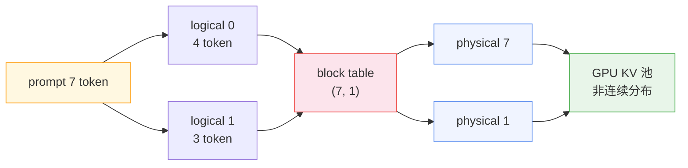
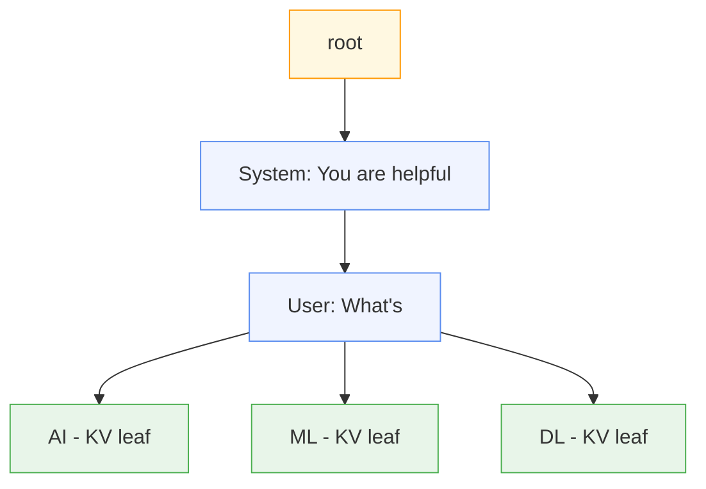

> 一台 A100 提供 40 GB 显存，跑 OPT 13B 模型（FP16 权重 26 GB），剩余 14 GB 全部给 KV cache。按现有框架的默认做法，每个请求按 max sequence length 2048 预留连续内存，单请求 1.6 GB，14 GB 同时容纳 8 路并发；但这 8 路里平均输出只有 200 token，实际占用的内存不到 160 MB，其余 1.44 GB 全程空着等分配上限到来。
>
> 同一份带固定 system prompt 的多轮对话负载分别在 vLLM 和 SGLang 上跑，第一个 token 延迟差 10–20%。差距不出在模型权重，也不出在 GPU 型号，而出在缓存 KV 时背后用的数据结构。

这篇文章讲两件事：vLLM 的 PagedAttention 怎么把 KV cache 从"一段连续显存"改造成"按块非连续存放"，SGLang 的 RadixAttention 又怎么在块状 KV 之上把"跨请求自动复用"做成了树形索引。两者经常被并列提起，但它们处在栈的不同层——前者管内存，后者管复用。

## 一、连续内存的碎片代价

要理解 PagedAttention 解决了什么，先看清旧的连续分配到底浪费在哪。KV cache 的体积由架构参数和序列长度决定，对单 token 有

$$\text{KVMem}_{\text{token}} = 2 \cdot n_{\text{layer}} \cdot n_{\text{kv_head}} \cdot d_{\text{head}} \cdot b_{\text{kv}}$$

OPT 13B 用传统 MHA，$n_{\text{kv_head}} = 40$，$d_{\text{head}} = 128$，$n_{\text{layer}} = 40$，FP16 时 $b_{\text{kv}} = 2$，单 token 约 $800\text{KB}$，与原文一致。模型允许的最大序列长度 2048，按最大值连续预留就是 $1.6\text{GB}$。

旧框架约束 KV cache 必须连续存放，是因为底层 Tensor 库要求 Tensor 在物理内存里连续。这个约束继承了传统深度学习负载的特征——固定 shape、生命周期与单次前向一致。KV cache 不一样：它的长度随 decode 增长、输出长度事先未知、生命周期跨越多次前向。把 KV cache 塞进"为定长张量设计"的连续容器里，必然要用预留最大长度的方式兜底。

预留带来的浪费有两个来源。**内部碎片**：实际长度小于最大值，预留位全程空着，上面 200 token 实际占用 160 MB，剩下 1.44 GB 是纯闲空，占比 90%。**外部碎片**：buddy allocator 反复分配/释放不同大小的连续块，把整块内存切出大量空隙，论文实测的系统级浪费是 60–80%——内部碎片和外部碎片综合后的真实数字。

这两个碎片是 KV cache 的特性与连续 Tensor 约束错配的直接结果，不是配置粗心或框架差。换更大显存、换更新 framework 都救不回来——只要还按最大长度连续预留，浪费就跟着最大长度线性增长。

## 二、非连续分块与块表

PagedAttention 把 KV cache 从"一个请求一段连续显存"改成"按固定大小切块、每块可在物理显存任意位置"。借的是 OS 虚拟内存的页式思想，但迁移到 GPU 上要做两件事：让 attention kernel 能跳着读 KV，以及把"逻辑块到物理块"的映射记下来。

把 KV cache 按 block size $B=16$ token 切分。请求视角下 KV cache 是一串逻辑块 $0, 1, 2, \ldots$，从左到右填满；物理视角下这些块的物理编号可以是 $7, 1, 5, \ldots$，彼此不连续。每个请求维护一张 **block table**，记录 logical block $j$ 对应的 physical block $\text{table}[j]$。当前位置 $i$ 的 key/value 落在物理块 $\text{table}[\lfloor i/B \rfloor]$ 的偏移 $i \bmod B$ 上。Attention 计算被改写成逐块形式：

$$A_{i,j} = \frac{\exp(q_i^\top K_j / \sqrt{d})}{\sum_{r=1}^{\lceil i/B \rceil} \exp(q_i^\top K_r / \sqrt{d})},\quad o_i = \sum_{j=1}^{\lceil i/B \rceil} V_j A_{i,j}^\top$$

$K_j, V_j$ 是 logical block $j$ 里 $B$ 个位置的 K/V 拼接。Kernel 按 block table 逐块 gather，跑出来的算术结果和连续存储完全一致，代价只是多一次间接寻址。对 GPU 这种 gather 负载友好的硬件来说，间接地址的 overhead 被 tensor core 的浮点吞吐稀释到不可见。

具体的运转可以用论文里的 7-token prompt 走一遍：prefill 结束后 logical 0、1 分别映射到 physical 7、1，logical 1 还剩一个空位；第一步 decode 把新 KV 写进 logical 1 的空位，block table 不变；第二步 decode 时 logical 1 满了，调度器从 free list 摘一块 physical 5 接在 logical 2 后面，block table 增加一条记录。请求整段生命周期的浪费被限制在最后一块的未填满部分——平均不到 $B/2$ token 的 KV 体量，相对整个序列长度可忽略。

块表这层间接一旦建起来，**内存共享**几乎免费。并行采样两个序列共享同一段 prompt，两条逻辑块链指向同一批物理块，给物理块加一个引用计数即可。当某条采样要写新 token 进共享块，引用计数 $>1$ 触发 copy-on-write：新分配一块物理块，把旧块内容拷过去，让该采样的 block table 指向新块并减旧块引用计数。Beam search、共享前缀、few-shot 共用示例 prompt，都通过 `fork / append / free` 三个原语组合表达：

- `fork(src_seq)` 从已有序列派生新序列，逻辑块链直接复用 src 的物理块，引用计数加一。
- `append(seq, token)` 把新 token 的 KV 追加到 seq 最后一个逻辑块；满则新分配物理块并更新 block table。
- `free(seq)` 递减 seq 所有物理块的引用计数，归零的块还回 free list。

$B$ 的取值是工程取舍。$B$ 太小，kernel 在单次 attention 内能并行 gather 的位置太少，tensor core 利用率下降；$B$ 太大，单块内部碎片升高，且不同请求共享前缀时命中粒度变粗（共享要按 B 对齐）。论文在 ShareGPT trace 上实测 $B = 16$ 到 128 之间性能最好，默认 $B = 16$。这个甜蜜点是负载相关的——短输出场景 $B = 16$ 够用，长前缀共享密集的负载偏大 $B$ 更划算。

碎片问题解决了。但块表本身只回答了"KV 怎么存才不浪费"，没有回答"哪些块可以跨请求复用"——这是后面两节的事。

## 三、块级哈希的前缀复用

多个请求带同一段 system prompt 是生产里最常见的复用场景：500 token 的 system prompt 算完 KV 要花一次 prefill，后续请求如果能直接用旧 KV，等于跳过这几百 token 的计算。vLLM 的 Automatic Prefix Caching（APC）把这个识别做成全局哈希表。

每个物理块用 **它自己的 token + 它前面所有 prefix token** 一起做哈希，得到一个唯一 key：

$$h_j = \text{hash}(\text{prefix_tokens}(j) \,\|\, \text{block_tokens}(j))$$

全局维护一张 $h_j \to \text{physical block}$ 的表。新请求进调度时按 B 切块逐块算哈希、查表，命中即把这个 logical block 指向已有物理块、引用计数加一，跳过该块的 prefill；未命中的部分照常计算并写入新物理块、把哈希登记进表。命中粒度精确到满块，最后一个未满块不缓存。

驱逐策略是 LRU。引用计数为 0 的块进入淘汰候选；多个候选同时被选时，优先淘汰"前缀最长末端"的块——长前缀的整体命中率比短前缀重要，因为复用收益线性于 prefix 长度。v0.11 起默认 SHA256 替换旧哈希，解决多租户下的碰撞风险；可选 xxhash 提速但要承担理论碰撞代价。

块级哈希的核心取舍是**精确匹配**：只有"前缀 token 序列完全相同"才会命中。这对固定 system prompt + 短 query 的批推理足够——system prompt 部分的哈希在所有请求里完全一致，命中率接近 100%。但它对"对话分支"不擅长：第二轮 chat 历史是 [system, user1, assistant1, user2]，第三轮是 [system, user1, assistant1', user2']——一旦某轮选了不同分支，后续所有块的 prefix 都变了，哈希全部不命中，得从头算 KV。Few-shot 变体、self-consistency 多采样、tree-of-thought 分叉搜索都落在这类场景里。

扁平哈希能高效表达"完全相同的前缀链"，但无法把"共享部分前缀后再分叉"的复用做系统化。树形结构就是为这个来的。

## 四、树形索引的自动复用

SGLang 的 RadixAttention 把 KV cache 复用判断从"全局哈希表"改成"基数树"。基数树是压缩前缀树：每个节点存一段 token 序列（而非单 token），子节点的序列拼上父节点的序列构成更长的前缀；节点 value 是这段 token 序列对应的 KV 页索引。整棵树存在 CPU 上，维护开销小到消融实验里看不出对吞吐的影响——即便没有一次缓存命中，RadixAttention 默认仍然常开，不像 vLLM APC 需要显式 `--enable-prefix-caching`。

匹配过程是一次树查找。把新请求的 token 序列从 root 走下来，匹配到最长公共前缀的节点为止；命中段对应的 KV 已经在树上，直接复用；未命中的剩余部分才做 prefill，并把结果作为子节点插入到命中点下方。缓存粒度是 token 级——论文实现里每页 1 token，命中率与块对齐解耦。500-token 共享 system prompt 段里有 200 token 算过、300 token 没算的情况，树查找能精确命中到第 200 token 的位置，剩下 300 token 才算；块级哈希做不到这个，必须前 12 个满块（512 token）都完全相同才命中。

并行采样、beam search、对话分支这些"派生新分支"的场景，在树上是天然操作：在某节点下挂多个子节点就是 fork，每个子节点独立延伸自己的 KV，共享的父链不动。不在树上做 fork，就得手动拷贝整段 prompt KV——vLLM 的 COW 块在块内做到这点，但需要应用层显式调用 `fork`；RadixAttention 的 fork 就是树结构本身的插入操作，应用层只要发起一次新的 generate 调用就自动完成。

驱逐同样走 LRU，但作用在叶节点上，且递归——一个非叶节点的所有子节点都被驱逐后，它自己变成叶节点进入下一轮候选。这种结构化驱逐保留了高复用价值的内部节点（system prompt 这种多处共享的前缀），把淘汰压力扔给分叉末端。

树形查找是 $O(\text{prefix length})$，扁平哈希是 $O(1)$。看似树形慢，但查找开销被后面要做的 prefill 计算量稀释到不可测量——prefill 一段 token 是数百毫秒级，走树是微秒级。实际收益来自命中率：那些"扁平哈希不命中、树形命中"的场景，节省的是完整的 prefill 计算，不是几次 hash 查询。

## 五、复用层的结构差异

把两个系统并列对比，会发现它们其实并不正面竞争。PagedAttention 的贡献落在内存层——让 KV cache 不再被连续 Tensor 约束绑死，按块非连续存放，消除内部和外部碎片。APC 是它之上的一个策略，用扁平哈希做精确前缀识别，能否开启由用户决定。RadixAttention 假设块状 KV cache 已经存在（SGLang 本身的 KV 管理走 paged layout），贡献落在复用层——用基数树做最长公共前缀匹配，把跨请求复用做成运行时默认。

| 维度 | vLLM PagedAttention + APC | SGLang RadixAttention |
|------|---------------------------|-----------------------|
| 内存层 | KV 按 $B=16$ token 分块、非连续物理、块表间接 | paged layout、$B=1$ token/page |
| 复用索引 | 全局哈希表 $h_j \to \text{block}$ | 基数树，token 级最长公共前缀 |
| 命中粒度 | 整块（$B=16$）才命中 | token 级，命中到任意 prefix 末端 |
| 分支对话 | 不同分支后所有 prefix hash 失配 | 树上 fork 自然表达 |
| 驱逐策略 | LRU + 前缀末端优先 | 递归 LRU 叶节点 |
| 开启方式 | 默认关，`--enable-prefix-caching` 开 | 默认开，消融显示无开销 |

两者的工程取舍也对应这个分层。vLLM 选 $B=16$ 是为了 kernel 并行度——块越大，单次 attention gather 能 tensor core 对齐的位置越多。SGLang 选 1 token/page 是为了让命中粒度与块对齐脱钩——token 级匹配能让 partial prefix 也能命中，代价是块单位变小、单次 kernel gather 的位置少。这个取舍就是把"内存层效率"和"复用层精度"分到不同参数上：$B$ 大对内存层好、对复用层不利；$B=1$ 反过来。

到了选型，按负载特征衡量就好。固定 system prompt、模板化批推理、RAG 文档静态、query 短的负载，vLLM APC 足够，命中率高且开销低；多轮对话、agent 分支推理、few-shot 变体测试、tree-of-thought 这类 fork 密集型负载，RadixAttention 的命中率和分支表达都更好，TTFT 改善在 prefix 重叠 $>60\%$ 时可达 20–40%。两个框架的页式 KV 管理层差异并不大，真正的分歧全在复用层——把判断交给负载特征而不是引擎品牌，是更省心的视角。

